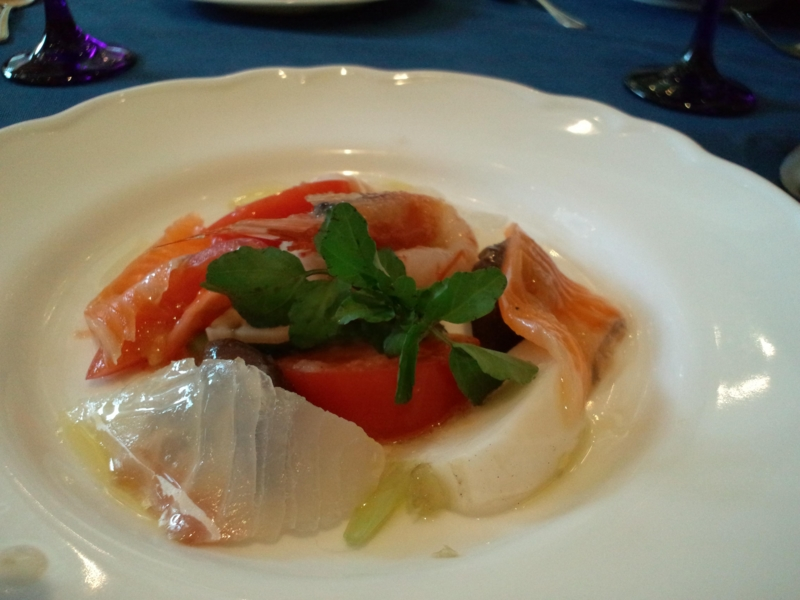
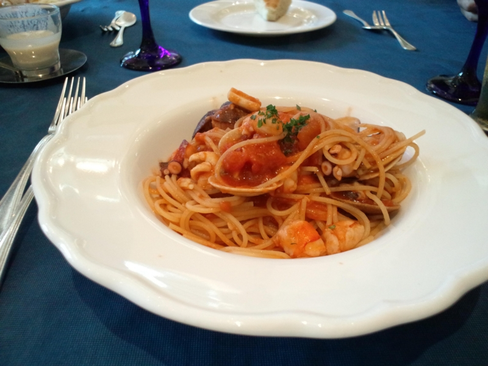
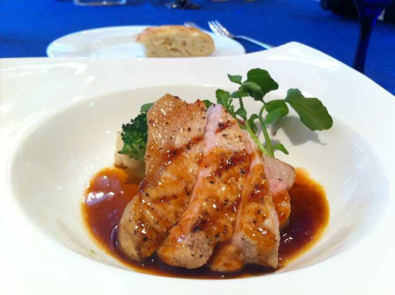
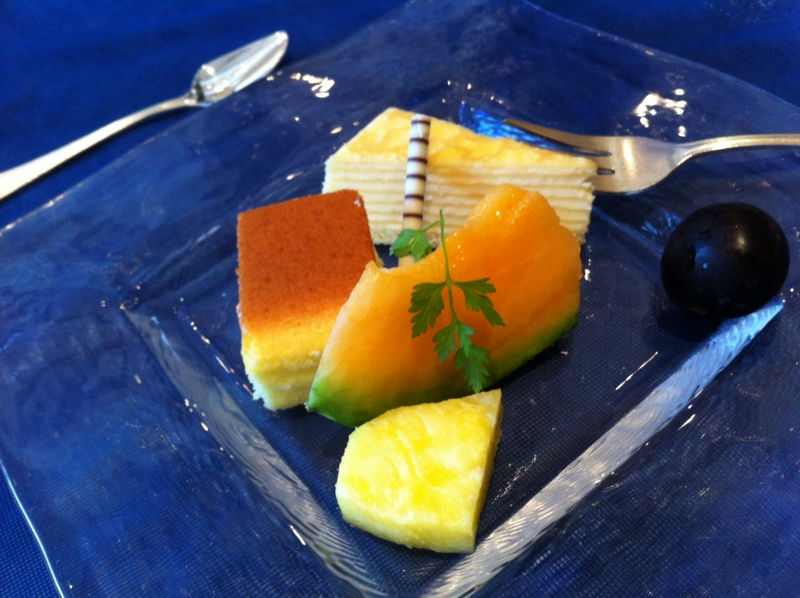
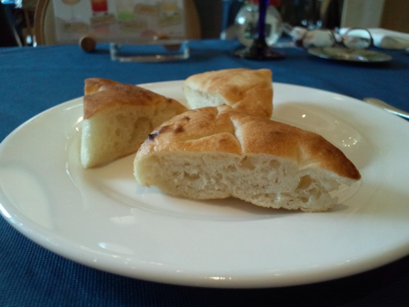

<a href="https://blog.daruyanagi.jp/entry/2012/10/14/192324">&#x30B9;&#x30DE;&#x30FC;&#x30C8;&#x30D5;&#x30A9;&#x30F3;&#x52C9;&#x5F37;&#x4F1A;@&#x95A2;&#x6771; #21 &#x306B;&#x53C2;&#x52A0;&#x3057;&#x3066;&#x304D;&#x307E;&#x3057;&#x305F; - &#x3060;&#x308B;&#x308D;&#x3050;</a> のあとは、実家にちょっと顔を出しに。<i>「インターネットの画面が変わってしまって困っている」</i>というので、それを直してあげたのだけれど、なんのことはない、「Google ツールバー」をインストールしたせいでスタートページが Google のトップページになっていただけだった。万年初心者の<i>「なにもしてないのにパソコンが壊れた」</i>は本当に信用がならない。

まぁ、そんなのはともかく。

そこでちょっと小耳にはさんだのだけど、最近弟2号がシャレオツなイタリア料理店で働いているらしい。ちょっと面白いので、おかんと弟1号とで翌日ランチタイムに偵察へ行くことに。

お店に行くと、少し小柄で見慣れた物体がオープン厨房の隅っこでくるくる働いている。ひたすら前菜の皿を製造しているようだ。それがこのカルパッチョ。まぁ、まぁ、美味しい。

弟2号が働いているというからフツーのお店だろうとタカをくくっていたのだけど、案外お高い店だった、というかほとんどレストランだった。おれなんかサンダルでスタスタ店に入ったのだけど、かなり浮いていたと思う。弟1号なんかジャージだしな。さすがにおかんは普通のカッコしてたけど。

お昼はこのフォカッチャが食べ放題なのらしい。しかも、家族だといえば割引もあったらしい。あとで弟2号に聞いた。そういうことは早く言え。

ちなみに、なぜかここのメシ代は俺持ちだった。なんか諭吉がひとり行方不明になったのだけど……どういうこと……。まぁ、ランチで助かった。ディナーだったら完全に死んでた。

