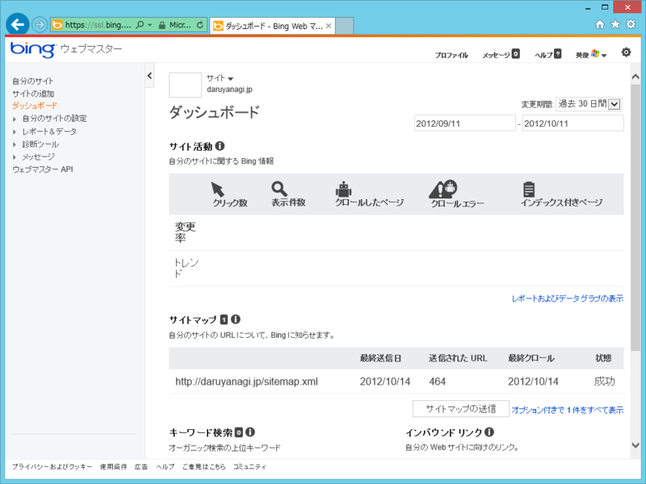
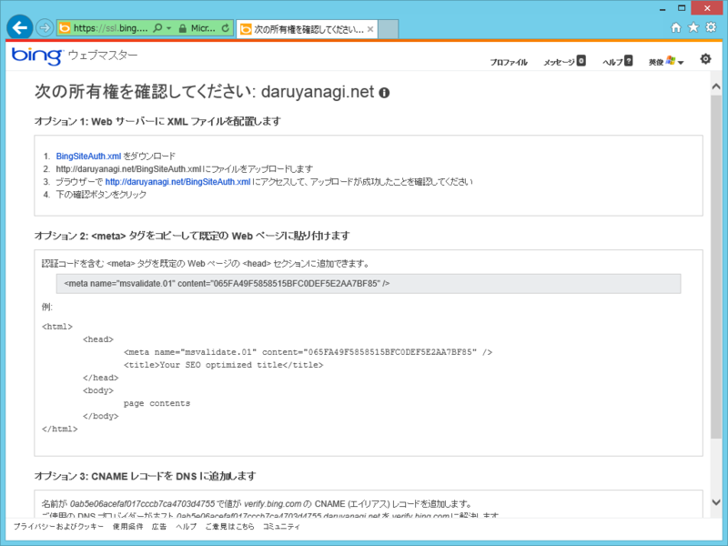
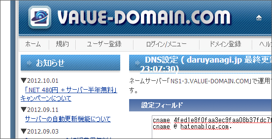

どうもウチのブログは Google に嫌われているみたいで、検索にまったく引っかからない。でも、Bing さんは引っかけてくれる。やっぱ時代は Bing だな<a href="#f1" name="fn1" title="使ってないけど">*1</a>。

その Bing さんにも、Google と同じくウェブマスターツールというのがあって、ちゃんと登録しておくと検索順位が上がるかもしれない<a href="#f2" name="fn2" title="知らんけど">*2</a>。

<a href="http://www.bing.com/toolbox/webmaster">Bing - Webmaster Tools</a>

まぁ、そうでなくてもいろいろ面白いデータがみられるかもしれないので、こちらにも一応登録しておくことにした。

<h3>はてなブログでの設定方法</h3>

Bing ウェブマスターツールに Web サイトを登録するには、以下のいずれかの方法によってその Web サイトを所有していることを証明しなければならない。

<ol>
<li>Web サーバーに XML ファイルを配置</li>
<li><meta> タグをコピーして既定の Web ページに貼り付け</li>
<li>CNAME レコードを DNS に追加</li>
</ol>
しかし、残念ながら <a href="http://hatenablog.com/">&#x306F;&#x3066;&#x306A;&#x30D6;&#x30ED;&#x30B0; (beta)</a> の場合、1 も 2 も不可能。Pro アカウントを購入して独自ドメインを割り当てている場合のみ、辛うじて 3 の方法が利用できる。<a href="#f3" name="fn3" title="Google ウェブマスターツールには対応しているのにな！">*3</a>

<h3>CNAME レコードを DNS に追加（VALUE DOMAIN）</h3>

「名前が 0ab***55（ながーい値） で値が verify.bing.com の CNAME (エイリアス) レコードを追加します。」という指示が出るので、それに従おう。<a href="http://www.value-domain.com/">VALUE DOMAIN:&#x30D0;&#x30EA;&#x30E5;&#x30FC;&#x30C9;&#x30E1;&#x30A4;&#x30F3;</a> を利用している場合は、ドメインの設定画面で

<blockquote>

cname 0ab***55 verify.bing.com. 
cname @ hatenablog.com. // <- はてなブログの DNS 設定

</blockquote>

と記述すればよい<a href="#f4" name="fn4" title="最後のドットを忘れないようにね">*4</a>。反映されるまでちょっと待ってから（30分ぐらいかな？）、［確認］ボタンを押せば設定は完了だよ。

<a href="#fn1" name="f1" class="footnote-number">*1</a>:使ってないけど

<a href="#fn2" name="f2" class="footnote-number">*2</a>:知らんけど

<a href="#fn3" name="f3" class="footnote-number">*3</a>:Google ウェブマスターツールには対応しているのにな！

<a href="#fn4" name="f4" class="footnote-number">*4</a>:最後のドットを忘れないようにね

