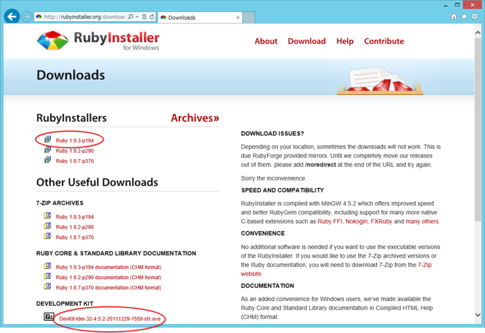
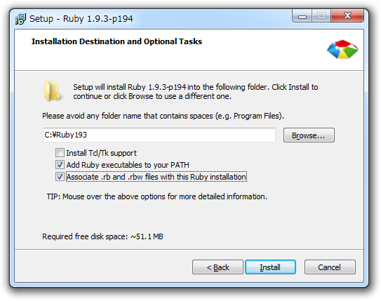
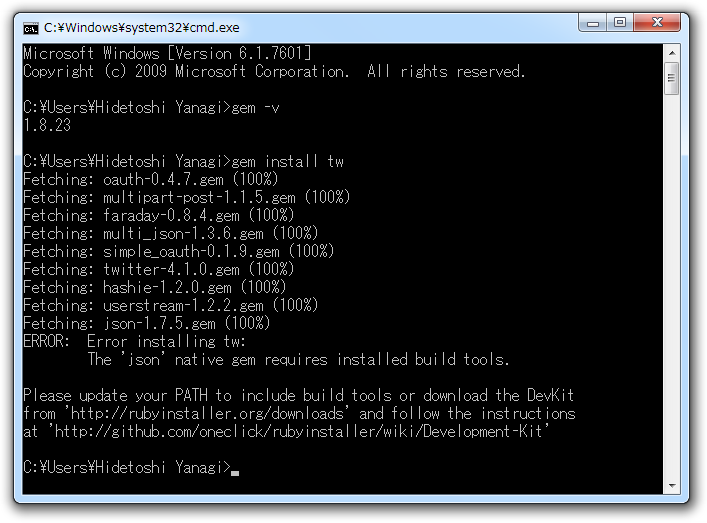
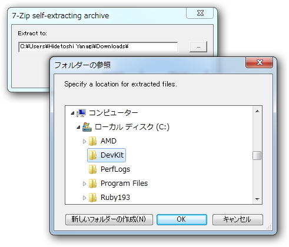

<h3>ダウンロード</h3>

<a href="http://rubyinstaller.org/downloads/">http://rubyinstaller.org/downloads/</a> で、

<ul>
<li>Ruby 1.9.3-p194</li>
<li>DevKit-tdm-32-4.5.2-20111229-1559-sfx.exe</li>
</ul>
をダウンロード。古いバージョンの Ruby を利用する場合は、DevKit のバージョンに注意。

<h3>Ruby 1.9.3-p194 のインストール</h3>

EXE 形式なので、そのまま実行。途中、Ruby の実行ファイルへパスを通しておくこと。なんでデフォでチェックが入っていないんだろう。関連付けは好きにすればいいと思う。

<h3>DevKit のインストール</h3>

このままでも利用できるのだけど、一部ネイティブな RubyGems をビルド・インストールには DevKit が必要。

慣れていれば、自己解凍書庫の中身をそのまま Ruby のインストールフォルダへコピーすればよかったと思う。自信がない場合は、公式の手順（<a href="https://github.com/oneclick/rubyinstaller/wiki/Development-Kit">https://github.com/oneclick/rubyinstaller/wiki/Development-Kit</a>）に従っておく。

<h4>C:\DevKit へ解凍</h4>

解凍先はどこでもいい。7z 形式の自己解凍書庫になっているので、実行して解凍先（C:\DevKit）を指定する。

<h4>ruby dk.rb init / ruby dk.rb install</h4>

コマンドプロンプトを起動。解凍先（C:\DevKit）へ移動して、コマンドを二つ実行する。

<pre class="code lang-sh" data-lang="sh" data-unlink>&gt;cd C:\DevKit

C:\DevKit&gt;ruby dk.rb init
[INFO] found RubyInstaller v1.9.3 at C:/Ruby193

Initialization complete! Please review and modify the auto-generated 'config.yml' file to ensure it contains the root directories to all of the installed Rubies you want enhanced by the DevKit.

C:\DevKit&gt;ruby dk.rb install
[INFO] Updating convenience notice gem override for 'C:/Ruby193'
[INFO] Installing 'C:/Ruby193/lib/ruby/site_ruby/devkit.rb'
</pre>
ruby dk.rb init は Ruby のインストールフォルダを検知して、config.yml を生成する。ruby dk.rb install はそれをもとに DevKit をインストールする。通常、config.yml の編集は必要ないはず。

どうせなら RubyInstaller に DevKit も同梱しておいてほしいけれど（ライセンスの関係かな？　知らんけど）、ゆとり過ぎますかね。

