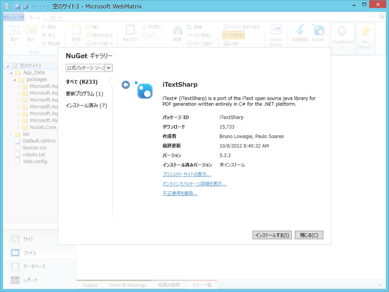
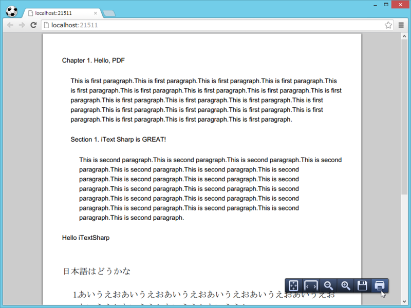

<blockquote cite="http://84zume.wordpress.com/2012/10/17/asp-net-mvc-razorpdf/">

RazorPDFはASP.NET MVCのRazor ViewEngineを利用してPDFファイルを出力します。 
ViewにはiTextXMLというXMLをPDFに変換するライブラリーを使用します。 
もともとSparkというViewEngineにあった機能を移植したものになります。 
ぱっと探してみましたけど、ソースコードがどうやら公開されていないですね。

<cite><a href="http://84zume.wordpress.com/2012/10/17/asp-net-mvc-razorpdf/">ASP.NET MVC&#x3067;PDF&#x3092;&#x51FA;&#x529B;&#x3059;&#x308B;&#xFF08;RazorPDF&#xFF09; &laquo; 84zume Works</a></cite>
</blockquote>

Razor と XML の組み合わせで PDF ドキュメントを出力できる。素敵だなぁ。ASP.NET MVC 向けなので、WebMatrix（ASP.NET Web Page）ではちょっと使えなさそうなのが残念だけど。

でも、PDF を吐くだけだったら WebMatrix でもできるよ！（対抗意識

調べてみると、「iTextSharp」というライブラリを使えばよさそう。ラッキーなことに NuGet も用意されていて、ライブラリのインストール自体は簡単。

いつも通り、ASP.NET の「空のサイト」テンプレートでごにょごにょとサンプルを書いてみた。

<pre class="code lang-cs" data-lang="cs" data-unlink># Default.cshtml

@using iTextSharp.text
@using iTextSharp.text.pdf

@{
// ドキュメントを作成
Document doc = new Document();

// 作成したドキュメントと Response.OutputStream を
// 結び付ける Writer オブジェクトを取得
PdfWriter.GetInstance(doc, Response.OutputStream);

// 開け、ゴマ！
doc.Open();

// あとは、チャプターを追加してみたり……
var p1 = new Paragraph(&quot;Chapter 1. Hello, PDF&quot;)
{
SpacingBefore = 20,
SpacingAfter = 20,
};

var chapter = new Chapter(p1, 0)
{
NumberDepth = 0,
Indentation = 16,
};

chapter.Add(
new Paragraph(&quot;This is first paragraph.&quot;.Times(20))
);

// セクションを追加してみたり……
{
var p2 = new Paragraph(&quot;Section 1. iText Sharp is GREAT!&quot;)
{
SpacingBefore = 20,
SpacingAfter = 20,
};

var section = chapter.AddSection(p2, 0);
section.Indentation = 16;

section.Add(
new Paragraph(&quot;This is second paragraph.&quot;.Times(20))
);
}
doc.Add(chapter);

// パラグラフを追加してみたり……
doc.Add(new Paragraph(&quot;Hello iTextSharp&quot;)
{
SpacingBefore = 20,
SpacingAfter = 20,
}
);

// 日本語フォントを用意
var base_font = BaseFont.CreateFont(
@&quot;c:\windows\fonts\msmincho.ttc,0&quot;,
BaseFont.IDENTITY_H, true
);
var font = new Font(base_font, 16);

doc.Add(
new Paragraph(&quot;日本語はどうかな&quot;, font)
{
SpacingBefore = 20,
SpacingAfter = 20,
}
);

// ほかにも、リストとかテーブルが作れる
var list = new List(true, 10)
{
IndentationLeft = 20,
};

list.Add(new ListItem(&quot;あいうえお&quot;.Times(10), font));
list.Add(new ListItem(&quot;さしすせそ&quot;.Times(10), font));

doc.Add(list);

doc.Close(); // &lt;- 便所の扉と一緒。開けたら閉める！

Response.ContentType = &quot;application/pdf&quot;;
}
</pre>

できてるみたい。有志によるリファレンス <a href="http://www.vector.co.jp/soft/winnt/writing/se462217.html">iTextSharp &#x30AF;&#x30E9;&#x30B9;&#x30E9;&#x30A4;&#x30D6;&#x30E9;&#x30EA;&#x30EA;&#x30D5;&#x30A1;&#x30EC;&#x30F3;&#x30B9;&#x306E;&#x8A73;&#x7D30;&#x60C5;&#x5831; : Vector &#x30BD;&#x30D5;&#x30C8;&#x3092;&#x63A2;&#x3059;&#xFF01;</a> は必須だなぁ。こういうのがあると、ほんとありがたいよ。

<h3>追記</h3>

書き忘れたけど、サンプルテキストのコピペでコードが長くなるのが嫌だったので、ちょっとした拡張メソッドを作って使っている。

<pre class="code lang-cs" data-lang="cs" data-unlink>public static class StringExtension
{
public static string Times(
this string target, int times)
{
string result = string.Empty;

for (int i = 0; i &lt; times; i++)
result += target.ToString();

return result;
}
}
</pre>
"a".Times(3) で "aaa" になればうれしい。

