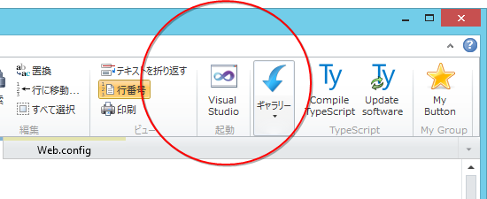
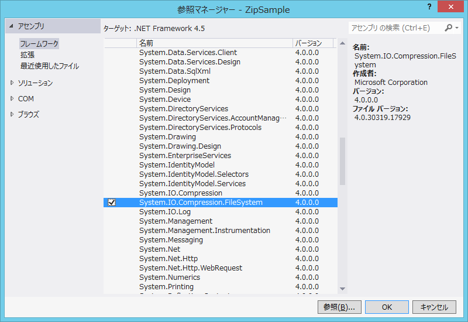
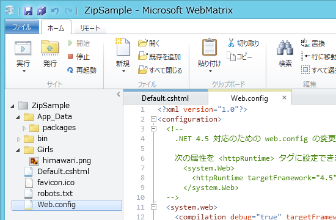
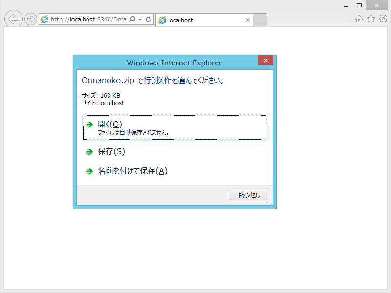
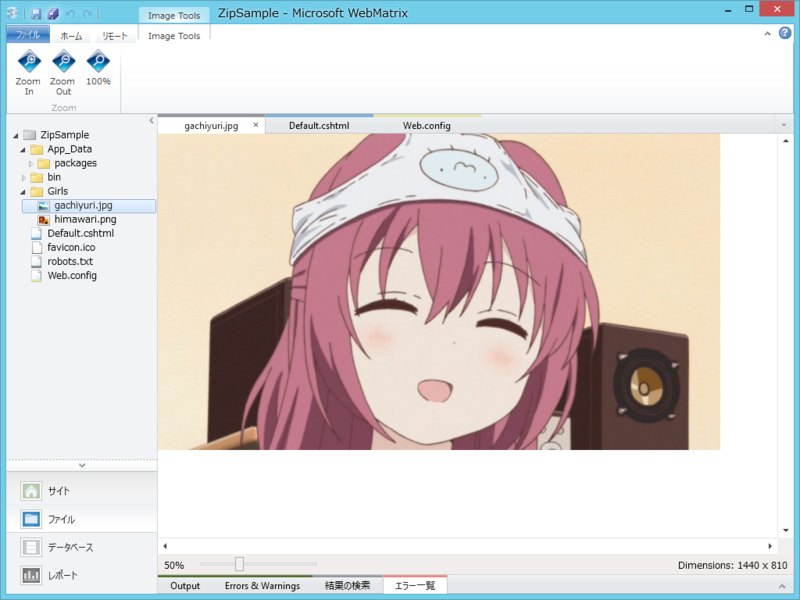
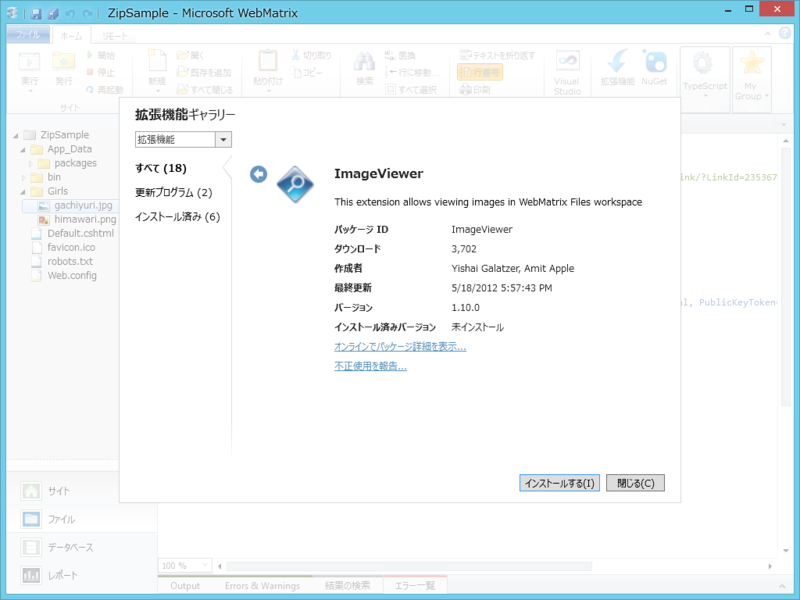

<blockquote class="twitter-tweet" lang="ja">
wget http://localhost/onnnanoko.zip で女の子落とせる
&mdash; Be玉さん (@BeMarble) <a href="https://twitter.com/BeMarble/status/259173405063000064" data-datetime="2012-10-19T06:05:29+00:00">10月 19, 2012</a></blockquote>

これは羨ましい！　わしも女の子落としたい！――できれば、WebMatrix で。

<h3>ヤりたいこと</h3>

まぁ、あらかじめ女の子を Zip で固めておいてアクセスし、「ほら、落ちてきました！」でもいいんだけど、せっかく WebMatrix でやるんだから圧縮ぐらいはオンデマンドでやってみたい。というわけで、

<ul>
<li>http:// localhost: **** へアクセスすると</li>
<li>Grirls フォルダに入っている女の子たちが</li>
<li>Zip でまるごと圧縮されて</li>
<li>落ちてくる！（onnanoko.zip）</li>
</ul>
が今回の目標。

<h3>何も考えずに書いてみる</h3>
<pre class="code lang-cs" data-lang="cs" data-unlink>#Default.cshtml /* 全部消して以下のコードに置き換える */

@using System.IO
@using System.IO.Compression

@{
string dir = Server.MapPath(&quot;~/Girls&quot;);
string zip = Server.MapPath(&quot;~/Onnanoko.zip&quot;);

// ~/Girls を ~/Onnanoko.zip へ圧縮
ZipFile.CreateFromDirectory(dir, zip);

// ~/Onnanoko.zip をダウンロード
Response.Redirect(&quot;~/Onnanoko.zip&quot;);
}
</pre>
もちろん、これは動かない。WebMatrix 2 で作成される ASP.NET Web Pages は .NET Framework 4 をターゲットとしているけれど、ZipFile クラスは .NET Framework 4.5 で追加されたものだからだ。.NET 4 対応のライブラリを使ってこの問題を解決してもいいのだけど、もう誰かがやってそうな気もする。というわけで、今回は WebMatrix 2 のほうを .NET 4.5 で動かしてみることにしよう。

<h3>.NET Framework 4.5 で動作させる</h3>

まず初めに考えたのは、Web.config の書き換え。

<pre class="code lang-xml" data-lang="xml" data-unlink>&lt;?xml version=&quot;1.0&quot;?&gt;
&lt;configuration&gt;
&lt;system.web&gt;
// 4.0 を 4.5 に書き換え
&lt;compilation debug=&quot;true&quot; targetFramework=&quot;4.5&quot;&gt;
&lt;/system.web&gt;
&lt;/configuration&gt;
</pre>
しかし、これだけでは動かん。System.IO.Compression.FileSystem.dll を参照に追加せねばならないらしい……。くそぅ、どうやればいいんだ……WebMatrix には参照追加のためのユーザーインターフェイスがない……。ここでオレの、オレたちの夢は途絶えてしまうのか！？

<h3>お兄ちゃん！　助けて！</h3>

そこで思い出したのが、「Visual Studio」。そう、<del>ターンエー</del>の「WebMatrix」のお兄さんだ！　まぁ、WebMatrix でもたいていのことはできるけど、やっぱり Visual Studio のほうが便利なところも多い。困ったときはサクッと切り替えるのも一つの手だぞ！

というわけで、参照マネージャーで DLL への参照を追加。すると、Web.config はこんな風に書き換わる。

<pre class="code lang-xml" data-lang="xml" data-unlink>&lt;?xml version=&quot;1.0&quot;?&gt;
&lt;configuration&gt;
&lt;!--
    .NET 4.5 対応のための web.config の変更点の説明については、http://go.microsoft.com/fwlink/?LinkId=235367 を参照してください。

    次の属性を &lt;httpRuntime&gt; タグに設定できます。
      &lt;system.Web&gt;
        &lt;httpRuntime targetFramework=&quot;4.5&quot; /&gt;
      &lt;/system.Web&gt;
  --&gt;
&lt;system.web&gt;
&lt;compilation debug=&quot;true&quot; targetFramework=&quot;4.5&quot;&gt;
&lt;assemblies&gt;
&lt;add assembly=&quot;System.IO.Compression.FileSystem, Version=4.0.0.0, Culture=neutral, PublicKeyToken=B77A5C561934E089&quot;/&gt;
&lt;/assemblies&gt;
&lt;/compilation&gt;
&lt;pages controlRenderingCompatibilityVersion=&quot;4.0&quot;/&gt;
&lt;/system.web&gt;
&lt;/configuration&gt;
</pre>
さすが、<del>ターンエー</del>の「WebMatrix」のお兄さん！　っていうか、こんなの手で書いてられるかよ！ ＞ｗ＜

あとはこれを実行するだけだ！

<h3>親方！　空から女の子が！</h3>

てぃーてぃーりりりー♪　てぃてぃーりりりー♬

うおおお！　ちゃんと女の子が落せた！　万歳……っ！……万歳っ……！

でも、リロードしたらエラーが発生したので、ちゃんとファイルの存在チェック＆削除のロジックを入れておかねばならぬ。

<pre class="code lang-cs" data-lang="cs" data-unlink>@using System.IO
@using System.IO.Compression

@{
string dir = Server.MapPath(&quot;~/Girls&quot;);
string zip = Server.MapPath(&quot;~/Onnanoko.zip&quot;);

if (File.Exists(zip))
{
File.Delete(zip);
}

ZipFile.CreateFromDirectory(dir, zip);

Response.Redirect(&quot;~/Onnanoko.zip&quot;);
}
</pre>

<h3>がちゆりさんを足してみた</h3>

初回テストでは、Girls フォルダに向日葵ちゃんしか入っていなかったけれど、これはちょっと寂しい。というわけで、複数ファイルも行けるかどうかのテストを兼ねて、Girls フォルダにがちゆりさん（<a href="http://dic.nicovideo.jp/a/%E8%B5%A4%E5%BA%A7%E3%81%82%E3%81%8B%E3%81%AD">&#x8D64;&#x5EA7;&#x3042;&#x304B;&#x306D;&#x3068;&#x306F; (&#x30A2;&#x30AB;&#x30B6;&#x30A2;&#x30AB;&#x30CD;&#x3068;&#x306F;) [&#x5358;&#x8A9E;&#x8A18;&#x4E8B;] - &#x30CB;&#x30B3;&#x30CB;&#x30B3;&#x5927;&#x767E;&#x79D1;</a>）を追加。

結果はもちろん成功！

……というわけで、本日のネタは Web サイト/アプリに「Zipでくれ」機能を付ける、でした！

ちなみに、WebMatrix で画像のプレビューをするには「ImageViewer」拡張機能をインストールするんだよ。

<h3>おまけ：これ、デプロイできんの？</h3>

ローカルで動くのはわかったけど、これリモートでも動くんだろうか。答えは「やれないことはないけれど、もう少し待て」。そのうち Azure Web Sites が .NET 4.5 に対応してくれるみたいだから、それを使えば楽にできそう。 Express Web のほうも対応してくれたらありがたいのだけどね。

