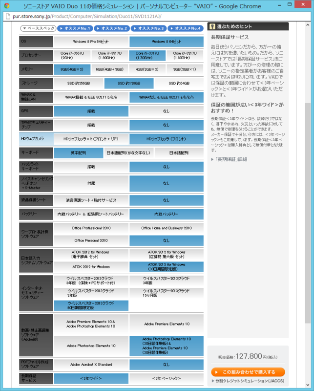

なんだか寝られなかったので、<a href="http://pc.watch.impress.co.jp/docs/news/20121001_562929.html">&#x3010;PC Watch&#x3011; &#x30BD;&#x30CB;&#x30FC;&#x3001;11.6&#x578B;&#x30D5;&#x30EB;HD&#x306E;&ldquo;&#x30B9;&#x30E9;&#x30A4;&#x30C0;&#x30FC;&#x30CF;&#x30A4;&#x30D6;&#x30EA;&#x30C3;&#x30C9;PC&rdquo;&#x300C;VAIO Duo 11&#x300D; &#x301C;Ultrabook&#x6E96;&#x62E0;&#x3001;&#x30C7;&#x30B8;&#x30BF;&#x30A4;&#x30B6;&#x30FC;&#x306E;&#x624B;&#x66F8;&#x304D;&#x306B;&#x5BFE;&#x5FDC;</a> の価格シミュレートをしていたら、いつの間にか予約していた。2012年11月10日頃お届けとのこと。会社に届くようにしたので<a href="#f1" name="fn1" title="家だと不在が多くて、受け取りが面倒で">*1</a>、できれば9日（金）には着いてほしいなぁー。

お金がないので CPU と SSD はケチらざるを得なかったけれど<a href="#f2" name="fn2" title="それでも i5 にしておいたのはターボブーストの存在とキャンペーンのため i3 との価格差が少なかったため">*2</a>、まぁ、サブ機と割り切れば問題はなさげ。そりゃ、Core i7 に 256GB もあれば最高だけどさ。その代り、メモリはめいいっぱい積んでおいた。

<blockquote cite="http://pc.watch.impress.co.jp/docs/column/ubiq/20121012_564468.html">

　Intelの第3世代CoreプロセッサのUシリーズは、標準スペック上では17WのTDPが設定されている。しかし、cTDPを利用すると、そのTDPを一時的に上げたり下げたりできる。……

　ただし、この25Wの設定を利用できるのはCore i7のみ。なので、このcTDPの機能を利用したい場合にはCTOでCore i7を選ぶ必要があるので注意したい。

<cite><a href="http://pc.watch.impress.co.jp/docs/column/ubiq/20121012_564468.html">&#x3010;&#x7B20;&#x539F;&#x4E00;&#x8F1D;&#x306E;&#x30E6;&#x30D3;&#x30AD;&#x30BF;&#x30B9;&#x60C5;&#x5831;&#x5C40;&#x3011; &#x7D20;&#x65E9;&#x304F;&#x5909;&#x5F62;&#x3059;&#x308B;&#x3060;&#x3051;&#x3058;&#x3083;&#x306A;&#x304F;TDP&#x9650;&#x754C;&#x3082;&#x8D85;&#x3048;&#x308B; &#x301C;&#x30BD;&#x30CB;&#x30FC;&#x300C;VAIO Duo 11&#x300D;&#x958B;&#x767A;&#x8005;&#x30A4;&#x30F3;&#x30BF;&#x30D3;&#x30E5;&#x30FC;</a></cite>
</blockquote>

あとはサブの AC アダプターがほしいのだけど、8,000円以上する。

<blockquote cite="http://ascii.jp/elem/000/000/736/736574/index-5.html">

<b>小野塚</b>「ノイズについては、電源に関する部分も大きいんですよ。当初は『VAIO X』に使っていたものと同サイズの、非常に小さなACアダプターを採用する予定でした。最終的に8ccほど大きくなってしまったのですが、これはタッチに対する外来ノイズ対策のために、大きくなってしまった部分なのです。各国・各状況によって、電源にのっているノイズも大きく異なっているので、その対策が必要でした」

　とはいえ、各社のACアダプターが大型化する中で、Duo 11のACアダプターは、かなり小さい部類に入る。カタログでこそうたわれていないが、これでも「1時間で80％」までは充電できるため、実用性は高い。

<cite><a href="http://ascii.jp/elem/000/000/736/736574/index-5.html">ASCII.jp&#xFF1A;&#x8907;&#x96D1;&#x306A;&#x30B9;&#x30E9;&#x30A4;&#x30C9;&#x6A5F;&#x69CB;&#x3092;&#x5B9F;&#x73FE;&#x3057;&#x305F;VAIO Duo 11&#x88FD;&#x9020;&#x306E;&#x79D8;&#x5BC6;&#xFF5C;&#x897F;&#x7530; &#x5B97;&#x5343;&#x4F73;&#x306E;Beyond the Mobile</a></cite>
</blockquote>

サードパーティー製でお安く済ましたいのだけど、ちょっと難しそう。S7S でも、AC アダプタからノイズがのって、タッチパネルが異常動作するケースが結構みられた。

<a href="#fn1" name="f1" class="footnote-number">*1</a>:家だと不在が多くて、受け取りが面倒で

<a href="#fn2" name="f2" class="footnote-number">*2</a>:それでも i5 にしておいたのはターボブーストの存在とキャンペーンのため i3 との価格差が少なかったため

