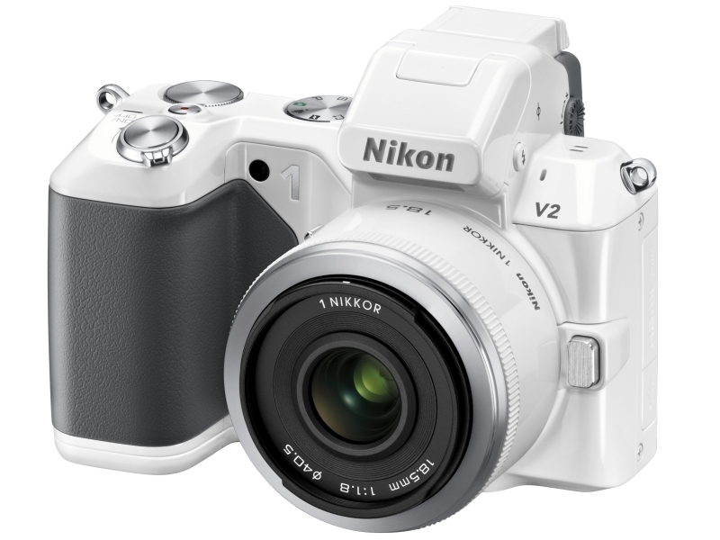

<a href="https://blog.daruyanagi.jp/entry/2012/06/06/052011">Nikon 1 V1 &#x3092;&#x3052;&#x3063;&#x3068;&#x306A;&#x3046; - &#x3060;&#x308B;&#x308D;&#x3050;</a> から5か月弱、Nikon 1 V2 が発表された。なんかすごい外観だなぁ、と思うけれど、これはこれでいいんじゃないか。前モデルの Nikon 1 V1 で一番面倒だなぁ、と思ったのは撮影モードの切り替えが面倒だったことだけど、それが改善されているのが羨ましいなぁ。

<blockquote cite="http://dc.watch.impress.co.jp/docs/news/20121024_568156.html">

Nikon 1 V1ユーザーから要望が多かったという操作性の向上を目指し、新たにP/S/A/M等のポジションを含むモードダイヤルを設けた。作画意図を撮影に反映したいユーザーへの配慮という。電源スイッチも同社デジタル一眼レフカメラと似たシャッターボタンと同軸のタイプになった。背面にはコマンドダイヤルも備える。

<cite><a href="http://dc.watch.impress.co.jp/docs/news/20121024_568156.html">&#x30CB;&#x30B3;&#x30F3;&#x3001;&#x5185;&#x8535;&#x30B9;&#x30C8;&#x30ED;&#x30DC;&#x3084;&#x30E2;&#x30FC;&#x30C9;&#x30C0;&#x30A4;&#x30E4;&#x30EB;&#x3092;&#x5099;&#x3048;&#x305F;&#x300C;Nikon 1 V2&#x300D; - &#x30C7;&#x30B8;&#x30AB;&#x30E1; Watch Watch</a></cite>
</blockquote>

正直、そのほかの改善点については興味ない。

一方、不満点もある。

ひとつはは新型バッテリーの採用。せっかく D7000 と共通化したのに、また新しくなったわけだ。いろいろ事情はあるんだろうけれど、呆れてしまう。

もうひとつは、マルチアクセサリーポート。どこ行ってもうたんや。写真をよく見ると、ストロボの上にアクセサリーシューのようなものが見えるので、それがそうなのかもしれない。けれど、これに GPS ユニット GP-N100 をつけるところを想像すると、思わずサブイボがたつ。ダサすぎる。

<a href="http://www.amazon.co.jp/exec/obidos/ASIN/B005OD1DHM/bestylesnet-22/">Nikon GPSユニット GP-N100</a>
<ul><li>出版社/メーカー: ニコン</li><li>発売日: 2011/10/20</li><li>メディア: エレクトロニクス</li><li> クリック: 9回</li><li><a href="http://d.hatena.ne.jp/asin/B005OD1DHM/bestylesnet-22" target="_blank">この商品を含むブログを見る</a></li></ul>

<h3>閑話休題</h3>

さて、今持っている Nikon 1 V1 なのだけど、<a href="https://blog.daruyanagi.jp/entry/2012/09/23/145821">Windows&#x30C7;&#x30D9;&#x30ED;&#x30C3;&#x30D1;&#x30FC;&#x30AB;&#x30F3;&#x30D5;&#x30A1;&#x30EC;&#x30F3;&#x30B9; in &#x6771;&#x4EAC; &#x306B;&#x53C2;&#x52A0;&#x3057;&#x3066;&#x304D;&#x307E;&#x3057;&#x305F; - &#x3060;&#x308B;&#x308D;&#x3050;</a> の懇親会で再び電源が入らなくなった。<a href="https://blog.daruyanagi.jp/entry/2012/09/07/102100">&#x304A;&#x4EA1;&#x304F;&#x306A;&#x308A;&#x306B;&#x306A;&#x3063;&#x305F; Nikon 1 V1 &#x304C;&#x5FA9;&#x6D3B; - &#x3060;&#x308B;&#x308D;&#x3050;</a> から二度目。さすがにちょっと怒って、少しキツめの言葉を添えて再修理を依頼したのだけど、結果は<i>バッテリー切れてたんじゃね？</i>でした。<i>んなわけあるかい。</i>

満充電にして出掛け、夕方まで使うことがなかったのに。懇親会で20ショット程度撮影したあと、しばらくしてもう一度取り出すと、電源が入らない状態だった。電源が入らないからバッテリー残量も確認できなかったのだけど、ほぼ満タンだったはずだ。

修理内容の明細には、ご丁寧に「GPS ユニットを装着している場合は、通常より多めにバッテリーを消費します」と書かれてあったけど、<i>んなこと、言われんでも知っとるわい。</i>

思い出すだけで、あれは胸糞悪い。Nikon 1 V1 はそんなにバッテリーを食う機体じゃない。現に、<a href="https://blog.daruyanagi.jp/entry/2012/10/14/192324">&#x30B9;&#x30DE;&#x30FC;&#x30C8;&#x30D5;&#x30A9;&#x30F3;&#x52C9;&#x5F37;&#x4F1A;@&#x95A2;&#x6771; #21 &#x306B;&#x53C2;&#x52A0;&#x3057;&#x3066;&#x304D;&#x307E;&#x3057;&#x305F; - &#x3060;&#x308B;&#x308D;&#x3050;</a> のときに満充電したバッテリー<a href="#f-90aa1dd1" name="fn-90aa1dd1" title="肝心の勉強会に持っていき忘れた">*1</a>だが、10日経った今でもちゃんと使えている。10ショットぐらいしかしていないので、バッテリー残量のゲージはひとつも欠けていない。

まぁ、その修理から帰ってきてからは一度も起動不能にはなっていないので、今のところ許しているけれど。ちょっとニコンが嫌いになった。

<a href="#fn-90aa1dd1" name="f-90aa1dd1" class="footnote-number">*1</a>:肝心の勉強会に持っていき忘れた

