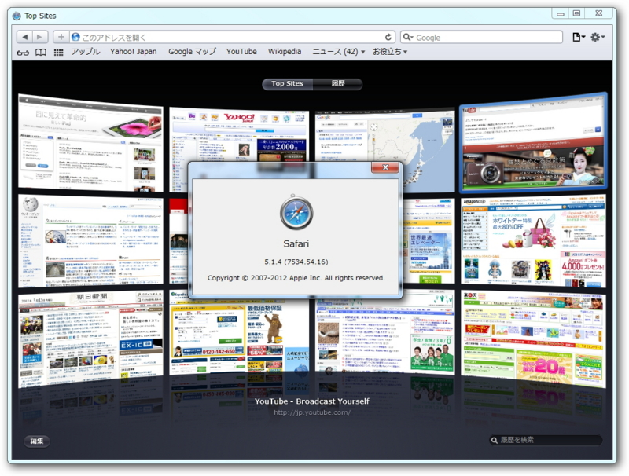
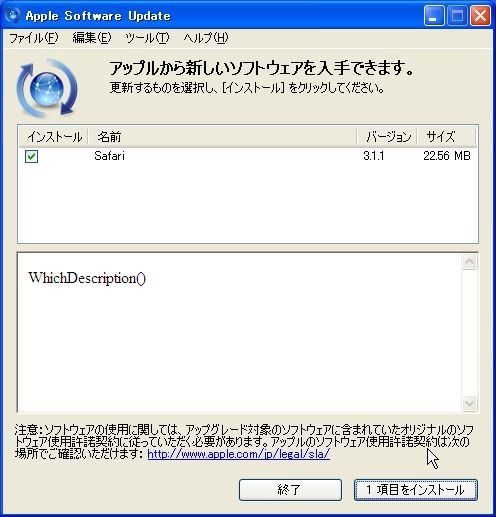

Windows 版の「Safari」がリリースされなくなって、半年が経とうとしている（<a href="http://www.forest.impress.co.jp/docs/news/20120510_531745.html">&#x7A93;&#x306E;&#x675C; - &#x3010;NEWS&#x3011;WebKit&#x306B;&#x95A2;&#x3059;&#x308B;&#x8907;&#x6570;&#x306E;&#x8106;&#x5F31;&#x6027;&#x3092;&#x4FEE;&#x6B63;&#x3057;&#x305F;&#x300C;Safari&#x300D;v5.1.7</a>）。無論、セキュリティ問題も放置だ。そしてとうとう、「Safari」は非推奨ブラウザーの指定を受けた（<a href="http://www.forest.impress.co.jp/docs/news/20121023_567875.html">&#x7A93;&#x306E;&#x675C; - &#x3010;NEWS&#x3011;IPA&#x3001;&#x8106;&#x5F31;&#x6027;&#x306E;&#x5B58;&#x5728;&#x306B;&#x3088;&#x308A;Windows&#x7248;&#x300C;Safari&#x300D;&#x306E;&#x4F7F;&#x7528;&#x505C;&#x6B62;&#x3092;&#x52E7;&#x544A;</a>）。

「革新的なブラウザー」の末路がこれですよ。

僕個人も Apple の製品は利用しているけれど、決して“信者”ではない。この会社はセキュリティに関する意識が低すぎると思っているので、できれば避けたいと思っているぐらいだ。

まず、「Google Chrome」などに比べると、更新頻度が圧倒的に低い。そして、セキュリティ情報への簡単なアクセスを提供していない<a href="#f1" name="fn1" title="できれば隠したい？">*1</a>。最近「Firefox」のリリースノートにもセキュリティ問題の修正が記載されなくなった<a href="#f2" name="fn2" title="別ページにまとめられているが">*2</a>が、こういう姿勢はよくない。システム管理者のために、セキュリティ更新プログラムの適用優先度を示すこともない。

かつて、Microsoft はセキュリティ問題まみれでだいぶ批判された。けれど、今ではかなり改善されて、リリースされている中で最高レベルのセキュリティを誇っている<a href="#f3" name="fn3" title="Mac OS X はあまり褒められた部類ではない。ただ、狙われるにはシェアが少なすぎるだけだ">*3</a>。Adobe もあまり評判がよくなかったが、最近では著しく改善されている。セキュリティアドバイザリの記述は、冗長だが真摯だと思う。ソフトウェアでバグを出すのは必ずしも不名誉なことではない。問題はそれに対する姿勢なのではないか。ソフトウェアの価値はバイナリにあるのではなく、満足を生み、継続して使ってもらうことにあるのだから。

もし Windows版「Safari」の開発をやめるのならば、Apple はそれを明らかにし、ほかのブラウザーへの移行を案内するべきだ。

こう言うと、なかには「Safari を使っている人などいない」「Safari をあえて使っている人は上級者なので案内の必要はない」という人が必ずいるのだけど、それは間違っている。

<pre class="code" data-unlink>110 ：名無しさん＠お腹いっぱい。：2009/11/05(木) 00:48:35 ID:Un/V1aQn0
iTunesが　おきあがり
なかまに　なりたそうに　こちらをみている！
なかまに　してあげますか？

┌───┐
│⇒はい│
│いいえ│
└───┘

iTunesが　なかまに　くわわった！
QuickTimeが　なかまに　くわわった！
Bonjour for Windowsが　なかまに　くわわった！
Apple Mobile Device Supportが　なかまに　くわわった！
Apple Software Updateが　なかまに　くわわった！
MobileMeが　なかまに　くわわった！
Apple Application Supportが　なかまに　くわわった！

Apple Software Updateが　Safariを　よびよせた！
Apple Software Updateが　iPhoneソフトウェアを　よびよせた！ </pre>
Apple はこうやって「Safari」の利用を初心者にもすすめてきたではないか。ならば、それに対する責任も負うべきではないだろうか。「Safari」よりも少ないシェアしかもつことができなかったベンダーでも、ほかのブラウザーの紹介とブックマークの移行処置の案内ぐらいのことはしてきた。

――といった内容を、個人的には <a href="http://www.forest.impress.co.jp/docs/serial/moritalk/">&#x7A93;&#x306E;&#x675C; - &#xFF03;&#x30E2;&#x30EA;&#x30C8;&#x30FC;&#x30AF; INDEX</a> に期待しているのだけど、ここ何回かは裏切られているｗ

<a href="#fn1" name="f1" class="footnote-number">*1</a>:できれば隠したい？

<a href="#fn2" name="f2" class="footnote-number">*2</a>:別ページにまとめられているが

<a href="#fn3" name="f3" class="footnote-number">*3</a>:Mac OS X はあまり褒められた部類ではない。ただ、狙われるにはシェアが少なすぎるだけだ

