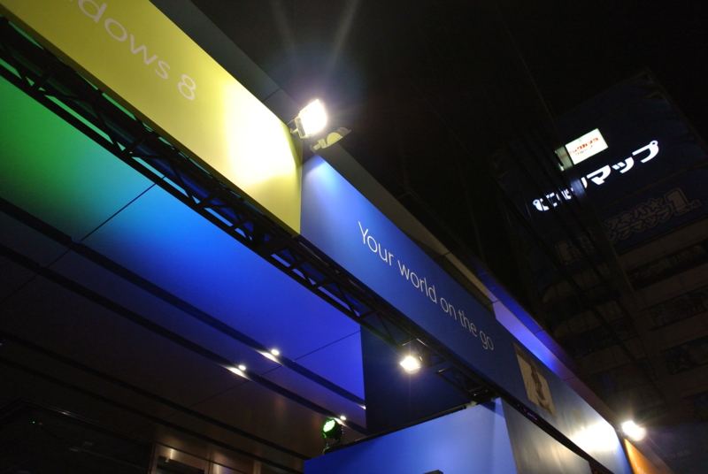
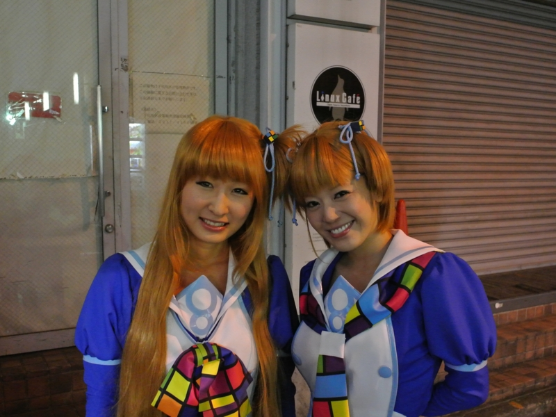
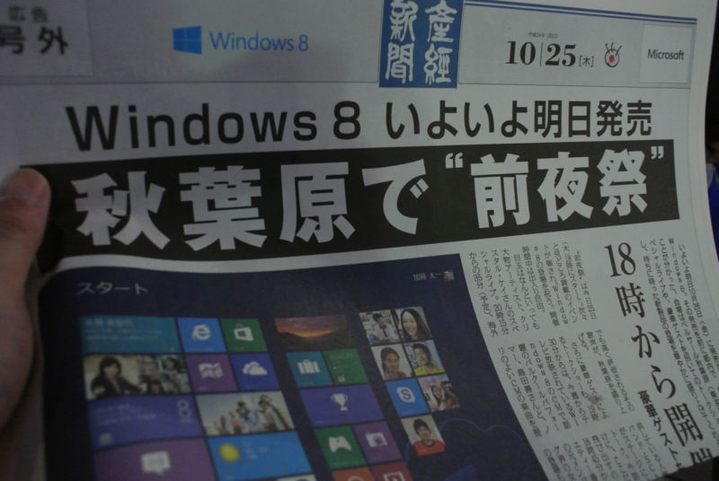

人混みが苦手なので早々に退散してきたけど、結構賑わってたよ。お目当ての VAIO Duo 11 も触らせてもらった。スライドのオープンにはバネが聞いていて、「カシャッ！」と小気味よく開くのがいい！　ちょっとイメージと違った部分もあったけれど、おおむね満足だ。買ってよかったと思う（<a href="https://blog.daruyanagi.jp/entry/2012/10/21/035318">VAIO Duo 11 &#x4E88;&#x7D04;&#x3057;&#x305F;&#x3063;&#x305F;&#xFF01; - &#x3060;&#x308B;&#x308D;&#x3050;</a>）。

あと、なんかフジテレビのインタビューを受けたりしていた。

<b>「Windows 8、どう思いますか？」</b> 
<b>「あー、いや、もう毎日使ってるんで……」</b>

みたいな感じで受け答えしていたので、たぶん TV では使われないだろうけど。このブログも、Windows 8で書いています。

窓辺クラウディア・ななみさんや……

窓辺ゆう・あいさんも出張してました。写真なんか撮らせてもらって、えろうすみませんでした (/ω＼)

あと、号外なんかも配ってた。<b>これ、産経新聞にいくら払って作ってもらったんだろう……</b>

Windows 8 かぁ……売れるのかなぁ。でも少なくとも、Windows 95/2000/Vista に並ぶ、またはそれ以上の意味をもったターニングポイントになるのは確か。

