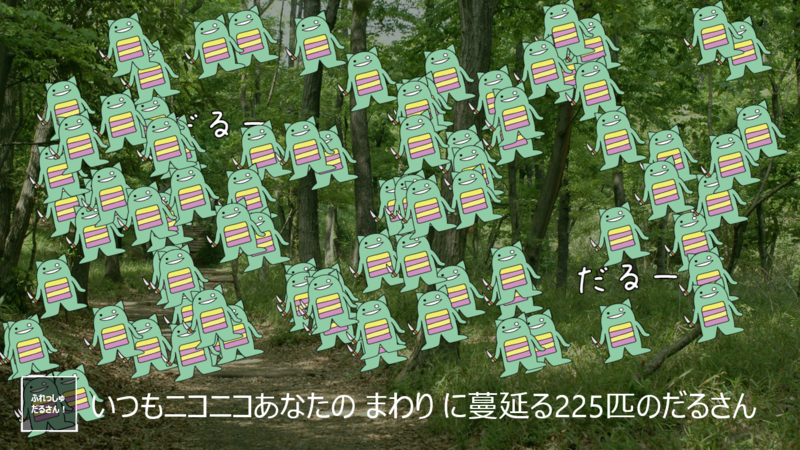
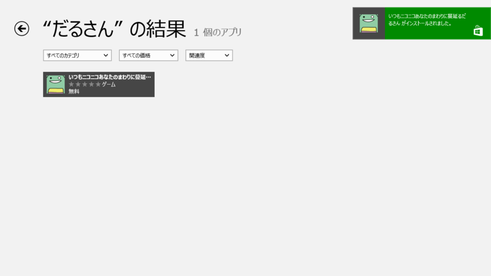

<b>「いつもニコニコあなたのまわりに蔓延（はびこ）るだるさん」</b>は、Twitterで今ブレーク中の癒し系マスコットキャラクター“だるやなぎ”を好きなだけ刈り取れるゲームアプリ。現在、Windows 8の「ストア」アプリ（Windows ストア）から無償でダウンロードできる。

“だるやなぎ”は、いつもTwitterでだるだるしている特別天然記念物。一部の心無い人達によって「ホモ」呼ばわりされても笑顔を忘れず、常に明るく健気に自分を貫いて生きる姿が共感を呼び、今、癒し系キャラクターとして女子高生・女子大生・OLを中心に人気を得つつある。

本アプリは、画面上の“だるやなぎ”をタップして収穫していくだけのゲーム。“だるやなぎ”が枯渇したら、左下の［ふれっしゅだるさん！］ボタンをタップしてみよう。再び画面いっぱいに“だるやなぎ”が生えてくる。この濃厚な“だるやなぎ”密度が本アプリの醍醐味。自然溢れる背景画像も相まって、あたかも森林浴を愉しんでいるかのような癒しが得られる。

ゲーム自体は一見単純だが、指の動きを工夫することでいくらでも刈り取りスピードを上げていけるところが意外に奥深い。刈り取りの際の効果音“だるーん”が快楽中枢をダイレクトに刺激するので、ついついハマってしまう。

本アプリをインストールするには、Windows 8の「ストア」で“だるさん”と検索すればよい。執筆時現在、アプリの評価は5段階中“5”をキープしており、高い評価を得ていることがわかる。

なお、本アプリを開発したのは『Windows8 UI/UXデザイン入門』（<a href="https://blog.daruyanagi.jp/entry/2012/09/28/211706">&#x300E;&#x307F;&#x3064;&#x3070;&#x305F;&#x3093;&#x306E;&#x8584;&#x3044;&#x672C;&#x300F; - &#x3060;&#x308B;&#x308D;&#x3050;</a>）で著名なみつばたん氏。Windows8 スタイルのデザインセンスを身に着けたいならば、ぜひ本アプリを体験しておきたい。

<a href="http://www.amazon.co.jp/exec/obidos/ASIN/4798034975/bestylesnet-22/">Windows8UI/UXデザイン入門code name Metro</a>
<ul><li>作者: 泉本優輝,吉竹遼</li><li>出版社/メーカー: 秀和システム</li><li>発売日: 2012/09/11</li><li>メディア: 単行本</li><li>購入: 5人 クリック: 109回</li><li><a href="http://d.hatena.ne.jp/asin/4798034975/bestylesnet-22" target="_blank">この商品を含むブログ (7件) を見る</a></li></ul>

<h3>ソフトウェア情報</h3>

【著作権者】みつばたん　氏 
【対応OS】Windows 8（x86、x64） 
【ソフト種別】フリーソフト 
【バージョン】‐（12/10/25）

<h3>関連リンク</h3>

<ul>
<li><a href="http://d.hatena.ne.jp/c-mitsuba/">atelier:mitsuba</a></li>
<li><a href="http://apps.microsoft.com/webpdp/ja-JP/app/f0bbe849-ee9c-4e32-8030-537aafae983d">&#x3044;&#x3064;&#x3082;&#x30CB;&#x30B3;&#x30CB;&#x30B3;&#x3042;&#x306A;&#x305F;&#x306E;&#x307E;&#x308F;&#x308A;&#x306B;&#x8513;&#x5EF6;&#x308B;&#x3060;&#x308B;&#x3055;&#x3093; &#x3092;&#x5165;&#x624B; - Microsoft Store ja-JP</a></li>
<li><a href="http://twitter.com/daruyanagi">&#x3060;&#x308B;&#x3084;&#x306A;&#x304E; &#x306B;&#x5929;&#x4F7F;&#x304C;&#x821E;&#x3044;&#x964D;&#x308A;&#x305F;&#xFF01; (@daruyanagi) | Twitter</a></li>
</ul>

