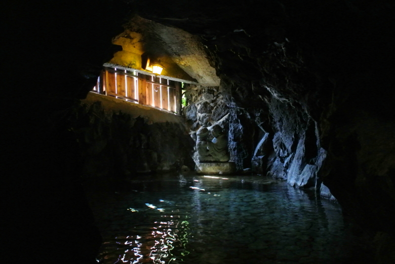

平成二十四年秋十月、とあるおっさん三人はハイブリッドでピカピカなクルマを駆り、神奈川の辺境・戸塚を発して西へ向かった。箱根山脈の北東端が関東平野に没せんとする辺の険峻なる丘陵地帯を縫って西行すること四時間。秋風は肌を撫でて心地よく、いかにも休日満喫たる感が深い。豆州・河津街の外れに至ってクルマはようやく止営した。すでに目的地・『テルマ・エロマエ』のロケ地に深く進み入っているのである。

というわけで。

<a href="https://blog.daruyanagi.jp/entry/2012/05/14/094159">&#x300E;&#x30C6;&#x30EB;&#x30DE;&#x30A8;&#x30FB;&#x30ED;&#x30DE;&#x30A8;&#x300F; - &#x3060;&#x308B;&#x308D;&#x3050;</a> のロケ地にもなったという、大滝（おおだる）温泉は天城荘に行ってきましたよ。「おおだる」温泉とは、わたしのハンドルネームにも通じる。何とも縁起のよい名前ではないか！　まさに私のために用意された温泉だといっても過言である。

別に宿泊したわけでなく、ただお風呂に入りに行っただけ。温泉にしてはたいそうなお料金（2,000円/3時間）だけど、なかなかどうして、楽しませてくれる温泉だった。今度はココに泊まってもいいかもね。

<h3>子宝の湯</h3>

まず入ったのは“子宝の湯”。岩をくりぬいた洞窟を少し降りるとそこには……

荘厳な空間が広がっていた。

薄暗い部屋の奥には、何とも不思議な・得体の知れない像が安置されている。うっすらと差し込む光を頼りに、目をこらしてよく見てみると……

ほとけさま（のようなもの）が、なにか見覚えのあるものを抱いている。これは<i>てぃんこ</i>じゃないか！　これは明らかに<i>てぃんこ</i>だ！

子宝の予感で、全身がゾクゾクする。

まさか……ココであんなことこんなことしたら、クロネコヤマトも真っ白な速さでコウノトリがコドモを届けてくれるのか！？　なんという背徳的な空間だ。おっさん同志じゃなくて、ここは女の子と来たかった。

ちなみに言い忘れていたけど、この温泉は<b>混浴</b>です。水着忘れないでね！

<h3>滝の湯</h3>

子宝の湯はちょっとぬるくて、すっかり体を冷やしてしまった。案内板をよく読むと、ほかの温泉でよく体を温めてから浸かるのがお勧めなのだそうだ。しまったぜ……

まぁ、そういうこともあろうかと、バスローブを借りておいたのだけど。200円ぐらいなので、今ぐらいの季節には借りておいたほうが何かとよろしい。ちなみに、写真で掲げている5000円札のタオルは、<a href="https://blog.daruyanagi.jp/entry/2012/06/24/183810">&#x9EC4;&#x91D1;&#x306E;&#x56FD;&#x30B8;&#x30D1;&#x30F3;&#x30B0;&#x304C;&#x8A87;&#x308B;&#x30A8;&#x30EB;&#x30FB;&#x30C9;&#x30E9;&#x30C9;&#x3001;&#x571F;&#x80A5;&#x91D1;&#x5C71;&#x3078;&#x6F5C;&#x5165;&#x3002;&#x305D;&#x3053;&#x3067;&#x76EE;&#x306B;&#x3057;&#x305F;&#x3082;&#x306E;&#x306F;&hellip;&hellip;&#xFF01; - &#x3060;&#x308B;&#x308D;&#x3050;</a> でゲットしたもの。羨ましい人は買うといいと思うよ。

子宝の湯でテンションをあげたオレ達は（※ここ、コナン風に！）、童謡を口ずさみながら、緑の光降り注ぐ坂道を下っていく。そしてその先には……

滝でござる！

滝でござる！

朝出発した時は少し曇っていたのだけれど、この時間はすっかり晴れて、雲一つ……ないことはないけれど、そんなにない。とっても爽やかで、こころも、のうみそも、てぃんこもほぐれていく気がする（写真は同行のおっさん、N 氏と Y 氏）。

ここでは、草陰をうろつく虫たちも、木陰でさえずる鳥たちも、社会の陰でこっそり生きるべき三十路のおっさんたちも、みんな平等に生きることを愉しめる。

<h3>穴風呂</h3>

そのほかにも穴風呂というのがある。

さすがのオレさまにも、これのどこに風情があるのかがよくわからなかった。まぁ、ちょっとした探検気分にななれるけれど。天井から水がしたたり落ちるので、ここまではカメラをもってはいらなかった。

<h3>お昼ごはん！</h3>

お風呂のあとはお昼ごはん！

なんか、ワサビ蕎麦＋とろろ付を食べたのだけど……おいしいのかどうかはよくわかんないけど、結構香りと後味が爽やかで、個人的には結構気に入った。そういえば、昔にも一度ここに来たことがあって、その時も食べた気がする。いつだったかは忘れたけど。

思い出は忘れても、食ったものは忘れない。それが人間というものであるらしいな。

