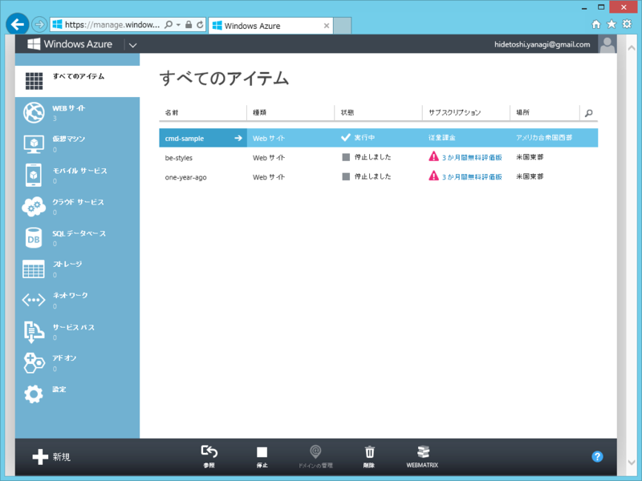
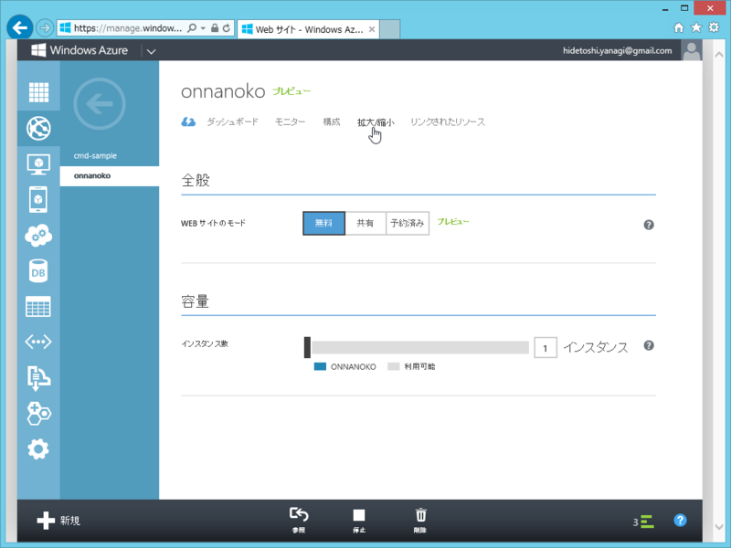
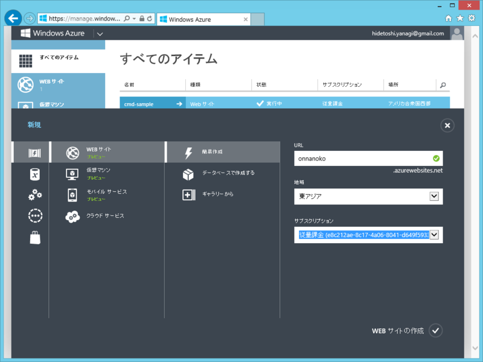
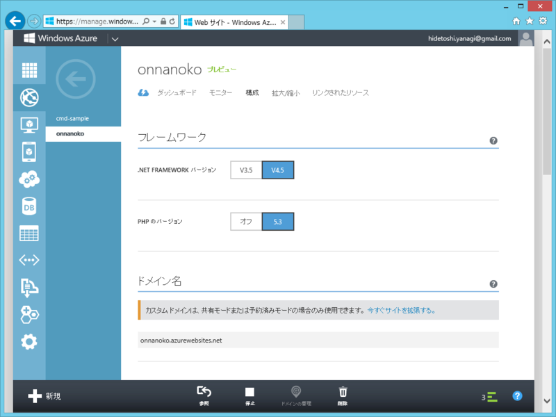
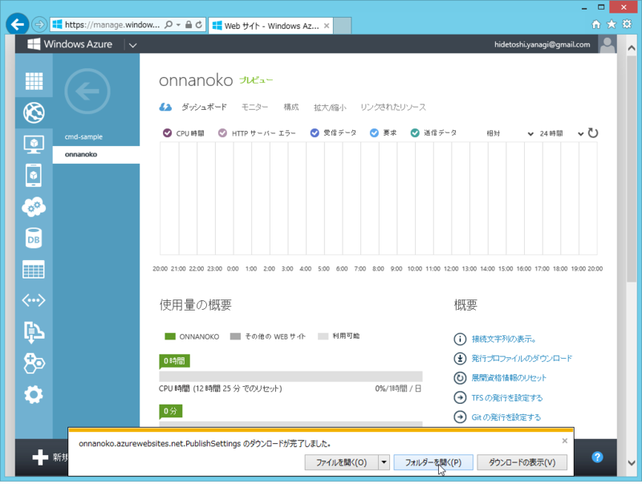
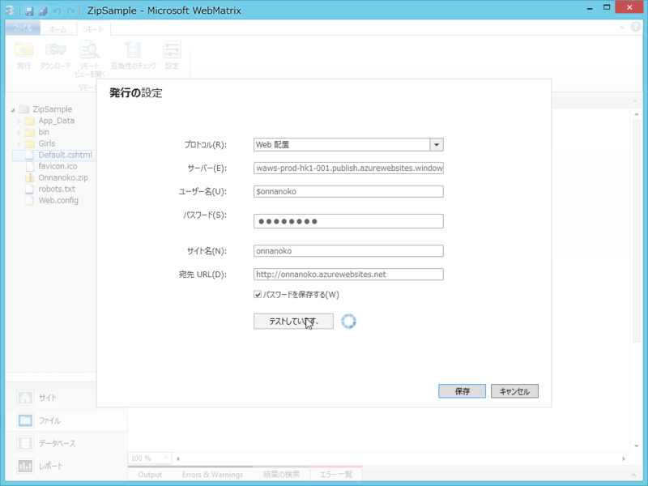
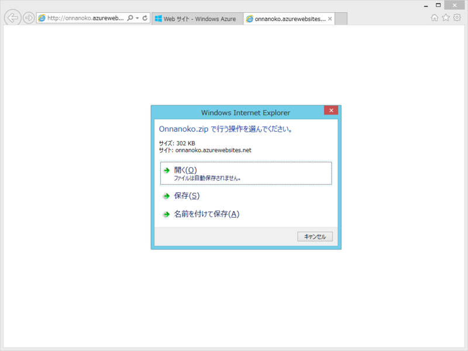
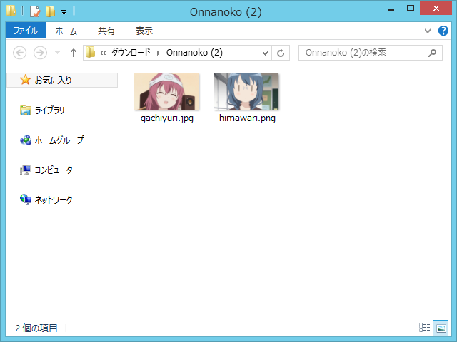

<blockquote cite="http://blogs.msdn.com/b/bluesky/archive/2012/10/29/windows-azure-sdk-1-8-released-with-net-4-5-ready-windows-azure-portal-refresh-with-windows-azure-store-and-japanese-available.aspx">

Windows Azure Web サイト にて .NET 4.5 アプリケーションが配置可能になり、また Windows Azure クラウドサービスでも Windows Azure SDK 1.8 にて .NET Framework 4.5 および Guest OS 3.0 (Windows Server 2012 互換) のテンプレートが追加されています。

<cite><a href="http://blogs.msdn.com/b/bluesky/archive/2012/10/29/windows-azure-sdk-1-8-released-with-net-4-5-ready-windows-azure-portal-refresh-with-windows-azure-store-and-japanese-available.aspx">2012 &#x5E74; 10 &#x6708;&#x306E; Windows Azure &#x4E00;&#x6589;&#x30A2;&#x30C3;&#x30D7;&#x30C7;&#x30FC;&#x30C8; : .NET 4.5 &#xFF06; Windows Sever 2012 &#x5BFE;&#x5FDC;&#x3001;SDK 1.8 &#x30EA;&#x30EA;&#x30FC;&#x30B9;&#x3001;&#x7BA1;&#x7406;&#x30DD;&#x30FC;&#x30BF;&#x30EB;&#x65E5;&#x672C;&#x8A9E;&#x5BFE;&#x5FDC; &ndash; &#x9752;&#x3044;&#x7A7A;&#x306E;&#x5411;&#x3053;&#x3046;&#x3078;</a></cite>
</blockquote>

Windows Azure Web サイトが .NET Framework 4.5 に対応したらしい。ついでに、管理ポータルが日本語に対応したそうな。

ってことはですよ。<i><a href="https://blog.daruyanagi.jp/entry/2012/10/20/213231">WebMatrix &#x3067;&#x5973;&#x306E;&#x5B50;&#x3092;&#x843D;&#x3068;&#x3059; - &#x3060;&#x308B;&#x308D;&#x3050;</a> をWindows Azure Web サイトへ配置できる！</i>つまり、「Windows Azure で女の子が落せる」わけです。<i>「親方！　空から女の子が！」</i>ってヤツですね！　なんと胸が熱い……。

（<a href="http://moshimoswitch.main.jp/idea/2581">idea276-&#x7A7A;&#x304B;&#x3089;&#x5973;&#x306E;&#x5B50;&#x30E9;&#x30B8;&#x30B3;&#x30F3; &laquo; &#x3082;&#x3057;&#x3082;&#x30B9;&#x30A4;&#x30C3;&#x30C1;&#xFF5C;&#x304A;&#x3082;&#x3061;&#x3083;&#xFF5C;&#x73A9;&#x5177;&#xFF5C;&#x4F01;&#x753B;&#xFF5C;&#x4F1A;&#x793E;&#xFF5C;&#x6771;&#x4EAC;&#xFF5C;&#x79CB;&#x8449;&#x539F;&#xFF5C;</a> より）

<h3>新しい管理ポータル</h3>

あ、ほんとに日本語化されている。

“3か月無償版”で作成したサイトにはアクセスできなくなっているので、泣きながらこれを削除（ローカルにソースコード残っているかなぁ……）。現在は“従量制”コースになっているけれど、Free（無料）プランで Web サイトを作成すれば、使いすぎてもサイトがロックされるだけでお金を要求されることはない。とりあえず、テストだけならタダでできる。

 

<h3>新しいサイトの作成</h3>

新しいサイトを作成。

リージョンに「東アジア」が選択できるようになっている！　サイトごとに異なるリージョンって、前は選択できたっけ？　できなかった気がするんだけど、いつの間にか改善されたのかな。

いつかリージョンに「日本」が選択できるようになればいいなぁ。

.NET Framework は初期状態で 4.5（CLR 3.0）が選択されいる。3.5（CLR 2.0）も選択できるけれど、レガシーアプリでもなければ意味はなさそう。

<h3>Web サイトの発行</h3>

発行プロファイルをダウンロードして、

WebMatrix で読み込み、開発した Web サイト（<a href="https://blog.daruyanagi.jp/entry/2012/10/20/213231">WebMatrix &#x3067;&#x5973;&#x306E;&#x5B50;&#x3092;&#x843D;&#x3068;&#x3059; - &#x3060;&#x308B;&#x308D;&#x3050;</a>）をデプロイ。ここら辺は毎度のことだから説明は省くよ。

<h3>結果</h3>

<i>「親方！　空から女の子が！」</i>そんな男の子の夢が叶えられる。そう、Windows Azure Web サイト（＋WebMatrix 2）ならね。

検索キーワード：がちゆりさん

