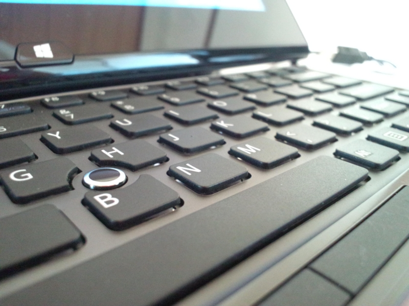

<a href="https://blog.daruyanagi.jp/entry/2012/10/21/035318">VAIO Duo 11 &#x4E88;&#x7D04;&#x3057;&#x305F;&#x3063;&#x305F;&#xFF01; - &#x3060;&#x308B;&#x308D;&#x3050;</a> が昨日届きました。当初、お届け予定日は11月10日だったのだけど、9日間の短縮。是非、明日の <a href="http://pronama.wordpress.com/2012/10/18/pronama-18-at-osak/">http://pronama.wordpress.com/2012/10/18/pronama-18-at-osak/</a> へ持っていきたかった<a href="#f-d90698c1" name="fn-d90698c1" title="そして自慢を……">*1</a>ので、とってもありがたい。　

<h3>最初の印象</h3>

ディスプレイサイズの割にはデカい。「タブレットとして使いたい」と思って考えているならば、やめたほうがいいかも。これは「タブレット」というよりむしろ、<b>「ノートパソコン」</b>のカテゴリに近い製品だと思う。

ただ、ディスプレイがキーボードから近く、裏からヒンジで支えられていることもあり、積極的にタッチディスプレイを利用する気になれるから、<b>「タダのノートパソコン」</b>というわけでは決してない。届く前は角度が変えられないディスプレイに懸念を覚えていたのだけれど、なかなかどうして、タッチで使うには絶妙な角度。キーを入力するうえで違和感を感じることもない。

なかなかこれまでには味わったことのない、妙な感覚だ。

<h3>入力デバイス</h3>

そのキーボード<a href="#f-5833b849" name="fn-5833b849" title="英語配列を選択">*2</a>だが、正直、最初は打ちにくかった。

キートップの縦幅が短く、デスクトップとかなり感覚が異なるので、ミスタイプが頻発する。パームレストがなく、手の置き所が窮屈なのも辛い。とくに光学式トラックポイントが我が占拠する［G］［H］［B］キーのあたりや、横幅の狭い［>］［/］キーのあたりが打ちにくい。［>］［/］キーはプログラミングでよく使うし、日本語テキストを入力する場合でも読点を入力するために頻繁に利用する。あまり使わないであろう右［Fn］キーを潰してでも、横幅はちゃんと確保してほしかった。

ついでにいうと、光学式トラックポイントとボタンの使い勝手もイマイチ。とはいえ、タッチパネルでの入力が快適なのであまり出番はない。デスクトップアプリでのテキスト選択など、どうもタッチでは辛い操作で補助的に使えるのはありがたい。

ぶっちゃけると、テキスト入力デバイスとしては落第点に近いと思う。けれど、先に述べたタッチ操作との融合性を評価するならば、それほど気にはならない。慣れれば済む話なので。

<h3>ハードウェア</h3>

一言でいえば、「頑張ったなぁ」という印象。とくにヒンジの部分は見ているだけで思わず「にやぁっ」としてしまう。スタイラスが収納できないのは減点だけど、これだけあれこれ詰め込んでいたら無理もないのかな、と思える。

ただ、回転ロックボタン・音量ボタンの位置は気に食わない。最初どこにあるのかわからなくてあちこち探していたのだけど、キーボードの裏にそれを発見した時は、軽くめまいがした。タブレットモードのときはまだよいとして、ラップトップモードのときはどうやって押すのか。まぁ、筐体を少し持ち上げて手探りで押すことになるのだろうけど……ちょっとイケてない。

パフォーマンスは満足。ワイド保証を除けば11万円台の構成だけど、サブマシンならば十分これで戦える。ただ、OS を Windows 8（無印）にしたので、Windows Phone SDK 8.0 のエミュレーターが動かないというのは誤算だった。まぁ、後からでもアップデートできるんだけど、そうするとプリインストールのストアアプリが使えなくなるという罠があるらしい。

<h3>ソフトウェア</h3>

タッチドライバーは Samsung Series 7 Slate に比べると完成度が低いように見える。フリック操作であまり慣性が効かないから、横に長いグリッドをスクロールすると手が疲れる。デスクトップで右クリックするとメニューが出るまで数秒待たされるのもナゾな動き。常駐アプリが何か悪さをしているのだろうか。初めて電源を入れ、ソフトウェアアップデートをかけると、さっそく再起動を促される。指示に従うと、なにやらエラーダイアログが出る。

納得ハードウェアにがっかりソフトウェアを付ける体質は相変わらずのようだ。

日本メーカーのデバイスは、どうもソフトウェアが弱い。そりゃ、かつてはハードウェアの完成度 ≒ 製品の完成度だったろうけど、今ではソフトウェアを搭載しない製品などほとんどない。ハードにこだわるのもいいけれど、片腕だけ鍛えた醜いボディビルダーにはなってほしくないね。

とはいえ、昔よりは面白いソフトを添付しているし<a href="#f-ae44dff0" name="fn-ae44dff0" title="手書き入力アプリは消すつもりだけど、キャプチャーアプリは残しておくかもしれない">*3</a>、さっそくサポートアプリが Metro アプリとして提供されていることにもやる気を感じる<a href="#f-6ec2e901" name="fn-6ec2e901" title="新着アップデートがトーストで通知された！">*4</a>。ここは生暖かく見守るべきなのだろうか。

<h3>まとめ</h3>

この記事は VAIO Duo 11 で書いているけれど、ミスタイプに苦労したり、画像ファイルのドラッグに失敗してイライラしたり。デスクトップで書いているときの半分以下の効率だけれども、多分、この機体が得意とするのはそういうことではないんだろう。

もっと頭を柔らかくして、使いこなしていきたいなと思った。今のところ、絵を描いたり、ペンでメモを取ったりということしか思いつかないけれど。

<a href="#fn-d90698c1" name="f-d90698c1" class="footnote-number">*1</a>:そして自慢を……

<a href="#fn-5833b849" name="f-5833b849" class="footnote-number">*2</a>:英語配列を選択

<a href="#fn-ae44dff0" name="f-ae44dff0" class="footnote-number">*3</a>:手書き入力アプリは消すつもりだけど、キャプチャーアプリは残しておくかもしれない

<a href="#fn-6ec2e901" name="f-6ec2e901" class="footnote-number">*4</a>:新着アップデートがトーストで通知された！

