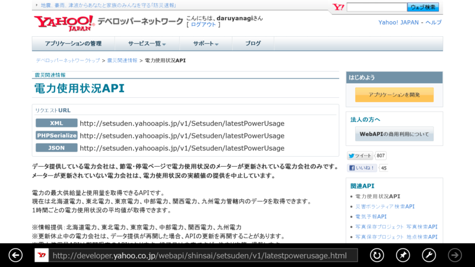
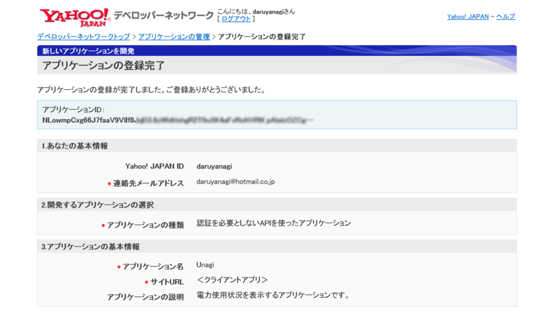
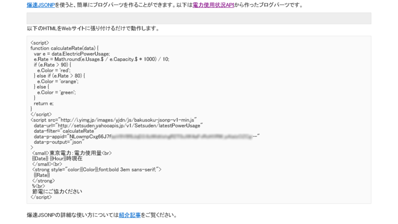
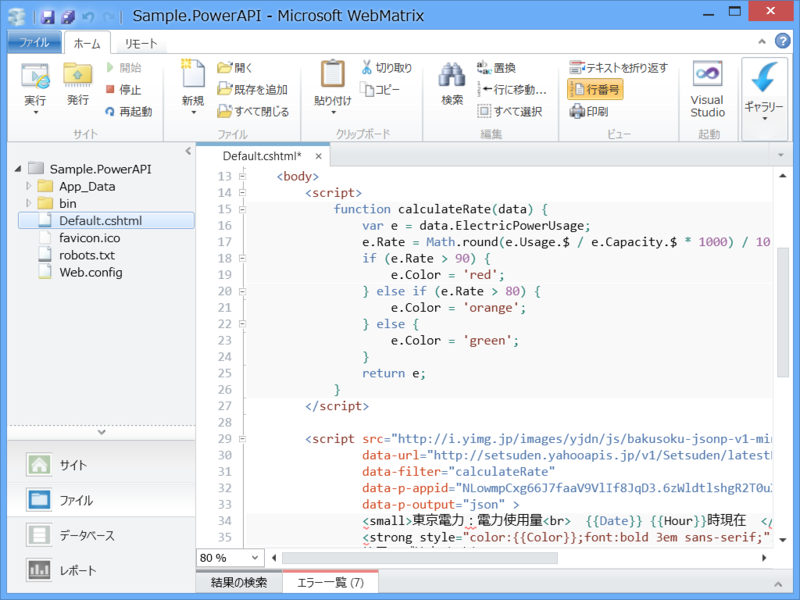
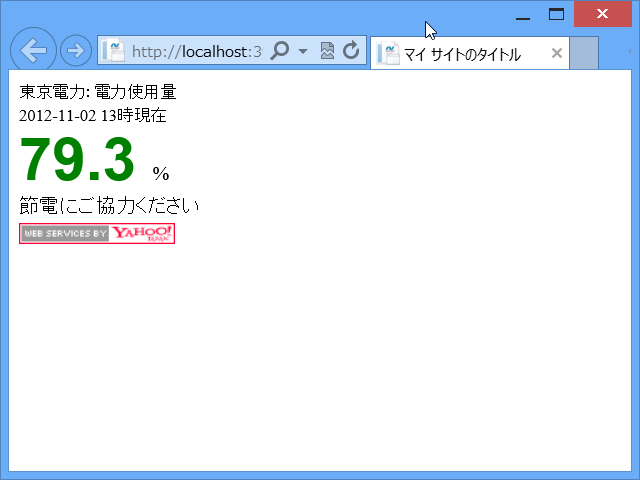

次の Windows Store アプリのネタ、どうしようかなぁ……などと考えていたのだけど、まだトーストへプッシュ通知するアプリを試していなかった。冬はまた電力需給が逼迫しそうなので、ヤバくなったらデスクトップへ通知してくれるアプリなんかいいかもしれない。

それにはまず、API の使い方を勉強しなきゃいけない。

<ul>
<li><a href="http://developer.yahoo.co.jp/webapi/shinsai/setsuden/v1/latestpowerusage.html">&#x9707;&#x707D;&#x95A2;&#x9023;&#x60C5;&#x5831;:&#x96FB;&#x529B;&#x4F7F;&#x7528;&#x72B6;&#x6CC1;API - Yahoo!&#x30C7;&#x30D9;&#x30ED;&#x30C3;&#x30D1;&#x30FC;&#x30CD;&#x30C3;&#x30C8;&#x30EF;&#x30FC;&#x30AF;</a></li>
</ul>

<h3>とりあえずアプリの登録</h3>

API キーをもらう。名前は適当に「Unagi（うなぎ）」にした。

<h3>サンプルコードを試す</h3>

するとサンプルコードが吐き出された。これをぺったんこすればそのまま動くらしい。ちょっと拍子抜けだ。

試しに WebMatrix でそのサンプルコードを貼り付けてみた。

動いたし。

HTML + JavaScript で簡単に作れるのならば、ストアアプリも HTML プロジェクトで作るといいのかもしれない。

