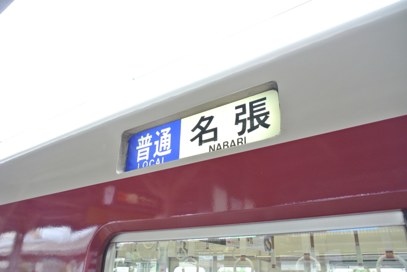
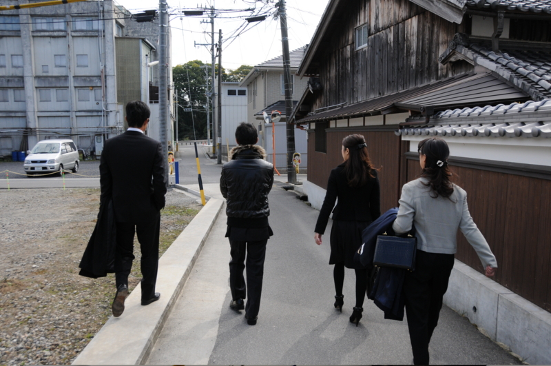

<a href="http://atnd.org/events/32864">&#x30D7;&#x30ED;&#x30B0;&#x30E9;&#x30DF;&#x30F3;&#x30B0;&#x751F;&#x653E;&#x9001;&#x52C9;&#x5F37;&#x4F1A; &#x7B2C;18&#x56DE;&#xFF20;&#x5927;&#x962A; #pronama : ATND</a> に参加してきました！……の前に、名張へ寄り道して墓参りしてきた。

この前行ったばかり（<a href="https://blog.daruyanagi.jp/entry/2012/08/06/223332">1&#x5E74;2&#x30F6;&#x6708;&#x3076;&#x308A;&#x306E;&#x5893;&#x53C2;&#x308A;&#xFF08;&#x89B3;&#x5149;&#x30AC;&#x30A4;&#x30C9;&#x3068;&#x9053;&#x6848;&#x5185;&#x3064;&#x304D;&#xFF09; - &#x3060;&#x308B;&#x308D;&#x3050;</a>）だけど、<a href="https://blog.daruyanagi.jp/entry/2012/10/23/212056">&#x3058;&#x3044;&#x3061;&#x3083;&#x3093;&#x304C;&#x4EA1;&#x304F;&#x306A;&#x3063;&#x305F; - &#x3060;&#x308B;&#x308D;&#x3050;</a> こともあり、母＋兄弟3人で。この組み合わせで新幹線に乗るだなんて、子どものころ以来だ。

そう言えば、兄弟全員がそろうことなんかもうなくなったな。誰かしらとしょっちゅう会うけれど、全員で集まるというのはない。次こうやって全員顔を合わせるのも、誰かが結婚したとか、親戚に不幸があったとか、そういうきっかけでもなければもうないのだろうね<a href="#f-dffca2a0" name="fn-dffca2a0" title="そういえば前回集まったのは親父の60歳の誕生日で、その前は妹の結婚式だった">*1</a>。

<a href="#fn-dffca2a0" name="f-dffca2a0" class="footnote-number">*1</a>:そういえば前回集まったのは親父の60歳の誕生日で、その前は妹の結婚式だった

