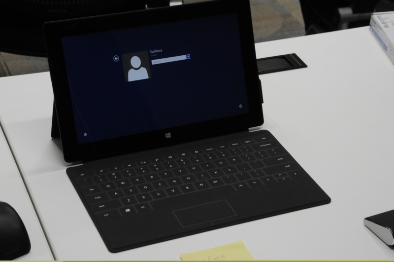

<a href="http://pronama.wordpress.com/2012/10/18/pronama-18-at-osak/">http://pronama.wordpress.com/2012/10/18/pronama-18-at-osak/</a> に参加してきました。LT やろうかと思ってたのだけど、VAIO Duo 11 のセットアップ（<a href="https://blog.daruyanagi.jp/entry/2012/11/02/155646">https://blog.daruyanagi.jp/entry/2012/11/02/155646</a>）などで時間をとられて資料ができあがらず。最悪メインセッション中に資料を作って飛び入り参加しようと思ってもみたのだけど、まぁ、結構参加者が多かったので僕の出番はないかな、なんて理由を作って今回はパスしちゃいました。次回はリベンジしたいですね。

注目はやっぱりクラウディアさん（@Claudia_Azure）だったのかな。みんなちょっとテンション高かったです。

あと、Surface！　大人気でしたね。僕も少しだけ触らせてもらったのだけど、……これはほしくなる！　心配していたキーボードもそれほど違和感なし。「タブレット」としての利用がメインであれば、VAIO Duo 11 よりも Surface のほうがすぐれていると思いましたね。<b>日本でも売ればいいのに。</b>

個人的に一番興味を引いたのは @tworks さんの Dejphi 話だったかな。

昔は Delphi 使いだったのに、Windows / Mac のクロスコンパイルができることすら知らなかったほどなので、最近の Delphi 事情が聴けたのは収穫だったかも。ホビープログラマにとっては縁遠い存在になってしまったけれど、モノ自体はいいので使う人が増えてほしいですねぇ。

ただ、Metropolis アプリ？　あれのパチモン感は異常……ｗ　ほんとにガワをマネしただけなんだね。

懇親会に参加できなかったのは心残り。大阪だとついついお墓参りしたり、あちこち挨拶したりと、ついでの用事が重なっちゃって時間がなくなる。

