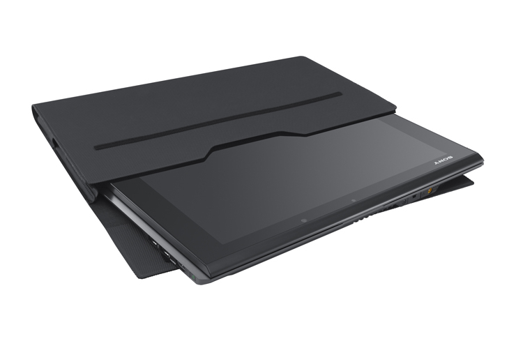
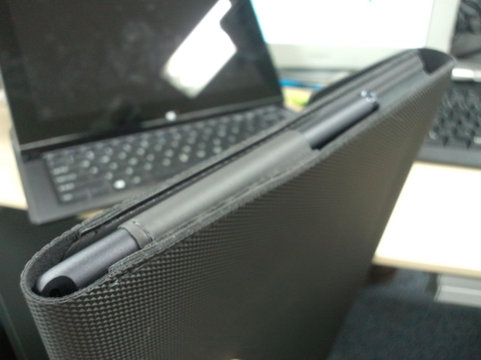

<a href="http://pur.store.sony.jp/Qnavi/Product/VGP-CK1/">&#x30BD;&#x30CB;&#x30FC;&#x30B9;&#x30C8;&#x30A2; VGP-CK1&#x306E;&#x5546;&#x54C1;&#x8AAC;&#x660E; | &#x30D1;&#x30FC;&#x30BD;&#x30CA;&#x30EB;&#x30B3;&#x30F3;&#x30D4;&#x30E5;&#x30FC;&#x30BF;&#x95A2;&#x9023;&#x5546;&#x54C1;</a> を購入した。本体を購入した時のクーポンを使って、3,600円弱で入手。

前後はピッタリ<a href="#f1" name="fn1" title="多少隙間はあるけど許容範囲">*1</a>で質感もいいんだけど、正直、耐衝撃能力については疑問。クッションの類は一つもない。その割には左右に余裕がある。液晶画面を露出したままカバンに突っ込むよりは安心できるけれど、落としたり、満員電車で圧迫された時にはどうなるんだろう。ほとんどケースをつけている意味はないんじゃないか。

あと、指紋でベタベタになりがちな液晶画面を吹くために、布を1枚、一緒に収納したかったのだけどポケットの一つすらもない。

このキャリングケースを作った人は、何を考えて設計したのだろうか。

まぁ、そんなことは承知の上。それでも購入したのは、スタイラスを収納できるところがほしかったからだ。そうでもしないと、自分のことだから必ず失くす。

<a href="http://pur.store.sony.jp/Qnavi/Product/VGP-STD1_B/">&#x30BD;&#x30CB;&#x30FC;&#x30B9;&#x30C8;&#x30A2; VGP-STD1/B&#x306E;&#x5546;&#x54C1;&#x8AAC;&#x660E; | &#x30D1;&#x30FC;&#x30BD;&#x30CA;&#x30EB;&#x30B3;&#x30F3;&#x30D4;&#x30E5;&#x30FC;&#x30BF;&#x95A2;&#x9023;&#x5546;&#x54C1;</a>

なんてったって、このペンは4,980円もする。ペンを買いなおせば、4,980円×2本の損害だ。それに比べれば、ケースなど安い。

あと、会社においておくためのACアダプターがほしいのだけれど、買うかどうか悩んでいる。

<a href="http://pur.store.sony.jp/Qnavi/Purchase/VGP-AC10V7/">&#x30BD;&#x30CB;&#x30FC;&#x30B9;&#x30C8;&#x30A2; VGP-AC10V7&#x306E;&#x5546;&#x54C1;&#x8CFC;&#x5165; | &#x30D1;&#x30FC;&#x30BD;&#x30CA;&#x30EB;&#x30B3;&#x30F3;&#x30D4;&#x30E5;&#x30FC;&#x30BF;&#x95A2;&#x9023;&#x5546;&#x54C1;</a>

なんせ、8,900円もするのだ。いかに独自のノイズ対策を工夫しているといえど、ちょっと高すぎるのではないか。

まぁ、いずれ買うんだろうけどさ。

<a href="#fn1" name="f1" class="footnote-number">*1</a>:多少隙間はあるけど許容範囲

