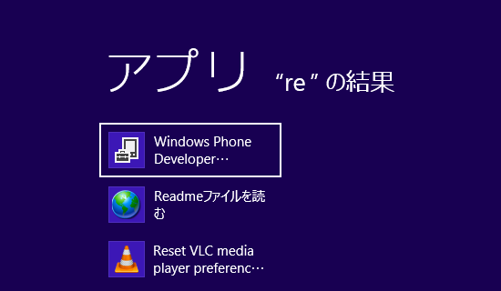
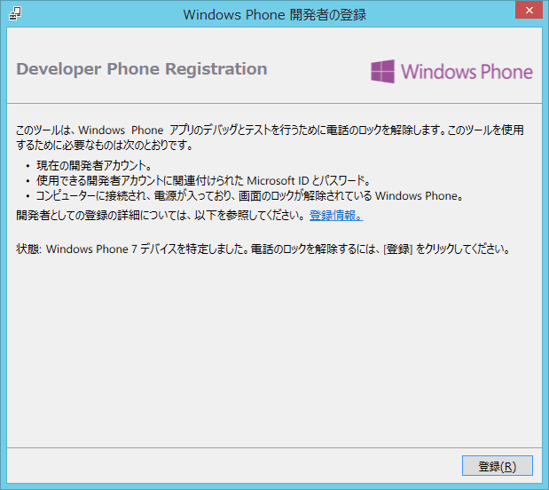
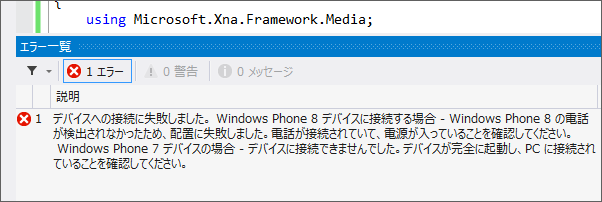

全然難しくなくて、SDK に同梱されている Windows Phone Developer Registration というツールを利用するだけ。

［Windows］キーを押して、適当に“Reg”とでも入力すれば検索に引っかかるので、それを起動し……

［登録］ボタンを押す。端末は PC に接続した状態で、ロックを解除しておくこと。あとは開発者登録を行った <del>Windows Live</del> Microsoft アカウントでログインすればいい。

Windows Phone 8 だったらこの作業は要らないのかな？　まぁ、日本では Windows Phone 8 端末そのものが売ってないから、どうでもいいんだけど。

