

<h3>Windows 95（Windows 4.0、1995～2001）</h3>

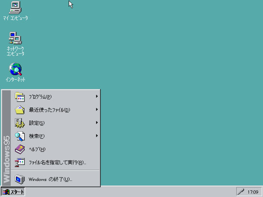

Windows に［スタート］ボタンが追加されたのは、Windows 95 からであるらしい。懐かしいなぁ……このときはまだ中学生だか高校生だかで、自分のパソコンなんてもってなかった。

当時は Mac ユーザーに「OSを終了するのにスタートボタンを押さなきゃならないだなんてｗｗｗ」などと言われていたよね。これは結局、Windows Vista になるまで続いた<a href="#f-8a7b732d" name="fn-8a7b732d" title="設定次第では“スタート”という文字を表示させることもできる">*1</a>。

<blockquote cite="http://homepage1.nifty.com/kazubon/progdoc/tclock/taskbarhistory.html">

初期のWindows95/NT4のスタートメニューは、ただのポップアップメニューでした。オーナードローのメニューで「Windows95」の文字やアイコンを描画しているだけです。

<cite><a href="http://homepage1.nifty.com/kazubon/progdoc/tclock/taskbarhistory.html">http://homepage1.nifty.com/kazubon/progdoc/tclock/taskbarhistory.html</a></cite>
</blockquote>

当初は非常にシンプルな構造をしていたが、Internet Explorer 4.0 のシェル統合（OSR 2.5）により内部構造がだいぶ変わっている<a href="#f-e483f876" name="fn-e483f876" title="IE が OS と再び分離可能になるのは Internet Explorer 8 を待たなければならない">*2</a>。

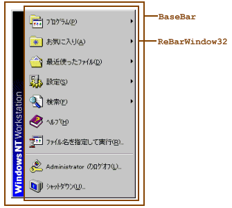 

<pre class="code" data-lang="" data-unlink>  BaseBar
+- ReBarWindow32
+- SysPager
+- ToolbarWindow32</pre>
<blockquote cite="http://homepage1.nifty.com/kazubon/progdoc/tclock/taskbarhistory.html">

IE 4の新しいシェルでは、スタートメニューはメニューではなく、BaseBar というクラス名のウィンドウになりました。「Windows 95」や「Windows NT Workstation」などのロゴは、BaseBar の上、ReBarWindow32 の左に描かれます。

<cite><a href="http://homepage1.nifty.com/kazubon/progdoc/tclock/taskbarhistory.html">http://homepage1.nifty.com/kazubon/progdoc/tclock/taskbarhistory.html</a></cite>
</blockquote>

これにより Windows はブラウザーと密接に統合された“インターネットOS”への進化を遂げたが、動作速度の低下とリソース不足、コアまで攻撃が貫通する甘いセキュリティ、ブラウザーをバンドルしたことに対する独占禁止法違反と戦わねばならなくなった。これはまた別の話。

<h3>Windows 98（Windows 4.1、1998～2006）</h3>

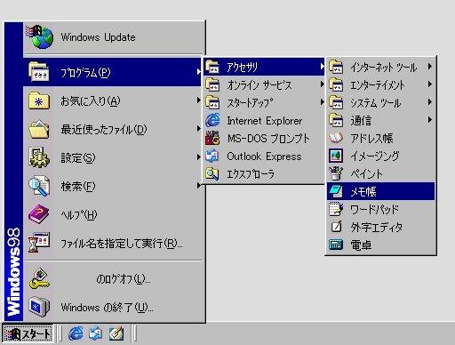

Windows 95 とあまり違いはない。Windows Update が一番上に鎮座しているのと、ログオフのためのメニュー項目が追加されているのが目につくぐらい。[スタート]メニューには直接関係がないが、［クイック起動］ツールバーが搭載されたのもこのバージョンなのか。

<blockquote cite="http://ja.wikipedia.org/wiki/Microsoft_Windows_98">

Windows 95と一線を画している特徴の一つとして、スタートメニューもドラッグアンドドロップの対象となった点が挙げられる。また日本語版では、システムフォントとして全角のひらがなとカタカナの文字の横幅が小さくなった「MS UI ゴシック」が新たに導入されたことに伴い、ウインドウのメニューバーなどに使用されていた半角カナが全角カナに統一された。

<cite><a href="http://ja.wikipedia.org/wiki/Microsoft_Windows_98">Microsoft Windows 98 - Wikipedia</a></cite>
</blockquote>

当時としてはメニュー左側の帯にグラデーションが施されているのがカッコよく、オーナードローによってこれを実現する TIPS が流行ったりしていた。

内部構造は Windows 95＋IE 4 時代を踏襲。

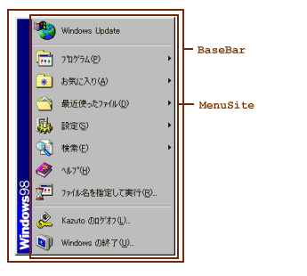 

<pre class="code" data-lang="" data-unlink>  BaseBar
+- MenuSite
+- SysPager
|    +- ToolbarWindow32
+- ToolbarWindow32</pre>
<blockquote cite="http://homepage1.nifty.com/kazubon/progdoc/tclock/taskbarhistory.html">

Windows 98（IE 5）のスタートメニューは、IE 4のスタートメニューと同じく、クラス名が BaseBar のウィンドウです。ただし、子ウィンドウの ReBarWindow32 が MenuSite に置き換わっています。Windows XPクラシックまで、この構成は同じです。

<cite><a href="http://homepage1.nifty.com/kazubon/progdoc/tclock/taskbarhistory.html">http://homepage1.nifty.com/kazubon/progdoc/tclock/taskbarhistory.html</a></cite>
</blockquote>

<h3>Windows Millennium Edition（Windows 4.9、2000～2006）</h3>

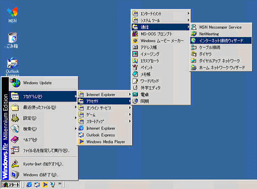 

<h3>Windows 2000（Windows 5.0、2000～2010）</h3>

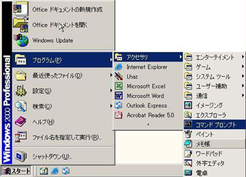

Windows 2000 では、使用頻度の低い項目を非表示にする<del>お節介な</del>機能が追加された。また、［ログオフ］メニューが消えたけれど、これは設定画面から復活させることができる。

<h3>Windows XP（Windows 5.1、2001～）</h3>

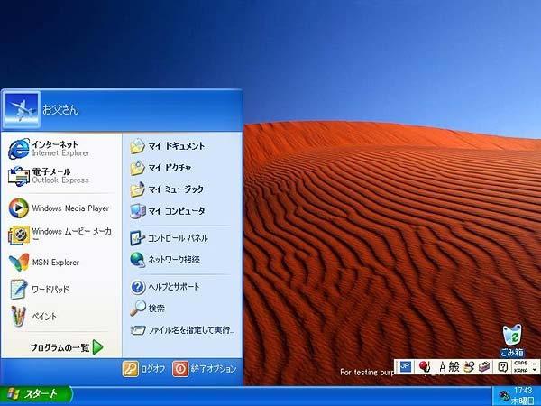

スタートメニュー史上における大きな転換点の一つ。

<ul>
<li>“使用頻度の高いものをアクセスしやすいところに配置する”</li>
<li>スタートメニュー≒ポップアップアップメニューという常識を破壊</li>
</ul>
できる機能をユーザーインターフェイスとして提供するのではなく、やってほしい機能・使うであろう機能をユーザーインターフェイスとして提供する方向へ舵を切った。

ところが“Luna”インターフェイスがキモすぎて、クラシック［スタート］メニューへ戻す人が続出（今でもそれが粋だと勘違いしてこだわる人多し）。こちらのほうの内部構造は Windows 2000 と同じ。

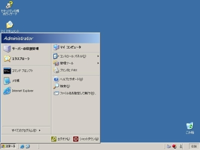

慣れ親しんだ“クラシック”テーマへ戻すことに留めて、スタートメニューそのものは新しいものを使うのが賢い。

一方、その新しいスタートメニューだが、内部構造ががらりと変わっている。

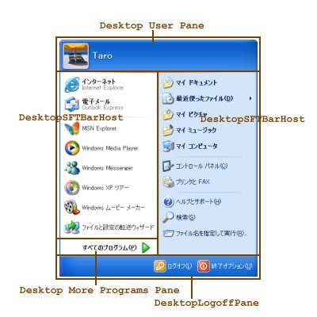 

<pre class="code" data-lang="" data-unlink>DV2ControlHost                    スタートメニュー
|- Desktop User Pane                 メニュー上部
|    +- Static
|- DesktopSFTBarHost                 メニュー左部
|    +- SysListView32
|         +- SysListView32
|- Desktop More Programs Pane        「すべてのプログラム」の部分
|    +- Button
|- DesktopSFTBarHost                 メニュー右部
|    +- SysListView32
|         +- SysListView32
+- DesktopLogoffPane                 メニュー下部
+- ToolbarWindow32</pre>
<blockquote cite="http://homepage1.nifty.com/kazubon/progdoc/tclock/taskbarhistory.html">

Windows XPの新しいスタートメニューは、DV2ControlHost というクラス名のウィンドウです。このスタートメニューは、5つの子ウィンドウを持ちます。

<cite><a href="http://homepage1.nifty.com/kazubon/progdoc/tclock/taskbarhistory.html">http://homepage1.nifty.com/kazubon/progdoc/tclock/taskbarhistory.html</a></cite>
</blockquote>

かなり複雑になった。個人的には“<b>スタートウィンドウ</b>”と呼びたい。

<h3>Windows Vista（Windows 6.0、2006～2012）</h3>

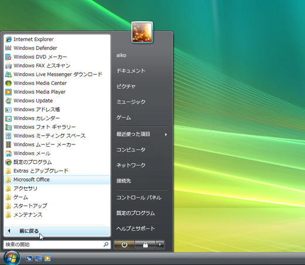

なんといっても検索できるようになったのが偉い。

これだけでも Windows XP から Windows Vista へアップグレードする価値があるが、当時のスペックでは検索のためのインデックスを作る処理がちょっと重かった。あと、マウスオペレーションしかできない“自称”上級者が盛んに中傷したこともあり、いまだに利便性が十分訴求されていない。

また、“すべてのプログラム”がメニューからツリーになった。メニューが横方向にグダグダと伸びることがなくなり、マウスの移動距離がかなり短縮されたほか、ふとしたミス操作で長々と開いたメニューが消えるという事故も減った。とはいえ、昔の操作を懐かしむ人は一定数いるようだが。

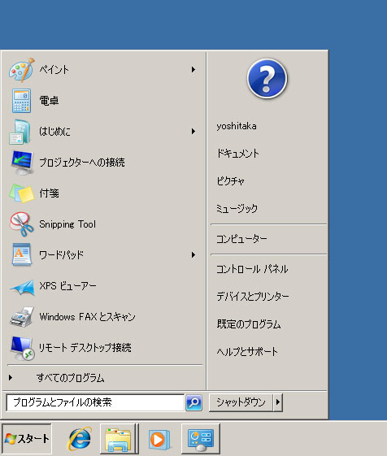

一方、“クラシック”テーマのスタートメニューは無残に。“Aero”は“Luna”よりも断然カッコいいため、“クラシック”テーマに戻す人はこれを機に激減した。

［スタート］ボタンからとうとう「スタート」という文字が消えたのもこのバージョンから。“クラシック”テーマを復活させた場合にだけ［スタート］という文字が現れるが、これは“回顧厨”への配慮だ。

<h3>Windows 7 （Windows 6.1、2009～）</h3>

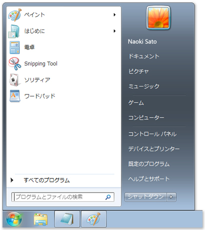

基本的な部分は Windows Vista を踏襲。ユーザーアイコンがメニューから飛び出さなくなったり、シャットダウンボタンのデザインが変わったり、“最近利用したファイル”が消えたりした程度。

Windows 95 から続いてきたクラッシックなポップアップタイプのスタートメニューは削除された。

<h3>Windows 8（Windows 6.2、2012～）</h3>

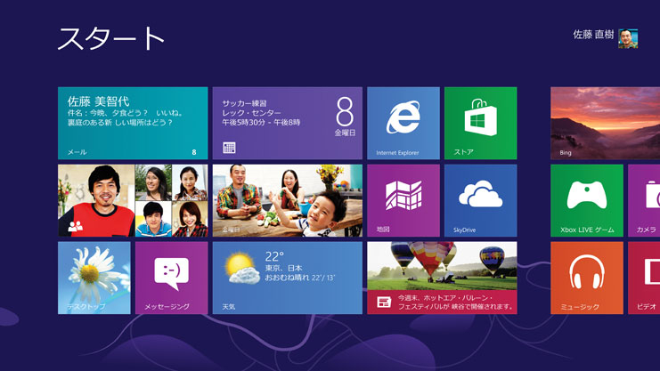

［スタート］ボタンに死が与えられた。［Windows］キーがないキーボードを使っている人は、キーボードを買い換えよう。

デザインのほうは、スタートメニュー → スタートウィンドウ と進化した流れを踏襲して、とうとう全画面を占拠する“<b>スタートスクリーン</b>”へ。

高解像度モニターが一般的になってきたのに、左下で細々とスタートウィンドウを小さなイジるのはナンセンス、というわけなのだろう。それにしても、スタートスクリーンを新しいタッチファースト・アプリケーションのプラットフォームにしてしまうとは大胆だ（コケなけりゃいいんだけど）。

一方、Windows ガジェットは役目を終えて殺された。Windows ガジェットは、もともとシングルタスクで涙目だった旧 Mac で苦肉の策として導入されたシステムを「カッコいい」と勘違いして導入したものだけど、邪魔になることこそあれ、便利なものはそれほど多くはなかった。

検索については、過去に言及した（<a href="https://blog.daruyanagi.jp/entry/2012/06/06/204210">Metro &#x30C7;&#x30B9;&#x30AF;&#x30C8;&#x30C3;&#x30D7;&#x306F;&#x3067;&#x3063;&#x304B;&#x3044;&#x30B9;&#x30BF;&#x30FC;&#x30C8;&#x30E1;&#x30CB;&#x30E5;&#x30FC;&#x3002;&#x6B7B;&#x3093;&#x3060;&#x306E;&#x306F;&#x30B9;&#x30BF;&#x30FC;&#x30C8;&#x30E1;&#x30CB;&#x30E5;&#x30FC;&#x3067;&#x306F;&#x306A;&#x304F;&#x30DE;&#x30A6;&#x30B9;&#x3002; - &#x3060;&#x308B;&#x308D;&#x3050;</a>）。

こうやって並べてみると、Windows 8 の“スタートスクリーン”には（マルクス的なｗ）必然性があるようにも思える<a href="#f-2402b8dd" name="fn-2402b8dd" title="が、そうやって感じられる“必然性”の多くは後付であり、単なる進化の経路依存であるに過ぎない">*3</a>。

<a href="#fn-8a7b732d" name="f-8a7b732d" class="footnote-number">*1</a>:設定次第では“スタート”という文字を表示させることもできる

<a href="#fn-e483f876" name="f-e483f876" class="footnote-number">*2</a>:IE が OS と再び分離可能になるのは Internet Explorer 8 を待たなければならない

<a href="#fn-2402b8dd" name="f-2402b8dd" class="footnote-number">*3</a>:が、そうやって感じられる“必然性”の多くは後付であり、単なる進化の経路依存であるに過ぎない

