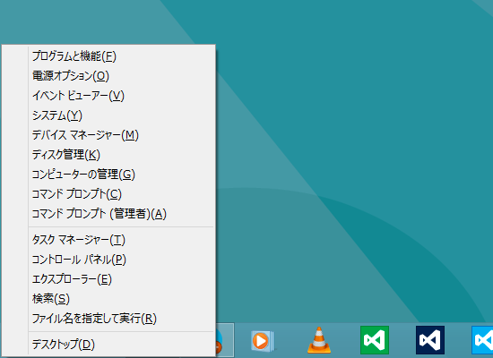
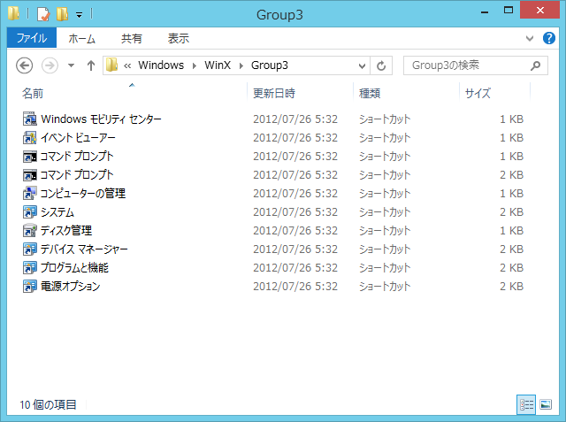
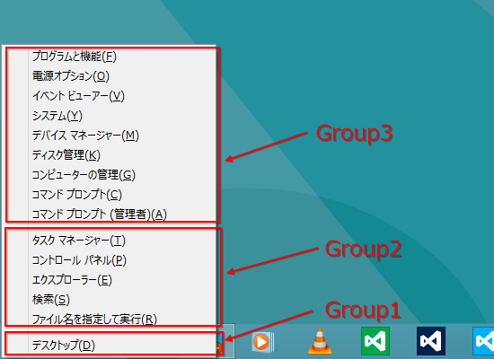
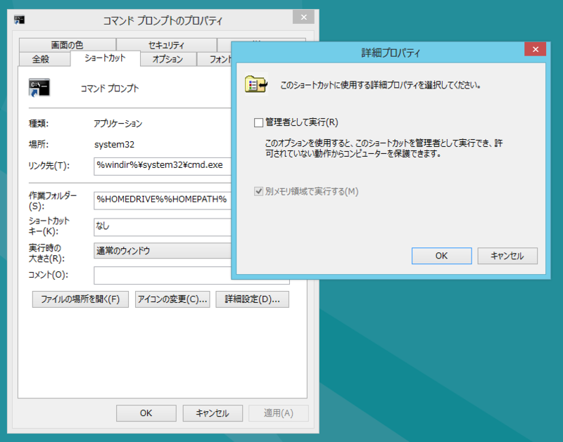
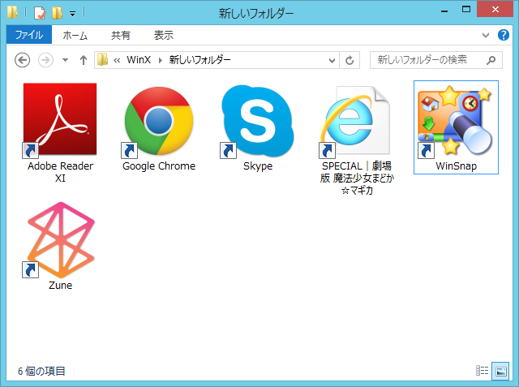
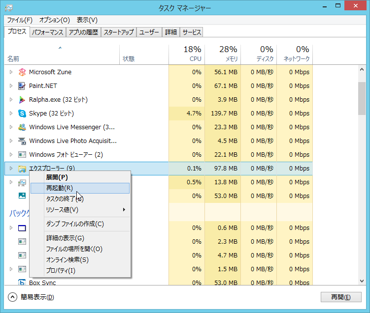

<h3>基本的な仕組み</h3>

［Windows］＋［X］キーで利用できる Windows 8 の管理メニューの構成は、

<pre class="code" data-unlink>%LocalAppData%\Microsoft\Windows\WinX</pre>
に保存されている。

単にフォルダ分けして、ショートカットファイルが収められているだけなので、簡単にカスタマイズできる……ように見える（後述）。

ショートカットファイルをフォルダ分けしておくと、メニューが表示されるときにスプリッタ―で分割されるので、多少見やすくなる。「Group*」という命名規則に従う必要は必ずしもないようだが、もしかしたら表示順序などには関係するのかもしれない。従っておいたほうが無難だと思う。

<h4>寄り道</h4>

ここで少し気になるのは、コマンドプロンプトのショートカットファイルが2種類あることだろう。この違いは管理者権限の有無だ。

これはショートカットファイルの［詳細設定］で変更できる。ちょっと階層が深い……。

<h3>メニュー項目をカスタマイズしてみる</h3>

とりあえずデスクトップに転がっていたショートカットファイルを「新しいフォルダー」に突っ込んでみた。

これだけだと何も起こらないので、エクスプローラーを再起動してみる。

すると、スプリッタ―だけが追加された。メニュー項目は追加されない。

<blockquote cite="http://www.withinwindows.com/2012/04/04/windows-8-secrets-the-winx-menu-and-its-hashing-algorithm/">

The entries on the menu are driven by shortcut (.lnk) files present in each Group folder located at %LocalAppData%\Microsoft\Windows\WinX. But you can’t manipulate the shortcuts within or add new ones. That’s because at first invocation (e.g. a fresh boot), the menu scans for and only adds approved shortcuts.

<cite><a href="http://www.withinwindows.com/2012/04/04/windows-8-secrets-the-winx-menu-and-its-hashing-algorithm/">Windows 8 Secrets: The WinX Menu and its hashing algorithm Within Windows</a></cite>
</blockquote>

どうやら管理メニューが最初に呼び出されるときに、ショートカットファイルをスキャンして“承認された”ものであるかどうかチェックが入るようだ。

“承認された”ショートカットファイルを作成するには、

<ul>
<li>The link’s target application path/file (e.g. C:\Games\Minecraft.exe)</li>
<li>The link’s target application arguments (e.g. –windowed)</li>
</ul>
これらのハッシュをとって、ショートカットファイルの特定のデータチャンクへ埋め込まなければならない。

<ul>
<li><a href="http://msdn.microsoft.com/en-us/library/dd871305(v=prot.20).aspx">[MS-SHLLINK]: Shell Link (.LNK) Binary File Format</a></li>
</ul>
ショートカットファイルの構造って結構メンドイのな……。うはぁ、めんどくさい！

<h3>まとめ</h3>

“WinX”フォルダーを編集すれば、［Windows］＋［X］メニューはカスタマイズできる。ただし、新たにショートカットファイルを登録する場合は、ハッシュを埋め込む必要がある。これを簡単なツールが、

<ul>
<li><a href="https://github.com/riverar/hashlnk">riverar/hashlnk &middot; GitHub</a></li>
</ul>
で公開されている。

ショートカットファイルの移動や削除だけならば、比較的簡単に行える。

また、エンドユーザー向けにはとあるロシア人が作ってくれたわかりやすいツールが用意されている。

<ul>
<li><a href="http://www.forest.impress.co.jp/docs/review/20121108_571662.html">&#x7A93;&#x306E;&#x675C; - &#x3010;REVIEW&#x3011;Windows 8&#x306E;&#xFF3B;Windows&#xFF3D;&#xFF0B;&#xFF3B;X&#xFF3D;&#x30E1;&#x30CB;&#x30E5;&#x30FC;&#x3092;&#x81EA;&#x5206;&#x597D;&#x307F;&#x306B;&#x7DE8;&#x96C6;&#x300C;Win+X Menu Editor&#x300D;</a></li>
</ul>
あと、このメニューはユーザーがカスタマイズして利用することがあまり想定されていないようだ。多少悲しいことがあっても、泣いちゃいけない。

