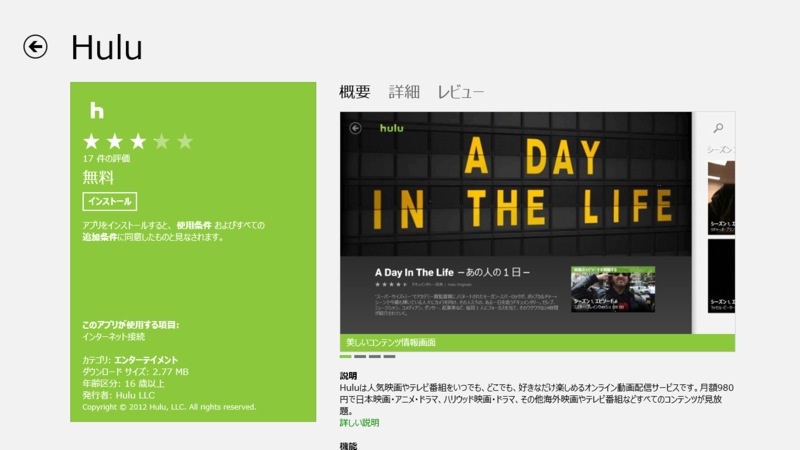

Hulu の Windows ストア アプリが来たよ！　あとは Kinoppy のアプリが来れば……！

ちなみに Hulu というのは月額980円で映画が見放題な Web サービス。海外ドラマなんかが好きな人にはお勧めできるかも。最近はアニメのラインナップも増えてきた。

<ul>
<li><a href="http://www.forest.impress.co.jp/docs/news/20121105_570935.html">&#x7A93;&#x306E;&#x675C; - &#x3010;NEWS&#x3011;&#x30D5;&#x30FC;&#x30EB;&#x30FC;&#x3001;Windows &#x30B9;&#x30C8;&#x30A2;&#x30A2;&#x30D7;&#x30EA;&#x300C;Hulu&#x300D;&#x3092;&#x516C;&#x958B;&#x3002;Windows 8/RT&#x306B;&#x5BFE;&#x5FDC;</a></li>
</ul>
でも、ぶっちゃけ Hulu なんかブラウザーでもみられるよね。わざわざストアアプリにして出す意味があるの？――というわけで、比べてみた。

<h3>Hulu は Metro 版の「Internet Explorer 10」で視聴できない</h3>

Metro 版の「Internet Explorer 10」では、「Adobe Flash Player」のプラグインが利用できる Web サイトが制限されている。そのせいなのか、残念ながら Hulu も利用できない。

もちろん、デスクトップ版の「Internet Explorer 10 for Desktop」ならばみることができる。

ちなみに、

<ul>
<li>「Internet Explorer in the Windows UI」：いわゆる Metro 版</li>
<li>「Internet Explorer for the desktop」：デスクトップで動作する従来版</li>
</ul>
というのが正式名称らしい。まぁ、ここらへんも流動的なのだろうけれど。この混乱、もう米国 Microsoft では収集する気がなさそうだなぁ。

<ul>
<li><a href="http://msdn.microsoft.com/en-us/library/ie/hh771832(v=vs.85).aspx">Internet Explorer 10 on Windows 8 (Internet Explorer)</a></li>
</ul>
というわけで、比較対象は Windows ストア アプリ版「Hulu」と、「Internet Explorer for the desktop」で表示する Web 版「Hulu」の二つとなる。

<h3>プレイヤー</h3>

Windows ストア アプリ版「Hulu」のプレイヤーコントロール。

Web 版「Hulu」のプレイヤーコントロール。

トリミングのサイズは統一してある。

<h4>機能</h4>

Web 版の「Hulu」が圧勝。

まず、Windows ストア アプリ版「Hulu」では動画品質のコントロールができない。これは Web 版にのみ用意されている。

あと、Web 版には動画の再生が終了すると次の動画を自動再生できるのだけど、ストアアプリではできない<a href="#f1" name="fn1" title="続き物であれば、続編がサジェストされるが">*1</a>。

<h4>操作性</h4>

Windows ストア アプリ版「Hulu」のほうがシンプルで、コントロールが大きく、タッチしやすい。そもそもストアアプリはタッチファーストでデザインするのが前提なので、勝って当然というべきか。

検索や共有がチャームから統一的に行えるというのも利点かな。

一方、Web版の「Hulu」は、プレイヤーのコントロール類ひとつをとってもいちいち小さ過ぎる。タッチするたびに動画が一時停止するのもうざい。全画面表示での再生も可能だけど、プレイヤーがフォーカスを失うと全画面モードは解除されてしまう。つまり、チャームを表示するだけでも解除されてしまうわけだ。

まぁ、そんなこんなも、マウス操作であればまったく問題はないのだけど。

<h3>画質</h3>

Windows ストア アプリ版「Hulu」

Web 版「Hulu」

ぶっちゃけ自分は画質音痴なのだけど、それでも Web 版のほうが明らかにキレイであるのはわかる（HD画質）。ストアアプリ版の画質があまりよくないのは、動画品質が調整できない（たとえば強制的に AUTO に設定される）ためか、サービス側が画質を落としているのか、OS 側の問題なのか。比べてみると、色味なんかも違うんだなぁ。

Web 版の画質を落として比較すればよかったけれど、キャプチャーするの忘れてた。まぁ、みんな最高画質でしか見ないでしょう。

<h3>まとめ ―― どっちをつかう？</h3>

Windows RT であれば、ストアアプリを使わなければならないだろう。ブラウザーでは見られないのだから（たぶん）。

Windows 8 であれば、今のところ Web 版を使うのが正解のようだ。ただ、布団でごろごろしながら見るのであれば、タッチ操作が楽なストアアプリを選択したほうがいいように感じる。

<h3>おまけ</h3>

ストアアプリでエラー出るようになってしまった ／(＾o＾)＼

<a href="#fn1" name="f1" class="footnote-number">*1</a>:続き物であれば、続編がサジェストされるが

