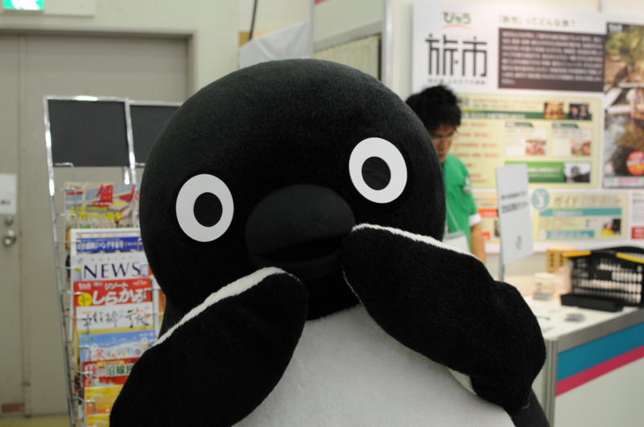
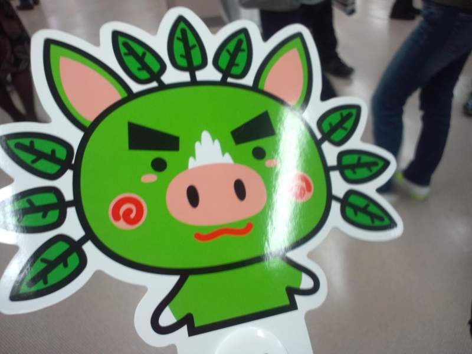
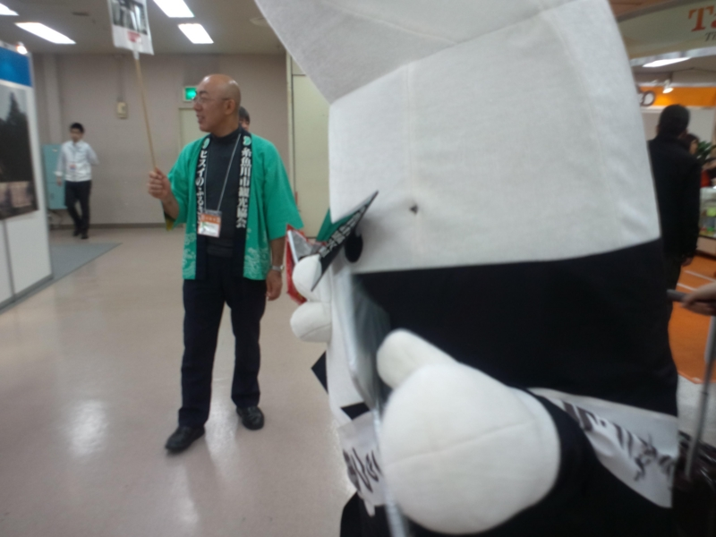
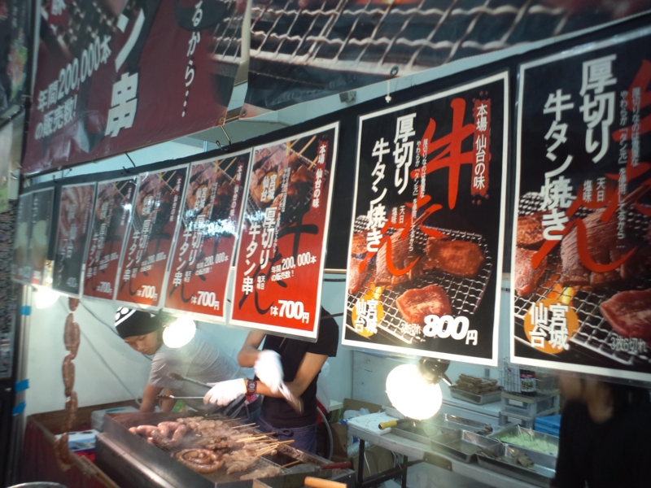
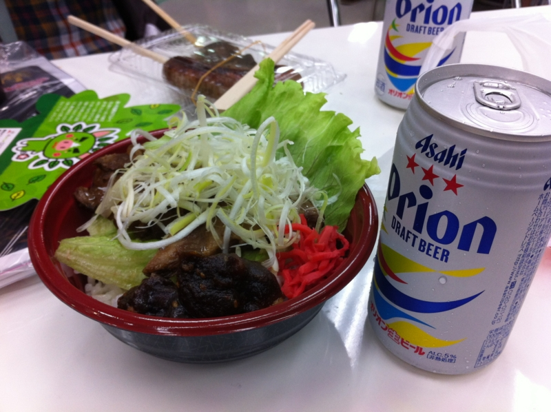
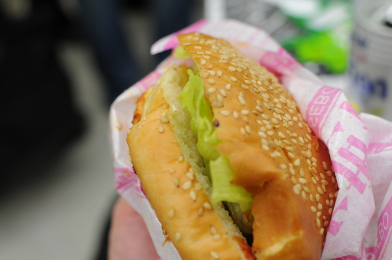
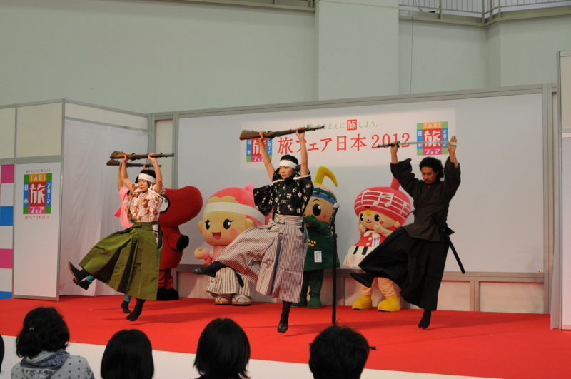

@sunmason と池袋でデートしてきた。途中、街の中で遭難したのでルノアールに避難して迎えに来てもらった。申し訳ない。池袋は昔、大型トラックでガードレールぶっ壊してからあまり近寄りたくない場所になっている。要するに、鬼門なんだ。

それはともかく。今回の目的地はココ。

<ul>
<li><a href="http://www.sunshinecity.co.jp/sunshine/event/e1541.html">&#x30B5;&#x30F3;&#x30B7;&#x30E3;&#x30A4;&#x30F3;&#x30B7;&#x30C6;&#x30A3; &#x30A4;&#x30D9;&#x30F3;&#x30C8;&#xFF5C;&#x65C5;&#x30D5;&#x30A7;&#x30A2;&#x65E5;&#x672C;2012</a></li>
</ul>
なんか観光誘致のためのイベントらしいのですよ。<i>旅する前に、旅しよう</i>みたいな。入場料は 500 円。SUICA などで入場できる仕組みだったのだけど、途中、機械が壊れていたりしてあんまり機能してなさそうだった。

全国のゆるキャラ総動員。最近は増えすぎて、よっぽどインパクトのあるやつしか記憶に残らない。<a href="#f1" name="fn1" title="グラサンに隠れたつぶらな瞳に萌える">*1</a>

あとはごはんですな。

オリオンビール＋ソーキ丼で沖縄っぽい昼食をとる。なんか甘くてちょっとお酒臭い味噌がついているので、それをぐちゃぐちゃにかき混ぜて食べるのだそうな。案外おいしい。

せっかく来たのだからと、佐世保バーガーのハーフも追加。肉汁たっぷりのハンバーグと焼きたての目玉焼きのおかげで、マクドよりは全然おいしい。けれど、ちょっと食べすぎてかなりお腹がやばいことになった。

なんとか席を確保し、出し物を見ながらごはん。今年の大河ドラマは“新島八重（新島襄の奥さん）”らしいです。福島にゆかりのある人らしいですね。

こういうイベントはあまり来たことがないのだけど、近場でやるならまた行きたいかもしれない。旅行かぁ……行きたいところはいっぱいあるんだけど、先立つものがないんだよねぇ。今のところ、国内なら九州（とくに大分）、海外なら台湾に行きたいわん。氷見で寒ブリも食べたいし、弟がしきりに勧める会津にも行ってみたい。

<a href="#fn1" name="f1" class="footnote-number">*1</a>:グラサンに隠れたつぶらな瞳に萌える

