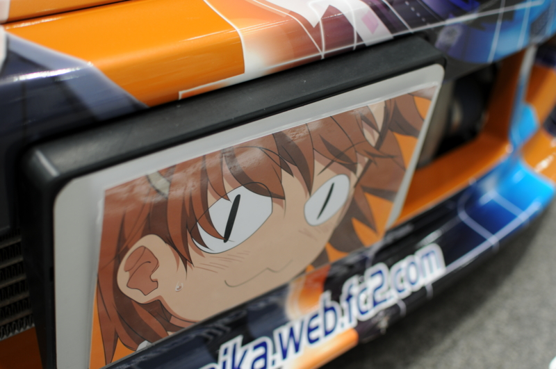
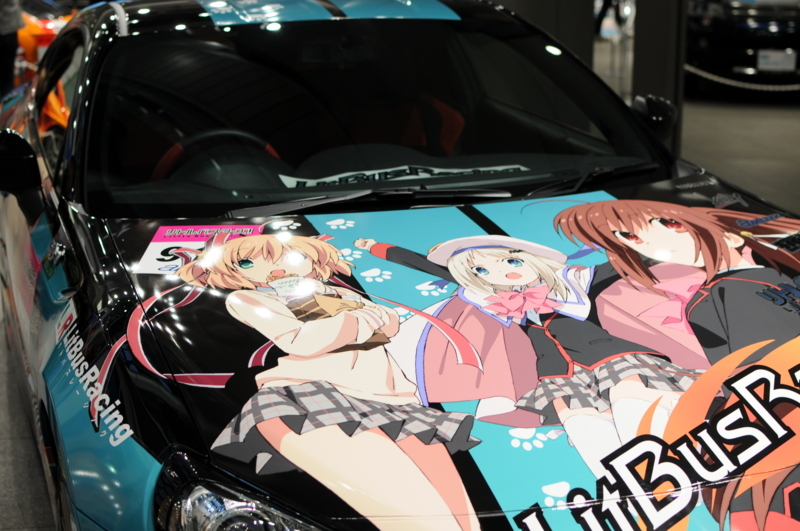
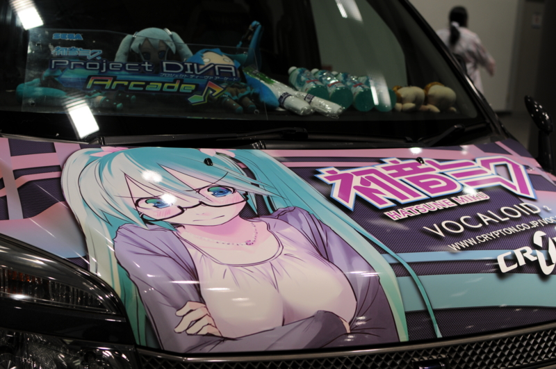
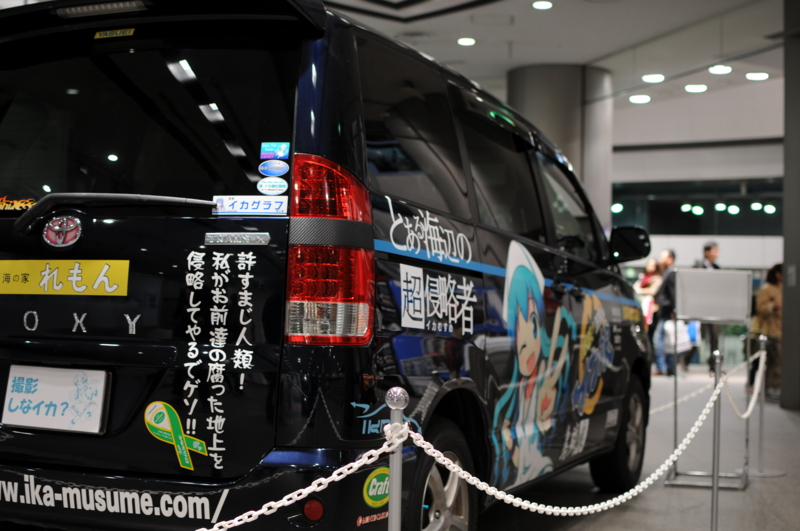
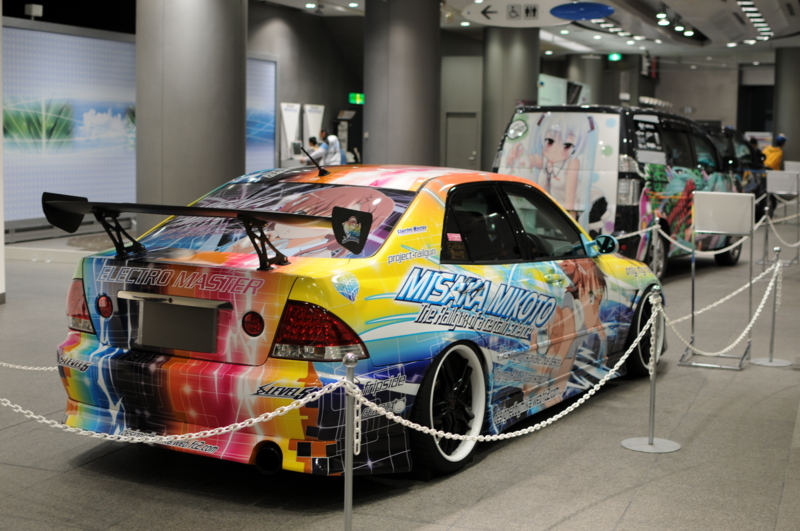
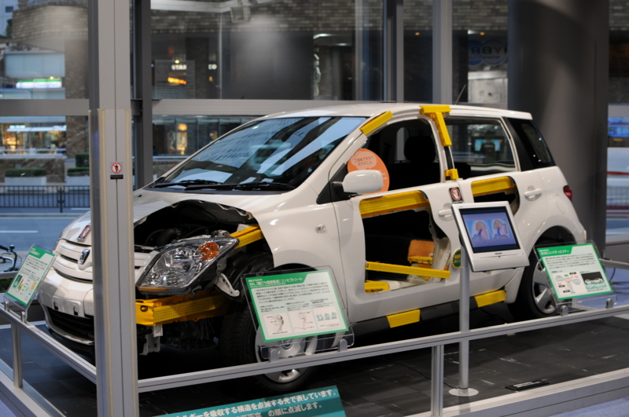

<a href="https://blog.daruyanagi.jp/entry/2012/11/12/233754">&#x65C5;&#x30D5;&#x30A7;&#x30A2;&#x65E5;&#x672C;2012 &#x3068;&#x3044;&#x3046;&#x3082;&#x306E;&#x306B;&#x884C;&#x3063;&#x3066;&#x304D;&#x305F; - &#x3060;&#x308B;&#x308D;&#x3050;</a> の帰りに、痛車が置いてあるのを見かけたので寄ってきた。地理的な位置は聞くな。田舎者だから、なにがどこにあるのかさっぱりわからん。

これは何のアニメだかマンガだかわからん。

ボーカロイドの初音ミクさん。最近は世界的に人気だと聞く。自分は音楽音痴なので、使ったことはないけれど。しかし、いい趣味してるな。可愛いじゃないか。

これは『侵略!イカ娘』のイカちゃん！　イカちゃん可愛い。ファーストシーズンは Hulu で観ることができたはず。

ただ、サイドが「とある～」になっているのはどうよ。愛がブレていると思う。

最後はその「とある～」シリーズの一つ、『とある科学の超電磁砲＜レールガン＞』の御坂美琴さん。あまりラノベには詳しくないのだけれど<a href="#f-d7c2d7ef" name="fn-d7c2d7ef" title="中学の頃にロードス・スレイヤーズを読んで、最近、『狼と香辛料』を古本屋で見つけて何巻か読んだ程度">*1</a>、結構人気あるよねぇ。

もちろん、2F には真面目なクルマも展示してある。

お金があれば、プリウスかオーリスは買ってもいいかなぁ。個人的にはプジョーの 260CC あたりに乗ってみたいけれど、たぶん、買うとすればトヨタ車なんだろう。妹の旦那がトヨタの人だしな。“しがらみ経済”というヤツだ。別に、それ自体は嫌いでないのだけど。

しかし、まぁ、どうなんだろな。

「若者<a href="#f-141337de" name="fn-141337de" title="わしが若者に入るかどうかはさておき">*2</a>のクルマ離れ」なんて言うけれど、実際買ってみれば、クルマだっていいモノなのかもしれない。たとえば最近、友人がワンボックスに乗り換えたりしているのを見ていると、少し羨ましい気がする。そのクルマに対してはまったく羨望を感じないけれど、それが必要になって、買っているという状態に、少しね。自分もいつかそうなるのかねぇ。今のお給料ではそんな気になれないけれどｗ 親の面倒もみなきゃいけないし、個人的にやりたいこともある。

そういうわけもあって、移動手段は当分、バイクでいい。<i>タイヤなんぞ四つも要らねぇ、二本あれば十分！</i>次の更新でゴールド免許なので、安全第一で行きたいですね。

<a href="#fn-d7c2d7ef" name="f-d7c2d7ef" class="footnote-number">*1</a>:中学の頃にロードス・スレイヤーズを読んで、最近、『狼と香辛料』を古本屋で見つけて何巻か読んだ程度

<a href="#fn-141337de" name="f-141337de" class="footnote-number">*2</a>:わしが若者に入るかどうかはさておき

