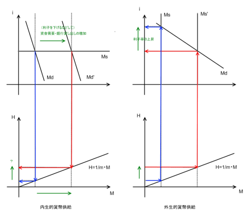

<h3>ハイパワードマネー（high-powered money）/ マネタリーベース（monetary base）</h3>

中央銀行が市場へ供給する現金。市場流通資金のうち、中央銀行が直接コントロールできる部分。基礎通貨（base money）。

<ol>
<li>民間銀行への貸し出し</li>
<li>公開市場でのオペレーション</li>
<li>政府短期証券の購入</li>
</ol>
<blockquote cite="http://www.boj.or.jp/type/exp/stat/faqbase.htm">

各種金融統計の位置付けや定義などを体系的に取りまとめたIMF金融統計マニュアルでは、マネタリーベースの基本概念について「中央銀行および政府の通貨性負債」であり、「通貨、信用を増加させる基礎となる金融手段」と位置づけています。

<cite><a href="http://www.boj.or.jp/type/exp/stat/faqbase.htm">&#x65E5;&#x672C;&#x9280;&#x884C;&#xFF1A;&#x30DA;&#x30FC;&#x30B8;&#x3092;&#x8868;&#x793A;&#x3059;&#x308B;&#x3053;&#x3068;&#x304C;&#x3067;&#x304D;&#x307E;&#x305B;&#x3093;&#x3067;&#x3057;&#x305F; Bank of Japan:Page cannot be displayed.</a></cite>
</blockquote>

日本の場合、

<ul>
<li>日本銀行券発行高（76兆8,977億円）</li>
<li>通貨流通高（4兆5,237億円）</li>
<li>日銀当座預金（22兆1500億円）</li>
</ul>
の合計。（2009年3月末）

<h3>信用乗数 / 貨幣乗数</h3>

 

<dl>
<dt>H（Hi-powered Money）</dt>
<dd>ハイパワードマネー</dd>
<dt>M（Money Supply）</dt>
<dd>マネーサプライ</dd>
<dt>C（Currency）</dt>
<dd>市中に出回っている（非金融機関によって保持されている）現金</dd>
<dt>D（Deposit）</dt>
<dd>預金残高</dd>
<dt>R（Reserve）</dt>
<dd>預金支払いのための準備金</dd>
</dl>
<blockquote cite="http://ja.wikipedia.org/wiki/%E3%83%9E%E3%83%8D%E3%83%BC%E3%82%B5%E3%83%97%E3%83%A9%E3%82%A4">

マネーサプライ（money supply、通貨供給量）とは金融機関と中央政府を除いた経済主体（一般法人、個人、地方公共団体等）が保有する通貨の合計として定義される。金融商品のうちで通貨としての機能を持つものの範囲、金融機関とみなす通貨発行主体の範囲については単純に決められず、幾つかの指標が作られている。

<cite><a href="http://ja.wikipedia.org/wiki/%E3%83%9E%E3%83%8D%E3%83%BC%E3%82%B5%E3%83%97%E3%83%A9%E3%82%A4">&#x30DE;&#x30CD;&#x30FC;&#x30B5;&#x30D7;&#x30E9;&#x30A4; - Wikipedia</a></cite>
</blockquote>

<dl>
<dt>γ（＝C/D）</dt>
<dd>現金通貨の預金通貨に対する比率</dd>
<dt>δ（=R/D）</dt>
<dd>預金残高に対する支払準備金の比率（準備率）</dd>
<dt>m（>1）</dt>
<dd>信用乗数（貨幣乗数）</dd>
</dl>
 

信用乗数m が一定であれば、マネーサプライM とハイパワードマネーH は1:1で対応するので、中央銀行はHを操作することでMを決定することができる。しかし、Mの大部分を占める預金量を決定するのは、実際には民間金融機関の貸し出しである。Hが先なのか（外生説）、Mが先なのか（内生説）。

<h3>内生的貨幣供給・外生的貨幣供給</h3>

<h3>内生的貨幣供給</h3>

 
貨幣は経済の貨幣需要に応じて内生的に供給される。真正手形学説（J.ロー）、銀行学派（J.S.ミル）、ポスト・ケインジアン等に見られる。

<ul>
<li>利子率は外生変数</li>
<li>水平な貨幣供給直線</li>
</ul>

<h3>外生的貨幣供給</h3>

貨幣数量説の長期（～中期）中立命題をコアとする。マネタリスト（M.フリードマン）が代表的。

<ul>
<li>利子率は内生変数</li>
<li>垂直な貨幣供給直線</li>
</ul>

