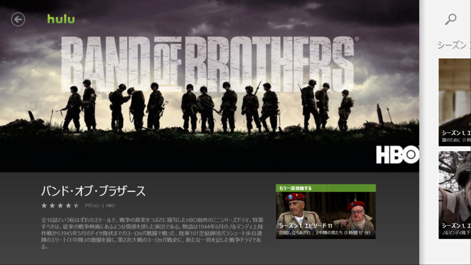

風邪ひいてぶっ倒れていた。本を読む気にもならない。こういうときに、Hulu はよろしい。ツタヤに行かなくても腐るほど映画があるしな。今回はかねてから観たいと思っていたけど、なかなかチャンスのなかった『バンド・オブ・ブラザーズ』を観た。まぁ、映画じゃなくて「テレビ」ドラマなんだけど。アメリカってすげえなぁ……ドラマ1本ですら、『プライベート・ライアン』並の迫力と規模だよ。

本作は、第二次世界大戦のヨーロッパ戦線における、アメリカ陸軍第101空挺師団第506連隊第2大隊E中隊の活躍を描く。空挺というのは、要はパラシュート部隊だね。ノルマンディーでは、主力が上陸する<a href="#f1" name="fn1" title="『プライベート・ライアン』の冒頭部分では、こちらの様子が描かれていた">*1</a>際、ドイツの防御陣地の中に飛び降りて、内部から長距離砲を破壊したりしていたみたい。

ノルマンディーでの降下作戦は夜に行われる。乗ってる輸送機が高射砲でガンガン落とされるし、パラシュートに火がついてるし、そこらじゅう大小口径の鉛玉が飛び交っている。戦場の混乱の中で、半島中に「ばら撒かれた」降下兵。体重並の重武装は降下時の衝撃で吹っ飛び、たとえ無事に降りられたとしても周りには味方がおらず、手にはナイフ一本しかないというのがザラだったようだ。わしだったら、10回ぐらい死んでる気がする。

そこからも苦難がてんこ盛りなのだけど、それは実際に観てくださいって感じ。

それにしてもビックリなのは、このドラマが「事実」を描いていること。毎回、冒頭に爺さんのインタビューが挿入されるのだけど、この爺さんたちが作中のウィンターズ少佐だったり、スピアーズ少尉だったりするんだよね<a href="#f2" name="fn2" title="誰が誰なのかは、番外編の11話で明らかにされる">*2</a>。実名なんだ。無論、脚色はあるだろうし、米軍兵の視点からの描写にはなっているのだろうけど、ちゃんと「事実」が再現されている。

話自体は一話完結タイプなので、少しずつ見ても、途中でスジが分からなくなって投げ出すことはないと思う。ただ、サブタイトルの和訳は全然イケてないと思った。

<h3>おまけ</h3>

この［パスワード］っていうボタン、なんなんだろ、って思ったら……

［ピン留め］のことでした！　なんという誤訳（？）

<a href="#fn1" name="f1" class="footnote-number">*1</a>:『プライベート・ライアン』の冒頭部分では、こちらの様子が描かれていた

<a href="#fn2" name="f2" class="footnote-number">*2</a>:誰が誰なのかは、番外編の11話で明らかにされる

