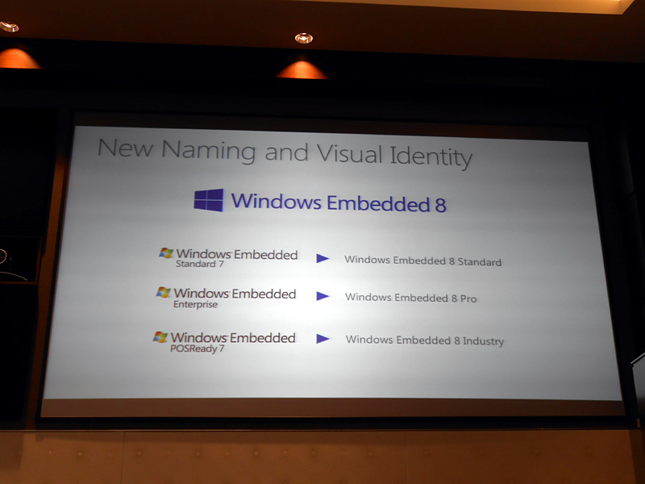

<blockquote cite="http://pc.watch.impress.co.jp/docs/news/20121115_573155.html">

米Microsoftは13日(現地時間)、Windows Embedded 8シリーズのラインナップ、および各々の提供時期を公開した。

<cite><a href="http://pc.watch.impress.co.jp/docs/news/20121115_573155.html">&#x3010;PC Watch&#x3011; Microsoft&#x3001;Windows Embedded 8&#x30B7;&#x30EA;&#x30FC;&#x30BA;&#x3092;2013&#x5E74;3&#x6708;&#x306B;&#x63D0;&#x4F9B;&#x958B;&#x59CB;</a></cite>
</blockquote>

ここら辺はだいぶ疎いのでまとめてみた。

<h3>Windows 8 ベース</h3>

<ul>
<li><b>「Windows Embedded 8 Standard」</b>（旧「Windows Embedded 7 Standard」）</li>
<li><b>「Windows Embedded 8 Pro」</b>（旧「Windows 7 for Embedded Systems」）</li>
<li><b>「Windows Embedded 8 Industry」</b>（旧「Windows Embedded POSReady」＋製造業やヘルスケア企業向け）</li>
</ul>

<h3>Windows Phone 8 ベース</h3>

<ul>
<li><b>「Windows Embedded 8 Handheld」</b>：郵便などの運送業者が使うハンディ端末への組み込みを想定</li>
<li><b>「Windows Embedded 8 Automotive」</b>：自動車向け</li>
</ul>
「Windows Embedded 8 Automotive」は、別に Windows Phone 8 ベースではないかもしれない。文脈的にそうとっただけ。

デスクトップやモバイルしか知らないと「Silverlight は衰退？」だなんて思っちゃうひともいるけれど、こっちの分野では組み込み Silverlight なんてのもあるよね（C++ が使えたんじゃないかな）。まぁ、Silverlight と言っても、僕らが想像するデスクトップ・ブラウザ向けとは全然違うものなのかもしれないけれど。

<h3>Windows CE ベース</h3>

<ul>
<li><b>「Windows Embedded Compact 2013」</b></li>
</ul>
<blockquote>

タッチやジェスチャーベースの入力、厳密なリアルタイム処理を必要とする小型デバイスをサポートする。2013年第四半期に提供開始

</blockquote>

<a href="https://www.microsoft.com/windowsembedded/ja-jp/windows-embedded.aspx">Windows Embedded | Microsoft &#x306E;Embedded &#x30BD;&#x30EA;&#x30E5;&#x30FC;&#x30B7;&#x30E7;&#x30F3;&#x306E;&#x8A55;&#x4FA1;&#x3068;&#x958B;&#x767A;</a>

「Opera」なんかもそうだけど、「自分たちが親しんでいるものが実は氷山の一角でした」というパターン、結構ある。

