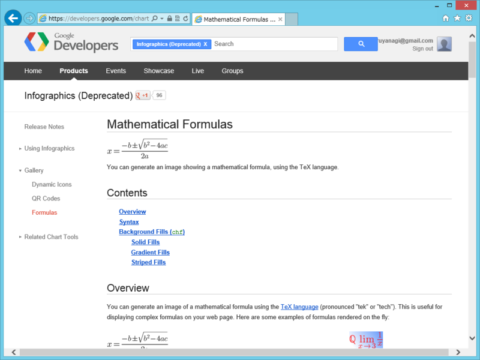
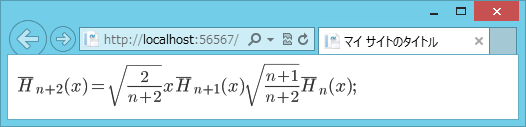

まず考えられる方法は <a href="https://developers.google.com/chart/?hl=ja">Google Chart Tools &mdash; Google Developers</a> を利用することです。TeX の数式を画像ファイルに変換してくれます。

<ul>
<li><a href="https://developers.google.com/chart/infographics/docs/formulas">Mathematical Formulas - Infographics (Deprecated) &mdash; Google Developers</a></li>
</ul>
Deprecated（非推奨）になっているのが気になりますけれど、まぁ、使えなくなるまで使えばいいんじゃないでしょうか。TeX による数式表現は業界標準（？）でもあるんで、万が一使えなくなってもいろいろ対処法はあるかと。あと、はてな記法でも使えるので覚えておくと使うことがあるかもしれない。

必要なパラメーターは、

<ul>
<li>cht=tx</li>
<li>chl=DATA</li>
</ul>
で、DATA は TeX による数式表現を URL エンコードしたものになります。たとえばこんな感じ。

<pre class="code lang-html" data-lang="html" data-unlink># Default.cshtml

@{

}

&lt;!DOCTYPE html&gt;

&lt;html lang=&quot;ja&quot;&gt;
&lt;head&gt;
        &lt;meta charset=&quot;utf-8&quot; /&gt;
        &lt;title&gt;マイ サイトのタイトル&lt;/title&gt;
        &lt;link href=&quot;~/favicon.ico&quot; rel=&quot;shortcut icon&quot; type=&quot;image/x-icon&quot; /&gt;
    &lt;/head&gt;
&lt;body&gt;
&lt;img src=&quot;http://chart.apis.google.com/chart?cht=tx&amp;chl=@UrlEncode(@&quot;\bar{H}_{n+2}(x) = \sqrt{\frac{2}{n+2}} x \bar{H}_{n+1}(x) \sqrt{\frac{n+1}{n+2}} \bar{H}_n(x)&quot;);&quot; /&gt;
&lt;/body&gt;
&lt;/html&gt;
</pre>
まぁ、 \bar{H}_{n+2}(x) = \sqrt{\frac{2}{n+2}} x \bar{H}_{n+1}(x) \sqrt{\frac{n+1}{n+2}} \bar{H}_n(x) なんてスラスラ書くのは無理だけど、自分の場合、

<ul>
<li>\hoge：文字 hoge の埋め込み（\alpha で α）</li>
<li>\hoge{}：引数をとって hoge る（\sqrt{0} なら √ {0}、\frac{0}{1} なら分数 {0} / {1} ）</li>
<li>^{Hoge}：上付き文字（指数とか）</li>
<li>_{hoge}：下付き文字（添え字とか）</li>
</ul>
の4つだけ覚えている。あとはググる。

<h3>ヘルパー化</h3>

さて、毎回イメージタグを書くのは不毛なので、これをヘルパー化することを考えましょう。たとえばこんな感じ。

<pre class="code lang-html" data-lang="html" data-unlink>#App_Code\GoogleChart.cshtml

@helper Formula(string tex_expression){
const string API = &quot;http://chart.apis.google.com/chart?cht={0}&amp;chl={1}&quot;;
var cht = &quot;tx&quot;;
var chl = HttpUtility.UrlEncode(tex_expression);
&lt;img src=&quot;@string.Format(API, cht, chl)&quot; /&gt;
}
</pre>
使い方はこんな感じ。

<pre class="code lang-html" data-lang="html" data-unlink># Default.cshtml

@{

}

&lt;!DOCTYPE html&gt;

&lt;html lang=&quot;ja&quot;&gt;
&lt;head&gt;
        &lt;meta charset=&quot;utf-8&quot; /&gt;
        &lt;title&gt;マイ サイトのタイトル&lt;/title&gt;
        &lt;link href=&quot;~/favicon.ico&quot; rel=&quot;shortcut icon&quot; type=&quot;image/x-icon&quot; /&gt;
    &lt;/head&gt;
&lt;body&gt;
@GoogleChart.Formula(@&quot;\bar{H}_{n+2}(x) = \sqrt{\frac{2}{n+2}} x \bar{H}_{n+1}(x) \sqrt{\frac{n+1}{n+2}} \bar{H}_n(x)&quot;)
&lt;/body&gt;
&lt;/html&gt;
</pre>

<h3>注意</h3>

リクエストのリミットはとくに決まっていないようですが、250,000/日 を超える場合は chart-api-notifications@google.com に連絡しなければいけないそうです。

