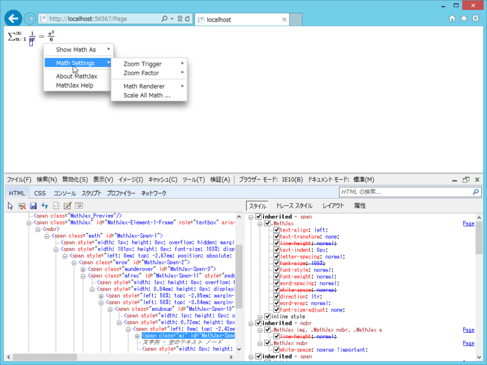

<a href="https://blog.daruyanagi.jp/entry/2012/11/16/042840">WebMatrix &#x3067;&#x6570;&#x5F0F;&#x3092;&#x8868;&#x73FE;&#x3059;&#x308B;&#xFF08;&#xFF11;&#xFF09; - &#x3060;&#x308B;&#x308D;&#x3050;</a> の続き。前回の方法は、Google の気分次第でいつでも廃止されちゃいます。というわけでもう少し調べたところ、MathJax.js という素敵な JavaScript ライブラリがあるそうなので、こっちを使うほうがいいのかも。

<ul>
<li><a href="http://www.mathjax.org/">http://www.mathjax.org/</a></li>
<li><a href="http://genkuroki.web.fc2.com/">MathJax&#x306E;&#x4F7F;&#x3044;&#x65B9;</a></li>
</ul>
たとえばこんな感じ。

 

<pre class="code lang-html" data-lang="html" data-unlink># Default.cshtml

@{

}

&lt;!DOCTYPE html&gt;

&lt;html lang=&quot;en&quot;&gt;
&lt;head&gt;
        &lt;meta charset=&quot;utf-8&quot; /&gt;
        &lt;title&gt;&lt;/title&gt;
        &lt;script src=&quot;http://cdn.mathjax.org/mathjax/latest/MathJax.js?config=TeX-AMS_HTML&quot;&gt;
&lt;/script&gt;
    &lt;/head&gt;
&lt;body&gt;
\(\sum_{n=1}^\infty \frac{1}{n^2} = \frac{\pi^2}{6}\)
&lt;/body&gt;
&lt;/html&gt;
</pre>
\(……\) で囲まれた部分が TeX 記法の数式として扱われ、文系人間にも読める形へ変換されます。もはや WebMatrix （ASP.NET Web Page）である必要すらない、とても汎用的な方法ですね！

難点と言えば、複雑怪奇ゲロゲロな HTML タグが吐き出されることと、ちょっと余計な機能が多すぎるかな、といった点でしょうか。ほとんど難癖に近いですけれど。

あと思いつくのは <a href="http://blogs.wankuma.com/pizyumi/archive/2012/05/19/271826.aspx">while(true);</a> のような方法を利用して、サーバー側でレンダリングする方法でしょうか。そっちのほうが WebMatrix とは思いますが、ちょっとめんどくさいですね。

