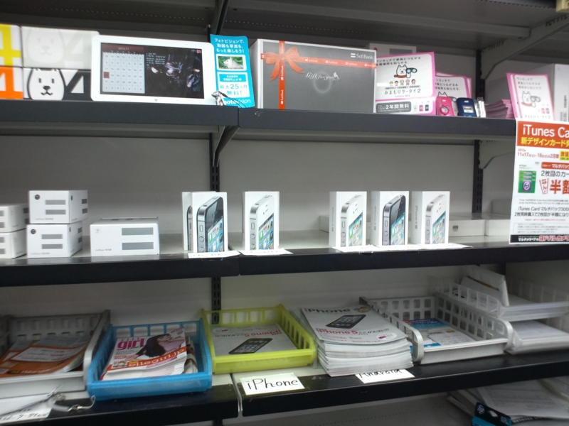
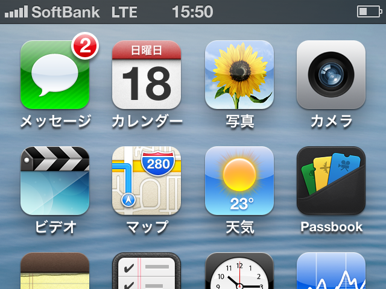

iPhone 4（SBM）を2年間ほど使っていたのだけど、最近はバッテリーもへたり、カメラの起動もなんか遅い。そして何より我慢ならないのは、日本語変換の遅さ。たまに候補が出るまで3秒ぐらいフリーズするし、変換中に力尽きてアルファベットが入力されることすらある。端末を一度初期化したけれどあまり状況は改善されず、そろそろ寿命みたい。

スマートフォンはまだまだ成長過程で、製品サイクルも短い。だからあまり気にならないけれど、2年でほとんどダメになるってちょっとどうなのかと思う。これは iPhone に限らない問題だと思うけれど。

そんなわけで、iPhone 5（ホワイト、SBM）に機種変してきたんですよ。そろそろ予約しなくても全モデル手に入る感じだしね。

<h3>手に入れた感想</h3>

ビックリするぐらいワクワクしなかった。

初めて iPhone 3GS を買ったときなんか、店員さんが封を切って端末を布でふく所作がもどかしくて爆発しそうだったけれど、今回はそんなのお構いなしに Windows Phone で「iPhone 5 購入なう」などとつぶやく余裕があった。わしがおっさんになって感受性が劣化したのか、iPhone が十分に成熟してしまい、それほど“目を見張るほど”の進化を感じられなくなったからか。

本体は、長くて軽い。ちゃんとバッテリー入ってんのかなぁ、と思うぐらい軽い。でも、その分高級感は減ったかな。HTC あたりでもやってそうな、なんか無難で、あまり必然性が感じられない白とアルミのツートン。iPhone 4 は重いし、落としたらひび割れ確定だけれど、確かにああいうのはジョブズのいる Apple でしか作れない気がする。ジョブズが死んで「世界がちょっとだけ面白くなくなった」と述懐した人を笑ったりもしたけれど、案外そういうのってあるのかもしれない。

あと、 LTE はやっぱ速いなぁ……。ちょっと、今までとは別体験だ。

これまでだったら、Twitter で流れてくるリンクなど開くことなかったのに、LTE だったらバシバシ開いて記事が読める。総武沿線だったら、ところどころ途切れることはあっても、だいたい LTE が使える。東京都内より、千葉県内のほうが LTE を掴みやすいみたい。

で、肝心の市川の自宅だけれど、LTE になったり 3G になったり、あまり安定していない。そのせいか、自宅で iPhone 5 を利用すると異常にバッテリーを消耗する。ただ、ソフトバンクに飼いならされているのでこれぐらいではへこたれない。イーモバイルも傘下にいれたことだし、状況が改善されるまで気長に待つつもりだ。

<h3>まとめ</h3>

普通に便利。IS12T よりも使いやすいしな。

