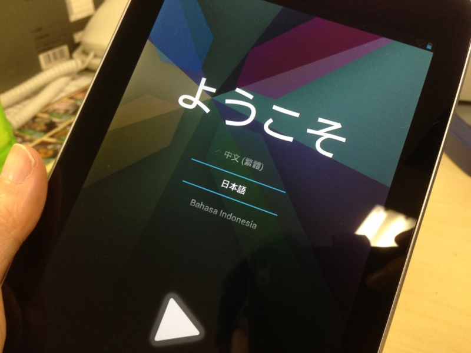

人間は、自分が食べたものでできている。だから、食べる時はよくよく考えなくてはならない。たぶん、買い物だってそうだろう。人間は、モノを買って生きる。だから、どう生きたかは、何を買うかによってあらかた察しが付くものだ。

というわけで。

噂の Nexus 7 を買いました！　これで GW の自作 PC 作りから始まった第4次（ぐらい）計算機環境改善計画は終了です。あと2年ぐらいはこの布陣で戦えるかなぁ。

<h3>現在の布陣</h3>

<table>
<tr>
<td></td>
<td>旧計算機環境改善計画</td>
<td>現計算機環境改善計画</td>
</tr>
<tr>
<td>ホームサーバー</td>
<td>Atom 機</td>
<td>Core 2 Duo 機</td>
</tr>
<tr>
<td>デスクトップ</td>
<td>Core 2 Duo 機</td>
<td>Core i5 機（IvyBridge）</td>
</tr>
<tr>
<td>ノートパソコン</td>
<td>Mac Book Pro</td>
<td>VAIO Duo 11</td>
</tr>
<tr>
<td>タブレット 10インチ</td>
<td>iPad 2、Samsung Series 7 Slate</td>
<td>VAIO Duo 11</td>
</tr>
<tr>
<td>タブレット 7インチ</td>
<td>-</td>
<td>Nexus 7</td>
</tr>
<tr>
<td>携帯電話（au）</td>
<td>IS12T</td>
<td>IS12T → ?</td>
</tr>
<tr>
<td>携帯電話（SBM）</td>
<td>iPhone 4</td>
<td>iPhone 5</td>
</tr>
<tr>
<td>モバイル回線</td>
<td>b-mobile ルーター</td>
<td>iPhone 5（テザリング予定）</td>
</tr>
</table>
Atom 機は引退したものの、電源を入れればちゃんと動く状態なので、なにか余生を考えてあげたいです。Core 2 Duo 機は Windows Home Server 2011 を入れてホームサーバーへ転用しました。CPU ファンがうるさいので新しいのに付け替えようかと思ったのですが、試しにとってみたところ、そのまま普通に動いているのでそのまま放置。もう1年以上使ってますけど、安定して稼働しています。ボーナスもらったら HDD のスペアがほしいなぁ。そろそろ死ぬような気がする。

あと、残念ながら Mac Book Pro は実家に（タダで）召し上げられてしまいました。「パソコン壊れちゃったんだけど、新しいのちょうだい。できればノートがいい」という電話一本で……。

モバイル回線周りは結構悩みましたが、SBM の iPhone 5 で統一することにしました。これが吉とでるか凶とでるか……。イー・アクセスの買収で SBM のほうに未来を感じたのですけど、現状は au の方が格段に優れているみたい。電波の再割り当て議論も出るでしょうけれど、まぁ、そんな資本主義的ルールを破壊するようなマネは、いかな総務省でもすまい（できまい）、というのが個人的な予想ですねぇ。

au の回線はとりあえず保持して、つぎに Windows Phone 端末を出すところに転用することになりそうです。

<h3>タブレットが、問題だ！</h3>

悩んだのは、タブレットですね……寝る時に Hulu を観たり、便所で RSS チェックをしたり。Kinoppy で買ったマンガだってタブレットで読む。これからは、ますますタブレットとお付き合いする時間が長くなるのですよね。

候補としては、

・iPad 2 と Samsung Series 7 Slate を使い続ける 
・新しい（笑）iPad 
・iPad mini 
・Nexus 7

があげられるけど、VAIO Duo 11 を買った今、iPad/S7S のような大きめのタブレットをもつ意味はあまりなくなったと思う。となれば、下二つの7インチタブレットの争いになるのだけど……決め手はやっぱり<i>お値段</i>でした。価格/スペック比だけを比べれば、Nexus 7 の圧倒的な勝利だと思う。実際手に取ってみるとしょっぱい部分もあるけど。

<h3>こんどはどうしよう</h3>

なかには「なんでこんなにいろいろもつんだ」という人もいるだろうけれど、そもそも道具には向き不向きがあるんだよ！　適当に俺的感覚でそれをまとめてみた。

○：やる気になる 
△：やれないこともない 
×：あんまやりたくない

<table>
<tr>
<td></td>
<td>デスクトップ</td>
<td>ノートパソコン</td>
<td>タブレット（10インチ）</td>
<td>タブレット（7インチ）</td>
<td>スマートフォン</td>
</tr>
<tr>
<td>アプリケーション開発</td>
<td>○</td>
<td>△</td>
<td>×</td>
<td>×</td>
<td>×</td>
</tr>
<tr>
<td>ブログを書く</td>
<td>○</td>
<td>△</td>
<td>×</td>
<td>×</td>
<td>×</td>
</tr>
<tr>
<td>RSSを読む</td>
<td>○</td>
<td>○</td>
<td>×</td>
<td>×</td>
<td>×</td>
</tr>
<tr>
<td>マンガを読む</td>
<td>×</td>
<td>△</td>
<td>○</td>
<td>○</td>
<td>△</td>
</tr>
<tr>
<td>小説を読む</td>
<td>×</td>
<td>×</td>
<td>△</td>
<td>○</td>
<td>○</td>
</tr>
</table>
Nexus 7 だと RSS を読む（＋はてぶつけたり）のは △ から ○ ぐらいになる感じなので<a href="#f1" name="fn1" title="iOS ってクソだったんだ！！">*1</a>、ハードウェアの問題だけではないんだなーとも思うけれど。

ともあれ、ノートパソコンでちまちま開発したり、電車の中で少しだけ RSS を読む効率を上げるために高いスマフォアプリを買ったりというのは、なるべくやりたくないんだ。やることに見合ったデバイスを使いたい。とはいえ、デバイスを減らしたいのも確か。周りの状況も結構変わるし、時には計画をまとめて見直さねば。

今回の計画では、ノートパソコンの比重がだいぶ下がった。「デスクトップをモバイルする」ためのものとしてのノートパソコンは、もうこれから買うことはないだろう。デスクトップというジャンル自体、ディスプレイ一体型や大型ノート PC に吸収されて行く傾向がある。僕みたいな人間はともかく、パソコンにパワーを求めるのはごく一部になっていくんだろうな。

逆に、最近存在感を増しているのがタブレット。どこに行くにもタブレット。何をするにもタブレット。

今のところ、タブレットは「スマートフォンでは小さすぎてめんどくさいこと」ができるように進化している感じだけど、そのうちノートパソコンを補完するような Windows 8 が目指すところもとりこんで行くはず<a href="#f2" name="fn2" title="Microsoft は7位インチタブレットをはよ！">*2</a>。VAIO Duo 11 みたいなコンバーチブルノートはそういう意味で要注目だと思う。

また、タブレットはスマートフォンから発展してきた Android/iOS と、デスクトップ側から迎え撃つ Windows/OS X との戦いの場としても面白い。ここら辺は CPU 陣営の戦いとも関連するし。まぁ、CPU の方は置いといて OS だけに話を絞ると、Microsoft は今ある武器でモバイル OS とガチンコバトルするしかない。一方、Apple はこれから OS Xで iOS も動くようにするのだと思うけど、どうやって融合させるのかが課題になりそう。あと、忘れそうになるけど Windows Phone。結構イケていると思うのに、なかなか“離陸”できない感じ。惜しいところだ……。

<table>
<tr>
<td></td>
<td>デスクトップ/ノート</td>
<td>10インチタブレット</td>
<td>7インチタブレット</td>
<td>スマートフォン</td>
</tr>
<tr>
<td>Microsoft</td>
<td>Windows 8</td>
<td>Windows 8/RT</td>
<td>(Windows RT?)</td>
<td>Windows Phone</td>
</tr>
<tr>
<td>Apple</td>
<td>Mac OS X</td>
<td>iOS</td>
<td>iOS</td>
<td>iOS</td>
</tr>
<tr>
<td>Android</td>
<td>-</td>
<td>Android 4.2</td>
<td>Android 4.2</td>
<td>Android 4.2</td>
</tr>
</table>
次にいろいろ買い替える計画を立てる時には、どうなってるのかなぁ。

<a href="#fn1" name="f1" class="footnote-number">*1</a>:iOS ってクソだったんだ！！

<a href="#fn2" name="f2" class="footnote-number">*2</a>:Microsoft は7位インチタブレットをはよ！

