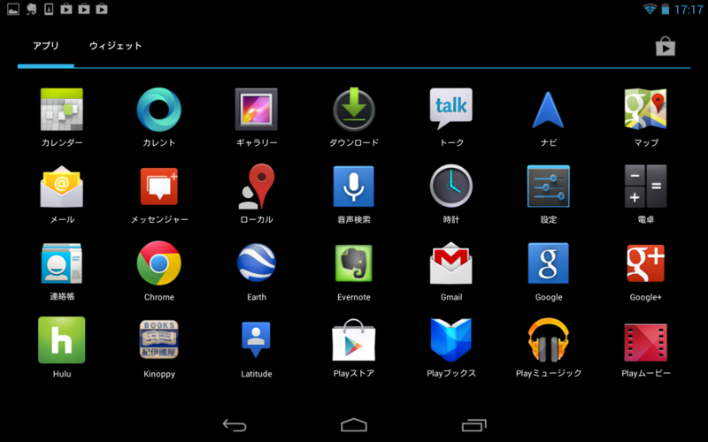

<a href="https://blog.daruyanagi.jp/entry/2012/11/23/210344">Nexus 7 &#x3092;&#x8CFC;&#x5165;&#x3001;&#x7B2C;4&#x6B21;&#x8A08;&#x7B97;&#x6A5F;&#x74B0;&#x5883;&#x6539;&#x5584;&#x8A08;&#x753B;&#x306F;&#x3053;&#x308C;&#x306B;&#x3066;&#x7D42;&#x4E86;&#x3002; - &#x3060;&#x308B;&#x308D;&#x3050;</a> から数日、結構マメに Nexus 7 を使っているけれど、なかなか良い端末だと思う。iPad と比べてとてもよいのは［戻る］ボタンがあるところだなぁ。Windows 8/RT 端末にもほしかった気がする。逆に、右側のタスク一覧（？）ボタンはあまり使わない。できれば［共有］なんかに割り当てられればいいのだけど。どうせスタート画面はカオスなんだし、キーの設定もいろいろ設定できればいいのに。

当面のところ Nexus 7 では Twitter<a href="#f-58847418" name="fn-58847418" title="いろいろ試したけれど、とりあえず公式アプリでいいやって感じになってる">*1</a> と RSS<a href="#f-b2f094db" name="fn-b2f094db" title="Google リーダー">*2</a>＋はてブ、Hulu（動画配信）、Kinoppy（電子書籍）が使えれば十分。これらのアプリを一通り試したけれど、今のところ大きな不満はない。十分に実用レベルだと思った。

ただ、ちょっと気になった点もある。

Kinoppy でマンガを読むと、なんか字がぼやけるんだよね。

ちょっと画面を下に引っ張ったり、拡大縮小させたあとに等倍へ戻すなどして再描画させると字がハッキリ描画されるようになる。この例だと“自暴自棄”の字を読み比べるとわかりやすいかもしれない。

これはアプリが悪いのか、Android がイケていないからなのか。

ついでに文句を言うなら、システムアップデート（4.1 → 4.2）がうざい。Hulu の再生中にダイアログが出ると、再生が中止されてしまうどころか、ときどき再開できなくなる。アプリの再起動で治るのだけど、こういった気の利かなさは Android（もしくはこれまでの Windows）らしいなと思った。

結局、めんどくさいので 4.1 から 4.2 へアップデートしたのだけど、そしたら今度は操作方法が結構変わっててちょっとビックリ。すぐ慣れるけど、あんまりこだわりなく変えてしまうんだな。まだまだ Android は発展途上って感じなのかねぇ。

ざっくりした感想を言わせてもらえれば、全体的な統一感がなくて、デザインされている感じがない。IT が苦手なおっさんは素直に iOS デバイス買っておけばいいと思った。とはいえ、お値段のことを考えると、これで十分って感じもする。日本語入力は「Google 日本語入力」のおかげで iOS よりも快適だしね。ただ、デフォルトの IME は iOS 以下でほんと使えない。

<a href="#fn-58847418" name="f-58847418" class="footnote-number">*1</a>:いろいろ試したけれど、とりあえず公式アプリでいいやって感じになってる

<a href="#fn-b2f094db" name="f-b2f094db" class="footnote-number">*2</a>:Google リーダー

