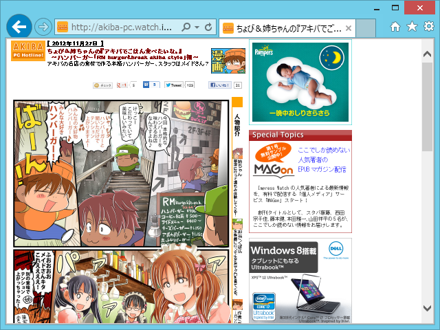
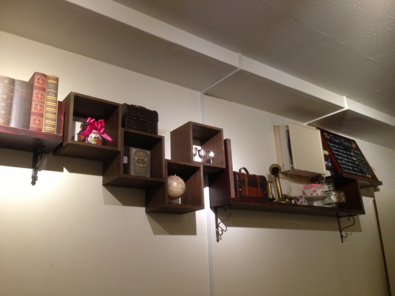
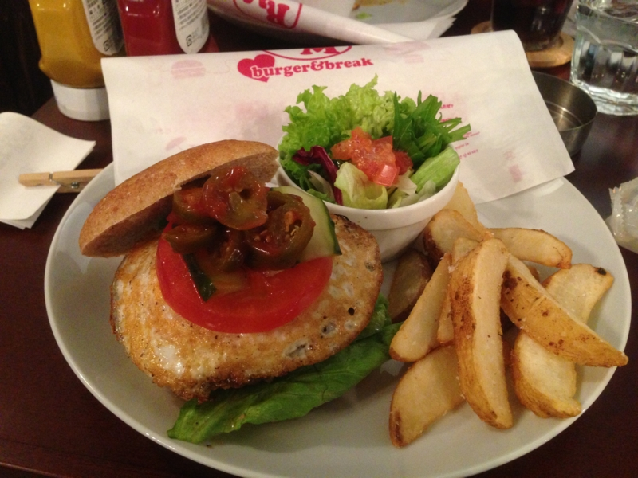
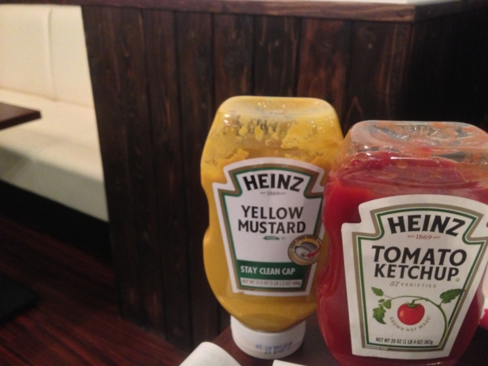

<a href="http://akiba-pc.watch.impress.co.jp/hotline/20121201/etc_comic1.html">&#x3061;&#x3087;&#x3073;&#xFF06;&#x59C9;&#x3061;&#x3083;&#x3093;&#x306E;&#x300E;&#x30A2;&#x30AD;&#x30D0;&#x3067;&#x3054;&#x306F;&#x3093;&#x98DF;&#x3079;&#x305F;&#x3044;&#x306A;&#x3002;&#x300F; &#x301C;&#x30CF;&#x30F3;&#x30D0;&#x30FC;&#x30AC;&#x30FC;&#x300C;RM burger&amp;break akiba style&#x300D;&#x7DE8;&#x301C;</a>

メイドさんが作るハンバーガーとな！　それはテンション上がるな！　……というわけで、さっそく @shibayan と行ってきたった。

混んでるかな？　と思ったけど、それほどでもなかった。店は結構広くてゆっくりできる。まぁ、平日の夜に行ったっていうのがデカいと思うけれど。

残念ながらメイドさんの写真はナシ。期待した人、ごめんなさい。マンガの方で、雰囲気を感じてくださいね。みんな可愛らしくて「多少マズくても全力で許しちゃおっかな！」って感じでした。

で、これがハンバーガー（チリソースだっけかに卵焼きをトッピング）。1,000円ぐらいだったかな。意外に本格的で、結構おいしかったです。バンズは硬めだけど、肉汁に負けず、食べごたえもある。

ひとつ食べただけでお腹いっぱい。ごちそうさまでした。

