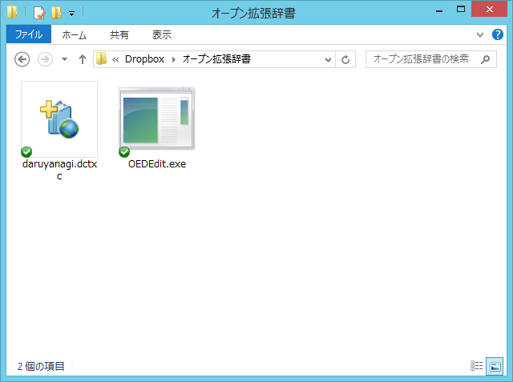

<ul>
<li><a href="http://www.forest.impress.co.jp/docs/news/20121122_574785.html">&#x7A93;&#x306E;&#x675C; - &#x3010;NEWS&#x3011;&#x300C;Google &#x65E5;&#x672C;&#x8A9E;&#x5165;&#x529B;&#x300D;v1.7&#x306E;&#x958B;&#x767A;&#x7248;&#x304C;&#x516C;&#x958B;&#x3001;&#x6A5F;&#x7A2E;&#x4F9D;&#x5B58;&#x306E;&#x7D75;&#x6587;&#x5B57;&#x304C;&#x5909;&#x63DB;&#x3067;&#x304D;&#x308B;&#x3088;&#x3046;&#x306B;</a></li>
<li><a href="http://www.forest.impress.co.jp/docs/news/20121129_576049.html">&#x7A93;&#x306E;&#x675C; - &#x3010;NEWS&#x3011;&#x300C;Google &#x65E5;&#x672C;&#x8A9E;&#x5165;&#x529B;&#x300D;&#x958B;&#x767A;&#x7248;&#x304C;&#x30A2;&#x30C3;&#x30D7;&#x30C7;&#x30FC;&#x30C8;&#x3002;Windows 8&#x3078;&#x306E;&#x5BFE;&#x5FDC;&#x304C;&#x3055;&#x3089;&#x306B;&#x5F37;&#x5316;</a></li>
</ul>
「Google 日本語入力 17」の開発版が出て、Windows 8 へ積極的に対応していてうれしい。ただ、いろいろ不具合はあって、たとえば自分の環境だと、

ストアアプリで設定チャームの動作がおかしかったり、

アプリが起動しなくなったりする。普通は起動処理に一定時間かかるとアプリが強制終了されたはずなのだけど、それもなくただ固まっている。

これらの現象は標準の IME に戻せばなおるので、たぶん「Google 日本語入力」が原因なんだろうなと思う。ATOK も出ないし<a href="#f1" name="fn1" title="とはいえ、ジャスッとシステムの製品サイクルでいえば来春に出るのが恒例なのだけど">*1</a>、IME の Windows 8 対応はなかなか難しいのかもしれない。

（ストアアプリ対応の IME としては <a href="http://www.forest.impress.co.jp/docs/review/20121129_575550.html">&#x7A93;&#x306E;&#x675C; - &#x3010;REVIEW&#x3011;&#x89AA;&#x6307;&#x30B7;&#x30D5;&#x30C8;&#x98A8;&#x5165;&#x529B;&#x306A;&#x3069;&#x306E;&#x72EC;&#x81EA;&#x6A5F;&#x80FD;&#x3092;&#x5099;&#x3048;&#x305F;&#x300C;SKK&#x300D;&#x98A8;&#x65E5;&#x672C;&#x8A9E;IME&#x300C;SKK&#x65E5;&#x672C;&#x8A9E;&#x5165;&#x529B;FEP&#x300D;</a> なんかもある）

なんやかんやそんなわけで。

当面は標準の IME を使わなきゃなんだけど、こいつはそんなに悪くない。

とくに、「オープン拡張辞書」（<a href="http://www.microsoft.com/ja-jp/office/2010/ime/open-extended-dictionary.aspx">Microsoft Office IME 2010 &#x30AA;&#x30FC;&#x30D7;&#x30F3;&#x62E1;&#x5F35;&#x8F9E;&#x66F8; | Microsoft Office IME 2010 | Microsoft Office 2010</a>）に対応しているのがなかなかよい。XMLベースになっていて、既存の構造化されていないテキストベースのものよりも壊れにくく、また関連付けが効くのでインストール・アップデートが簡単。CAB圧縮するか否かで2種類の拡張子がある（DCTX/DCTXC）。あと、署名をつけてネットワーク共有することも考えられていて、署名なしには収録できる単語数に制限がある。これまでは「Microsoft Office」についてくる、所謂「Office IME」の機能だったんだけれど、Windows 8 では標準で搭載されている。

作り方は、いろいろ参照してほしいのだけど……

<ul>
<li><a href="http://www.forest.impress.co.jp/docs/review/20120529_536042.html">&#x7A93;&#x306E;&#x675C; - &#x3010;REVIEW&#x3011;&#x300C;Office IME 2010&#x300D;&#x306E;&ldquo;&#x30AA;&#x30FC;&#x30D7;&#x30F3;&#x62E1;&#x5F35;&#x8F9E;&#x66F8;&rdquo;&#x3092;&#x4F5C;&#x6210;&#x300C;&#x30AA;&#x30FC;&#x30D7;&#x30F3;&#x62E1;&#x5F35;&#x8F9E;&#x66F8;&#x30A8;&#x30C7;&#x30A3;&#x30BF;&#x300D;</a></li>
<li><a href="http://www.forest.impress.co.jp/docs/review/20120522_534343.html">&#x7A93;&#x306E;&#x675C; - &#x3010;REVIEW&#x3011;&#x300C;Excel&#x300D;&#x30C6;&#x30F3;&#x30D7;&#x30EC;&#x30FC;&#x30C8;&#x3067;&#x300C;Office IME 2010&#x300D;&#x5411;&#x3051;&#x306E;&ldquo;&#x30AA;&#x30FC;&#x30D7;&#x30F3;&#x62E1;&#x5F35;&#x8F9E;&#x66F8;&rdquo;&#x3092;&#x4F5C;&#x308D;&#x3046;</a></li>
</ul>

自分の場合、Dropbox や SkyDrive なんかのオンラインストレージにツールと辞書を一式置いて、複数の PC から同じものを利用できるようにしている。

とはいえ、「Google 日本語入力」の圧倒的な語彙力はやっぱ魅力なんだよねぇ。一生使わなさそうな単語をわざわざツールで登録するのもめんどくさいしさ。

<a href="#fn1" name="f1" class="footnote-number">*1</a>:とはいえ、ジャスッとシステムの製品サイクルでいえば来春に出るのが恒例なのだけど

