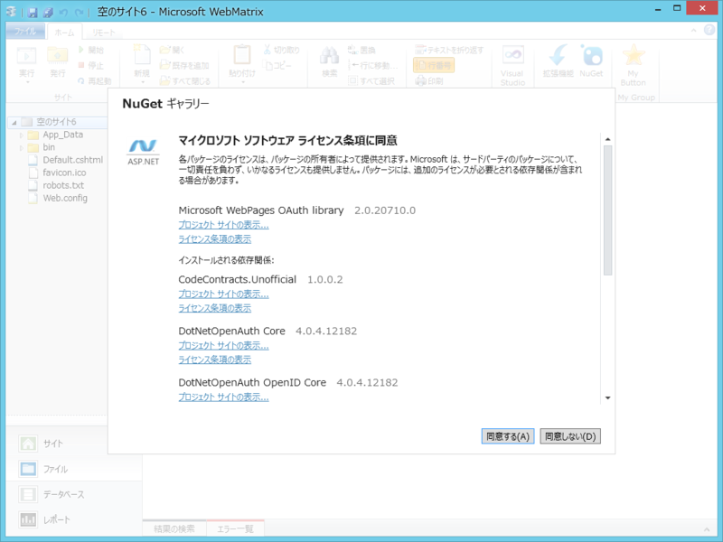

もう結構前の話になりますが、WebMatrix 2 に2度目のアップデートが配信されました。

「Microsoft WebMatrix 2 Refresh 2 for Windows 8」というのだそうです。どこが変わったのか全然わからなかったので、ただ単にぼへーっとみていたのですが……

（更新点をどこかに書いていてくれたら、職権みたいなものを濫用したりして、どこかのコーナーにぶち込んでアレしてこうしてできるのにさ！！）

そういえば、<a href="https://blog.daruyanagi.jp/entry/2012/09/04/023414">&#x3055;&#x3066;&#x3001;WebMatrix &#x3067; OAuth &#x8A8D;&#x8A3C;&#x3092;&hellip;&hellip;&Sigma;(&#xFF9F;&#x434;&#xFF9F;lll)&#xFF76;&#xFF9E;&#xFF70;&#xFF9D; - &#x3060;&#x308B;&#x308D;&#x3050;</a> なんかが解決されているかもしれないなーなどとふと思いつき、再度チャレンジしてみました。WebMatrix で Facebook や Twitter へのログインをサポートする便利なライブラリがあるんですが、前回試したときは NuGet が古いといわれてインストールできなかったんですよね。

結果は……成功！　まぁ、もしかしたら NuGet パッケージ側に修正が入ったのかもしれず、WebMatrix のアップデートのおかげってわけではないのかもしれませんけど……。

うわぁ、もう、何しちゃおっかな！　ネタを考えないと。

