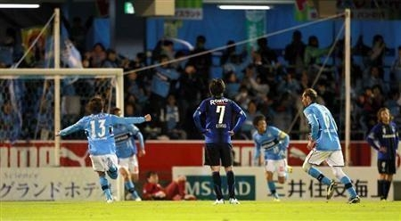

そして、降格。

喪に服するため、月曜日は会社を休むことにします。割と真面目な話で<a href="#f-aedadeef" name="fn-aedadeef" title="もちろん、来た原稿は読むけど">*1</a>。向こう二日間はのんびり暮らして、リフレッシュし、年末までガンバろう。

確率（<a href="https://blog.daruyanagi.jp/entry/2012/11/25/230119">&#x30AC;&#x30F3;&#x30D0;&#x5927;&#x962A;&#x304C;&#x6B8B;&#x7559;&#x3059;&#x308B;&#x78BA;&#x7387;&#x3092;&#x8A08;&#x7B97;&#x3057;&#x3066;&#x307F;&#x305F;&#x3002; - &#x3060;&#x308B;&#x308D;&#x3050;</a>）なんてアテにならないものだなぁ

<a href="#fn-aedadeef" name="f-aedadeef" class="footnote-number">*1</a>:もちろん、来た原稿は読むけど

