
Windows 環境で Web 開発<a href="#f1" name="fn1" title="要は“ホームページ”を作ることです！">*1</a>を行うならば、まず利用を検討してみてほしいのが「WebMatrix 2」です。

まぁ、ほかにもいろいろ便利なツールはあると思いますけど、これが一番楽ちんだと思います。だまされたと思って一度インストールしてみてください。

<h3>「WebMatrix 2」のダウンロード</h3>

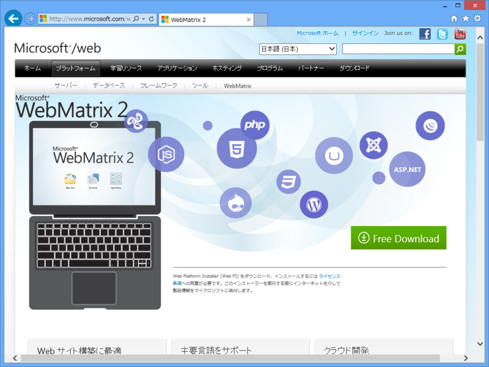

<a href="http://www.microsoft.com/web/webmatrix/">WebMatrix 2</a> からインストーラーをダウンロードして実行します。

<h3>「WebMatrix 2」のインストール</h3>

インストーラーを実行すると、「Web Platform Installer 4.0」が起動します。

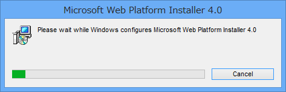

「Web Platform Installer」は、Microsoft による Web 開発に必要なサーバー・フレームワーク・データベース・ツール・アプリケーションを手軽に導入するためのインストーラーです。

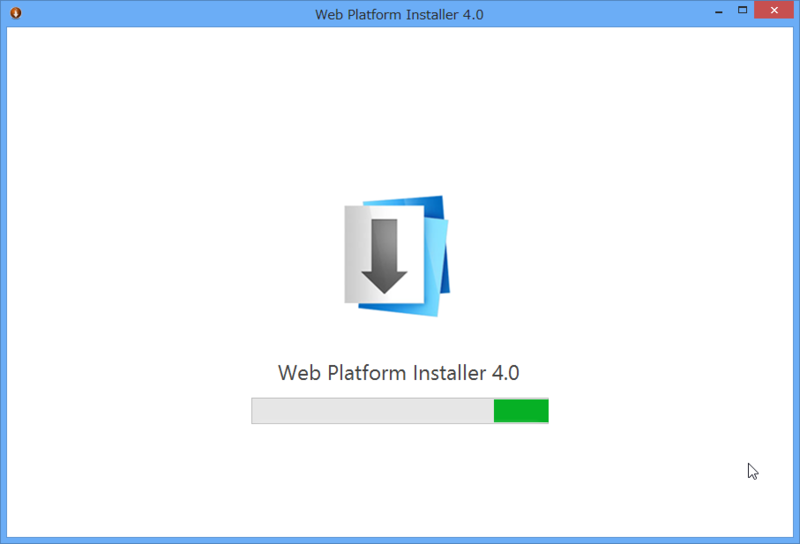

「Web Platform Installer」がセットアップされると、続いて「WebMatrix 2」のインストールへ移ります。

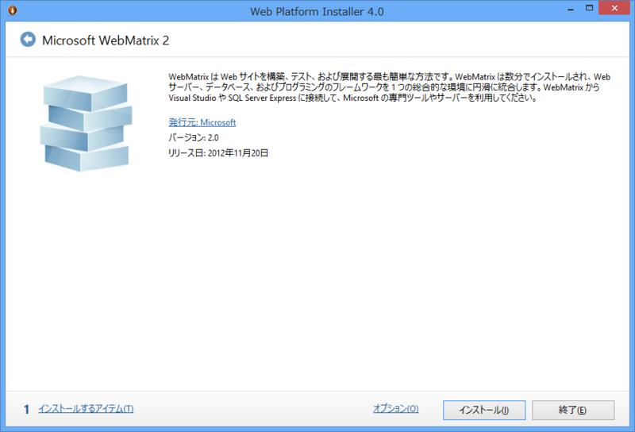

［インストール］ボタンを押せば、インストールが開始されます。

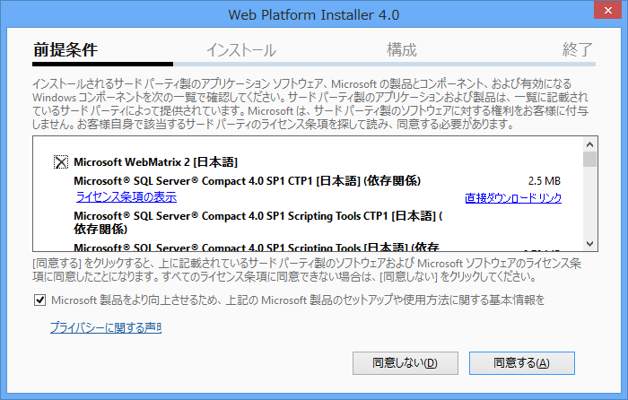

「Web Platform Installer」が便利なのは、「WebMatrix 2」の実行に必要なコンポーネントを勝手にダウンロードしてインストールしてくれるところです<a href="#f2" name="fn2" title="これは「依存性を解決する」と表現することがあります">*2</a>。

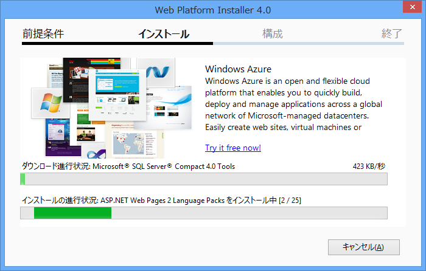

ちなみに、現時点での最新版は「WebMatrix 2 Refresh 2」です。

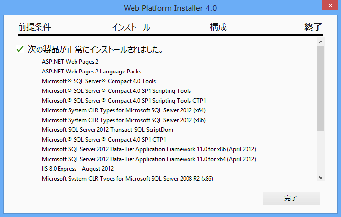

インストールが完了しました。多くのコンポーネントが自動でインストールされているのがわかります。

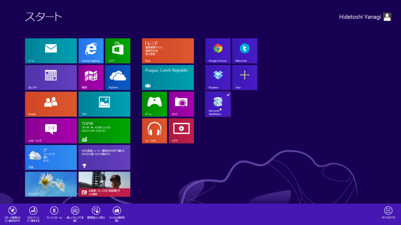

起動はスタート画面から。頻繁に利用する場合は、“ピン留め”しておくと便利です。

<h3>「Web Platform Installer 4.0」について</h3>

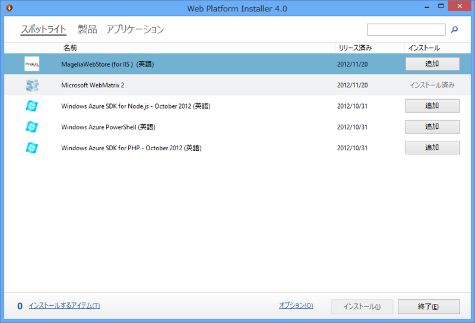

「Web Matrix 2」のインストールが終了すると、「Web Platform Installer 4.0」へ戻ります。もし必要なツールがあれば、続けてインストールすることも可能です。

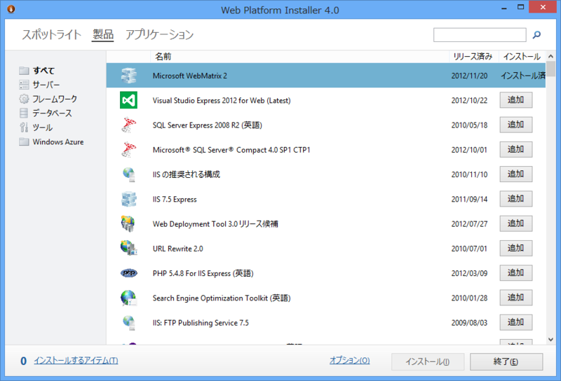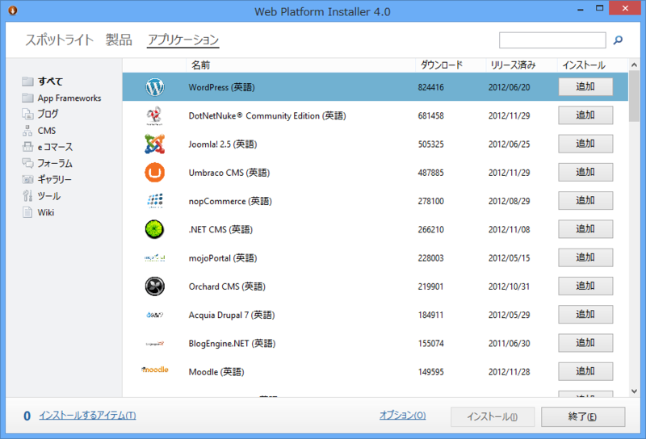

「Web Platform Installer 4.0」は Microsoft の製品ですが、インストールできるのは Microsoft のものに限りません。とくに Web アプリケーションは、オープンソースで開発されたものにも幅広く対応しています。ただ、Web アプリケーションのインストールは「Web Matrix 2」からも行えますので、「Web Platform Installer 4.0」についてはあまり気にしなくてもよいかと。そういうものがあるんだ、とだけ覚えていてもらえれば十分だと思います。

<h4>おまけ</h4>

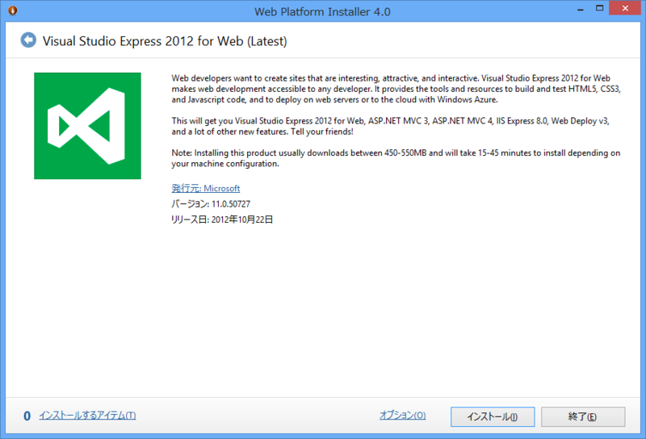

「Visual Studio 2012 Experess for Web」は無償の Web 開発環境で、いわば「WebMatrix 2」の“お兄さん”にあたります。ついでにインストールしておくと、「WebMatrix 2」では手に負えないときに助かります。

今日のところはここまで。

<a href="#fn1" name="f1" class="footnote-number">*1</a>:要は“ホームページ”を作ることです！

<a href="#fn2" name="f2" class="footnote-number">*2</a>:これは「依存性を解決する」と表現することがあります

