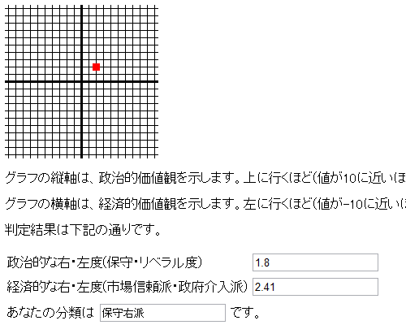
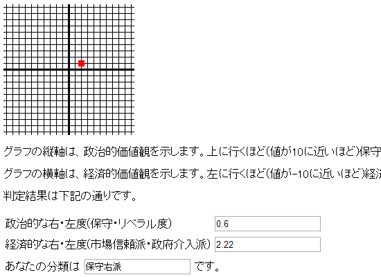

選挙も近いことだし、約1年ぶりにポリティカルコンパス（<a href="http://sakidatsumono.ifdef.jp/political-compass.html">&#x30DD;&#x30EA;&#x30C6;&#x30A3;&#x30AB;&#x30EB;&#x30B3;&#x30F3;&#x30D1;&#x30B9;&#x306B;&#x3064;&#x3044;&#x3066;</a>）をやってみた。

<h3>2011 年 9 月 5 日</h3>

<h3>2012 年 12 月 2 日</h3>

あんまり変わってなかった。

自分みたいな「自由経済主義保守派」にとってのジレンマは、“自由経済は古きよきものを破壊するか”という問題だけど、1年たってもまだ答えは出ていない。ただ、ぶっ壊されたあとでもしぶとく残っているのが本当によいものじゃないか、という気が最近はしている。

