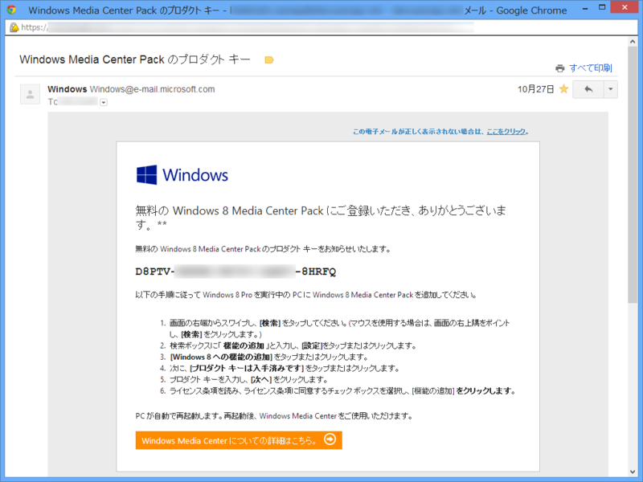
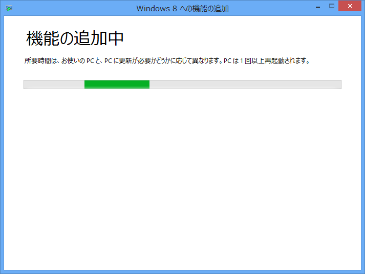
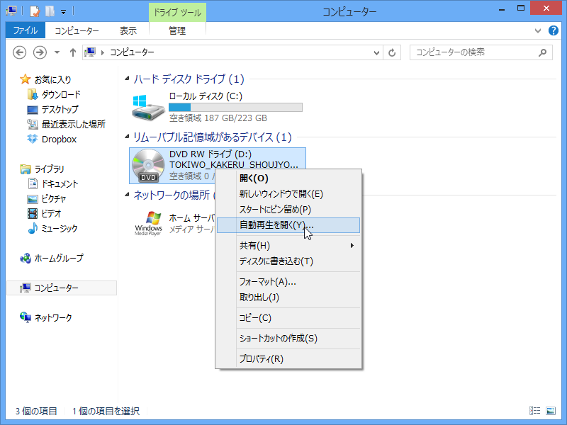
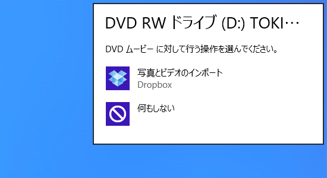
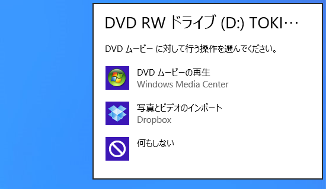
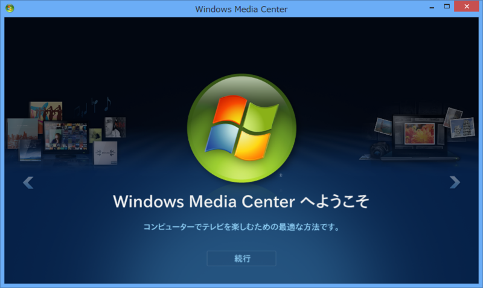
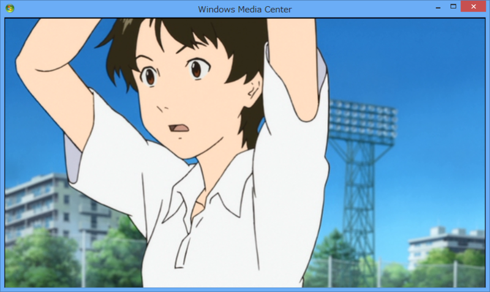
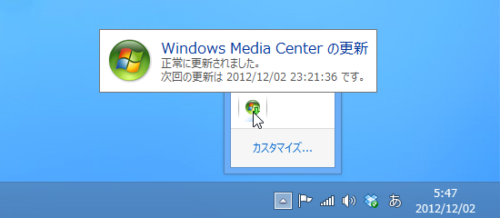

故あって Windows 8 Pro を再インストールしたのだけど、<a href="http://www.forest.impress.co.jp/docs/news/20121026_568818.html">&#x7A93;&#x306E;&#x675C; - &#x3010;NEWS&#x3011;Microsoft&#x3001;&#x300C;Windows 8 Media Center Pack&#x300D;&#x3092;&#x671F;&#x9593;&#x9650;&#x5B9A;&#x3067;&#x7121;&#x511F;&#x63D0;&#x4F9B;</a> の存在を忘れていた。プロダクトキーのメールが来ていた<a href="#f1" name="fn1" title="申請して一日ぐらいはかかるみたい？　今はもうちょっとスムーズかな">*1</a>のでインストールしてみた。

インストールは、案内通り［Windows 8 への機能の追加］からプロダクトキーを入力するだけ。10分程度かかったかな。再起動は一回だけだった。

［自動再生］メニューで選べるアプリに……

適用前

適用後

ちゃんと「Windows Media Center」が追加されたよ！

手近にあった『時をかける少女』を再生してみたけど、ちゃんと観れる。まぁ、こんな面倒なことをしなくても「VLC media player」なんかをダウンロードしてインストールすればいいのだけど、ああいうのには DVD のリッピング機能なんかもついているらしく、法律的にどーたらこーたら。ちゃんと正規の手段が用意されているのなら、それに如くはないね。

<a href="#fn1" name="f1" class="footnote-number">*1</a>:申請して一日ぐらいはかかるみたい？　今はもうちょっとスムーズかな

