

SkyDrive は 7GB まで無償で利用できるオンラインストレージサービスです。僕の場合、古くから利用しているので特典として 25GB のストレージ容量が与えられています。

けれど、Windows 8 を導入したときに新しい Microsoft アカウントを作成してしまったため、新規に無償提供される 7GB しか使えなくなりました。SkyDrive アプリを古いアカウントと同期させようとしても、アプリの設定がグレーアウトされてしまっています。

OS のユーザーに紐づけた Microsoft アカウントでしか、同期させてくれないみたい。

というわけで、<a href="http://www.forest.impress.co.jp/docs/review/20121119_574024.html">&#x7A93;&#x306E;&#x675C; - &#x3010;REVIEW&#x3011;XP&#x306B;&#x3082;&#x5BFE;&#x5FDC;&#x3059;&#x308B;SkyDrive&#x30AF;&#x30E9;&#x30A4;&#x30A2;&#x30F3;&#x30C8;&#x300C;syncDriver&#x300D;</a> を使ってみた。記事では Windows XP で利用できることが推しになっているけれど、ちゃんと Windows 8 にも対応している。

<h3>ダウンロード</h3>

GIGAZINE 風にいちから手順を説明しようか。わかってる人は読み飛ばしてください。

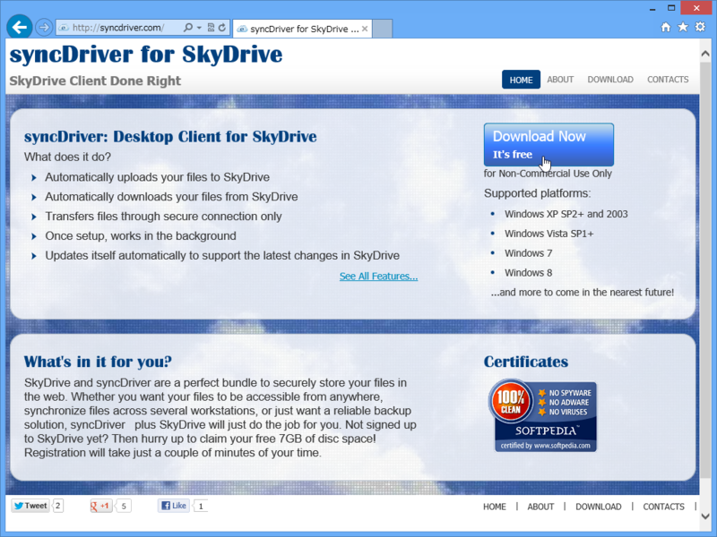

<a href="http://syncdriver.com/">http://syncdriver.com/</a> へアクセスして、［Download Now］ボタンからインストーラーをダウンロードして実行する。

<h3>インストール<a href="#f1" name="fn1" title="関係ない話だけど、うちのオカンは“いんすとろーる”って言ってる">*1</a></h3>

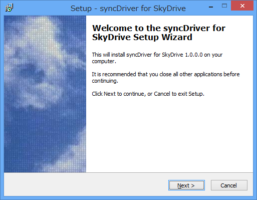

［Next］ボタンを押す。

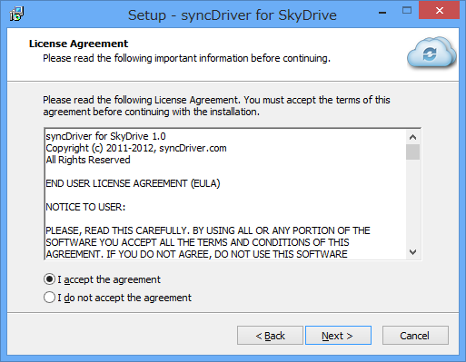

利用許諾。"Accept"の方をチェックして、［Next］ボタンを押す。

インストール先フォルダを指定。そのまま［Next］ボタンを押していい。

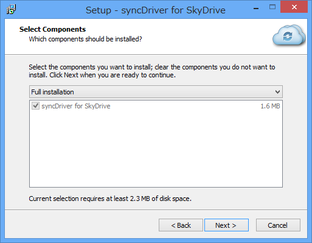

インストールする機能を選択。そのまま［Next］ボタンを押す。

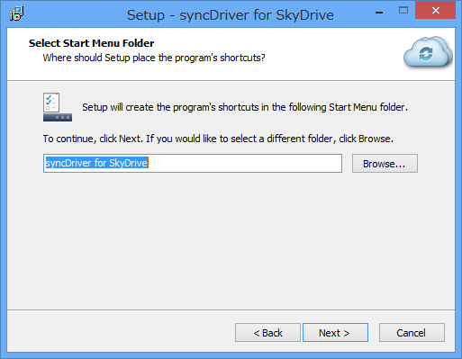

スタートメニューへの追加。そのまま［Next］ボタンを押す。

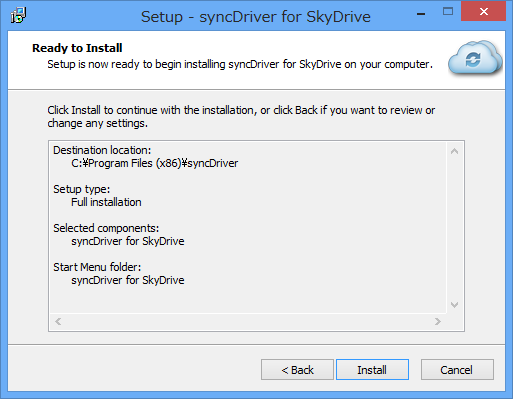

最後の確認。［Install］ボタンを押せば、インストール処理が始まる。

インストールの完了。この状態で［Finish］ボタンを押せば、「syncDriver」が起動する。

<h4>旧バージョンの .NET Framework のインストール</h4>

途中、.NET Framework 2.0/3.5 のインストールが求められる場合がある。なくても動作すると思われるけれど、入れておいた方が無難かな。

インストール完了後に起動してエラーが出る場合は、「syncDriver」の再インストールを試みよう。やれやれ。

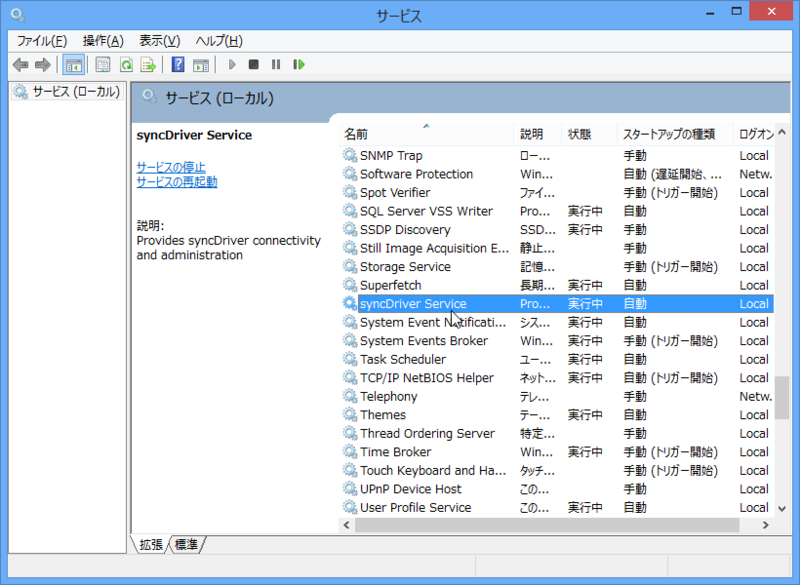

このアプリは Windows サービス<a href="#f2" name="fn2" title="最近はローカル サービスって呼ぶのか？">*2</a>が同期処理を担当して、アプリがそのフロントエンドになっているみたい。

<h3>使い方</h3>

<h4>Microsoft アカウントの入力</h4>

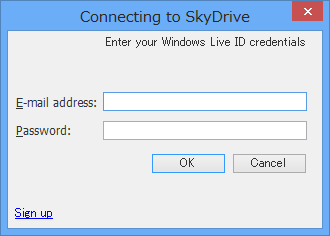

まず、ログイン。古い方の Microsoft アカウントを入力したぞ。

<h4>同期フォルダの選択</h4>

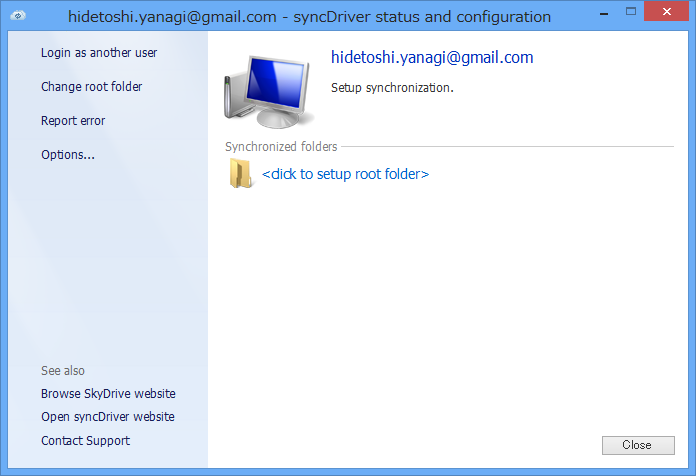

余計な部分の少ない、OS 標準の UI に準拠した好感の持てるデザイン。"click to setup root folder"をクリックして、SkyDrive をどのフォルダと同期するかを指定する。

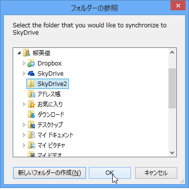

自分の場合は、ユーザーフォルダに SyDrive2 というフォルダを作成して、それを指定しておいた。

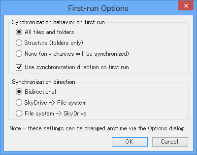

続けて入力が求められる同期オプションはそのままでいい。

これで設定は終了。10GB 以上利用していたせいか、同期処理が始まるまでかなりの時間がかかるけれど、のんびりお茶でも飲んで待つ。その間、左ペインにある"Options"をクリックして、追加で設定できるオプションを確認しておく。

<h4>同期フォルダにドライブレターを割り当てる</h4>

基本的な設定は先ほど現れた同期オプションの内容とあまり変わらない。唯一の違いは、同期フォルダをドライブとしてマウントできる設定があること。これは便利そうだ。

試しに S ドライブにしてみた<a href="#f3" name="fn3" title=""S"kydrive なので">*3</a>。

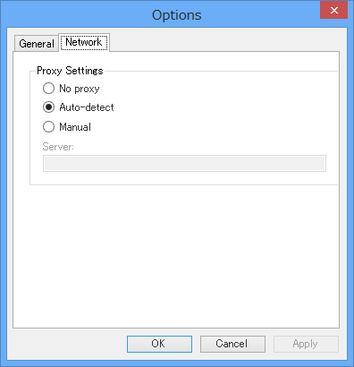

プロキシにも対応しているようだ。この機能は地味に要望が多いので、あると喜ぶ人も多そう。

<a href="#fn1" name="f1" class="footnote-number">*1</a>:関係ない話だけど、うちのオカンは“いんすとろーる”って言ってる

<a href="#fn2" name="f2" class="footnote-number">*2</a>:最近はローカル サービスって呼ぶのか？

<a href="#fn3" name="f3" class="footnote-number">*3</a>:"S"kydrive なので

