
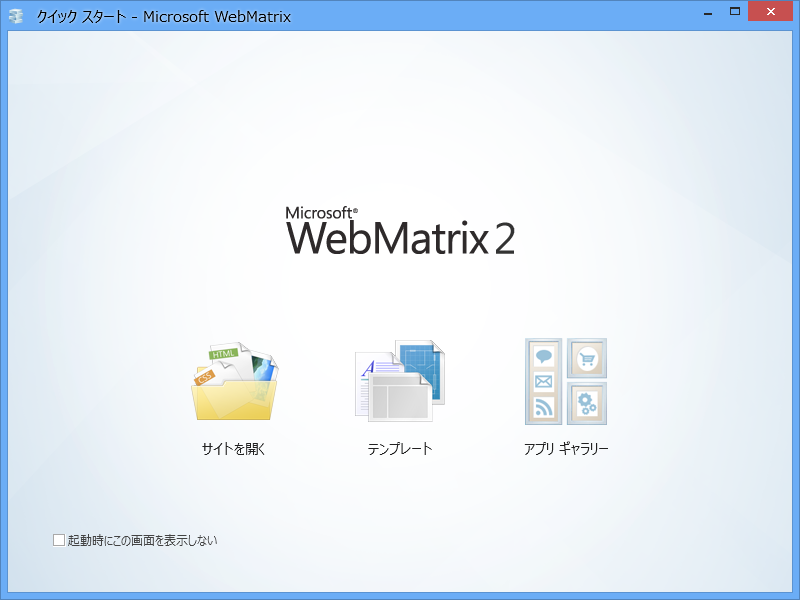

<a href="https://blog.daruyanagi.jp/entry/2012/12/02/042811">&#x300C;WebMatrix 2&#x300D;&#x306E;&#x5C0E;&#x5165; - &#x3060;&#x308B;&#x308D;&#x3050;</a> の続き。

普通は<i>「それでは“テンプレート”または“アプリ ギャラリー”から Web サイトを新規作成しましょう」</i>という話になるのだと思うけれど、今回はちょっと趣向を変えてみようかな。

<h3>フォルダーから Web サイトの作成</h3>

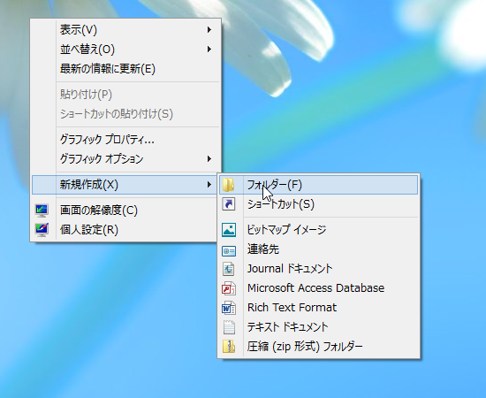

まず、デスクトップ（どこでもいいのだけど！）に空のフォルダーを作成します。

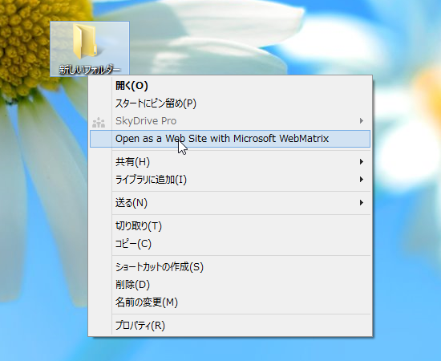

次にこのフォルダーのコンテキストメニューから、［Open as a Web Site with Microsoft WebMatrix］を選択。

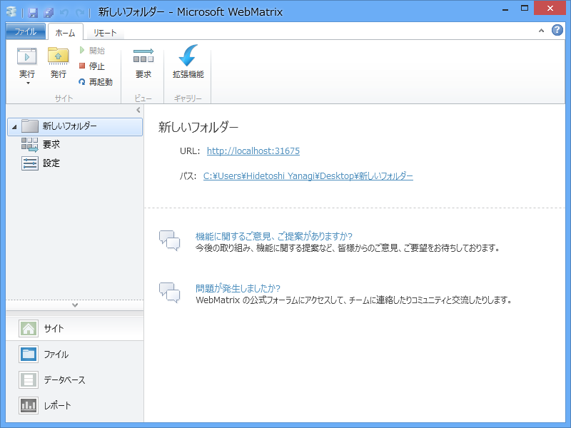

すると、「WebMatrix 2」が起動します。これで Web サイトが完成しました！（ぇ

中身は「WebMatrix 2」が勝手に追加する Robot.txt 以外何もないのだけど（この画面は、左下の［ファイル］というボタンを押すと表示されます）。

「WebMatrix 2」では、指定したフォルダーが Web サイトのルートフォルダになります。あとはそこへ HTML ファイルや CSS ファイル（スタイルシート）、スクリプトファイル、画像ファイルなどを置いていけばいい<a href="#f-c415b855" name="fn-c415b855" title="これらを“リソース”と呼ぶことがあります">*1</a>。

世の中には「マウス操作で簡単にカッコいい Web サイトが制作できる！」なんていう GUI ツールも多いですけど、ちゃんと HTML タグから学んで Web サイトを作っていきたい人にとって、「WebMatrix 2」は最良の選択肢の一つです。マウスでチョチョイ、というのも便利なんですけどね。

<h3>コンテンツの追加</h3>

これではあまりにも寂しいので、実際に簡単な Web ページを追加してみましょう。

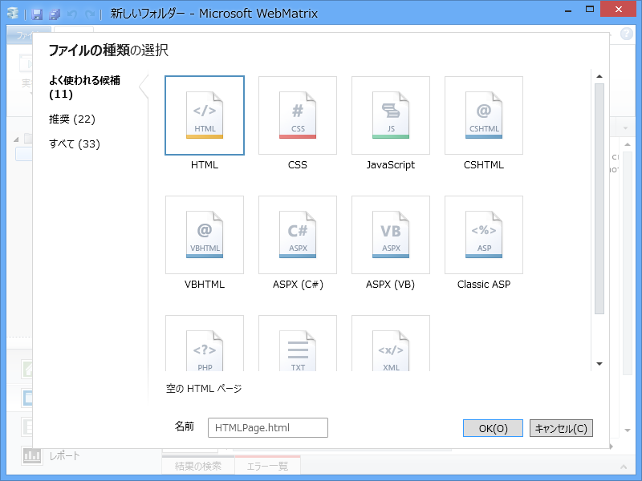

リボンの［新規］ボタンを押して、HTML ファイルを追加します。名前は“index.html”とでもしておきます。

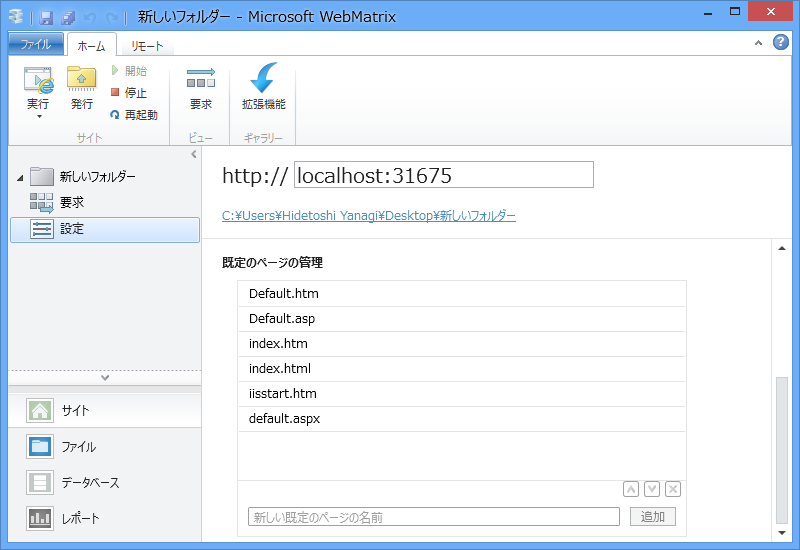

というのも、あらかじめ“既定のページ”に登録されたファイル名は、アクセスする際に名前を省略できるからです（カスタマイズ可能）。ファイル名を省略してアクセスすると、登録リストの上から順にファイルがあるかチェックされ、あればそれを返します。なければ“404 Not found”になるわけ。

おっと、話がそれた。HTML ファイルを作成したらコードを記述します。

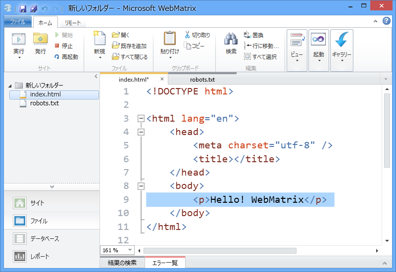

body タグの間に以下のように記述し……

<pre class="code lang-html" data-lang="html" data-unlink>&lt;p&gt;Hello! WebMatrix&lt;/p&gt;
</pre>
リボンの［実行］ボタンを押せば、

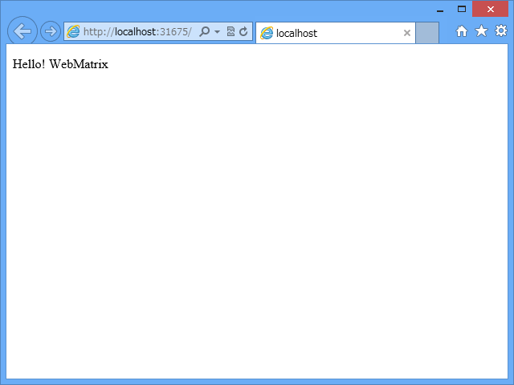

ちゃんと Web ブラウザーで Web サイトが表示されました。

<h3>WebMatrix 2 ＝ ファイル管理 ＋ テキストエディター ＋ IIS Express 7.5 ＋……and more！</h3>

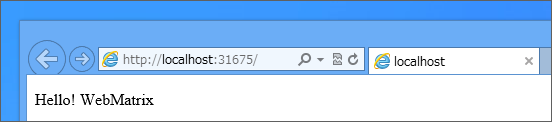

ここで、アドレスバーを確認。

“<b><a href="http://localhost:31675">http://localhost:31675</a></b>”と書いてありますけれど、これは“<b>localhost</b>”というアドレスのの“<b>31675</b>”番ポート<a href="#f-bc90316b" name="fn-bc90316b" title="これは「WebMatrix 2」が勝手に決めてくれます">*2</a>へ“<b>http</b>”というプロトコルで接続しました、という意味です。

つまり、HTML ファイルを直接 Web ブラウザーで開いたのではなく、間に Web サーバー（HTTP で応答してくれるサーバー）を挟んで HTML ファイルへアクセスしているということになります。

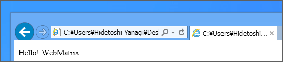

ちなみに、HTML ファイルをダブルクリックして直接 Web ブラウザーで開くと、アドレスバーにはファイルパスが表示されます。

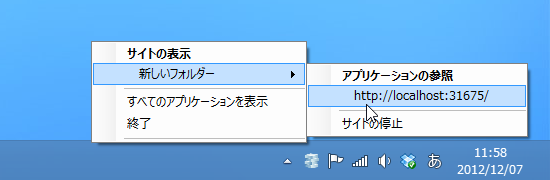

Web サーバーをセットアップしたり Web サイトがちゃんと動くように配置するのは結構めんどくさいのですが、「WebMatrix 2」には開発用の簡易 Web サーバー（<b>IIS Express 7.5</b>）が含まれていて、勝手に Web サイトをホストしてくれます。「WebMatrix 2」のインストール時に必要なコンポーネントがたくさんインストールされていましたけど、要はこういうのをセットアップしてくれていたのですね。

WebMatrix 2 ＋ IIS Express 7.5 なら、サーバーを止めるのも再開するのもボタンやメニューで簡単。何ならこのまま全世界へ公開することもできますけれど<a href="#f-49b07238" name="fn-49b07238" title="実際にやっている">*3</a>、あんまりオススメはしません<a href="#f-93f1b09d" name="fn-93f1b09d" title="あくまで開発用です！">*4</a>。

あと、IIS Express 7.5 は HTTP で一般的に利用される 80 番ポートを使わないので、ほかの Web サーバーとの共存が可能です。少なくとも、自分で使った限りではトラブルを経験したことはない。ただ、これは“理論的には可能”というだけで、実際にはいろいろあるようですね。まぁ、XAMPP などを使う人はそういうのを自分で解決できる人だと思うので……頑張れ！

<a href="#fn-c415b855" name="f-c415b855" class="footnote-number">*1</a>:これらを“リソース”と呼ぶことがあります

<a href="#fn-bc90316b" name="f-bc90316b" class="footnote-number">*2</a>:これは「WebMatrix 2」が勝手に決めてくれます

<a href="#fn-49b07238" name="f-49b07238" class="footnote-number">*3</a>:実際にやっている

<a href="#fn-93f1b09d" name="f-93f1b09d" class="footnote-number">*4</a>:あくまで開発用です！

