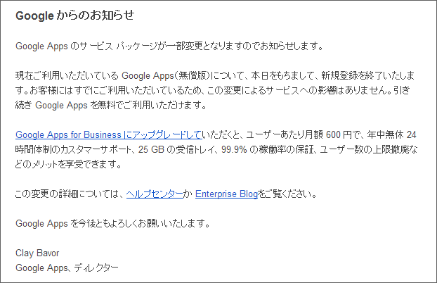

あらら……この技（<a href="https://blog.daruyanagi.jp/entry/2012/07/21/134131">&#x3072;&#x3068;&#x308A;&#x3067; Google Apps &#xFF08;Gmail&#xFF09; &#x3092;&#x4F7F;&#x3046;&#x3053;&#x3068;&#x306E;&#x30E1;&#x30EA;&#x30C3;&#x30C8; - &#x3060;&#x308B;&#x308D;&#x3050;</a>）がただで使えなくなるのね……。そのうち、お金かかるようになるのかなぁ。

そういえば、Microsoft がやっている <a href="https://domains.live.com/">https://domains.live.com/</a> の方はどうなったんだろう。独自ドメインで Hotmail が使えたはずだが。とりあえずまだやってるみたいだけど、Web ページの案内が不親切だな。あまりやる気なさそう。

