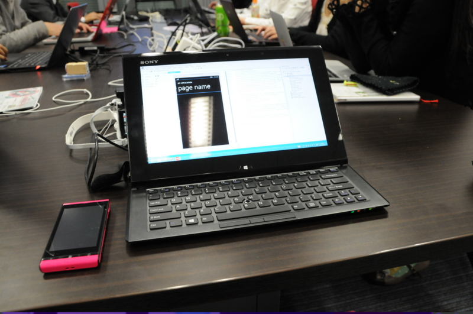

先週の水曜日、大阪まで出かけて <a href="http://wp-arch.net/">WPArch -is japanese windows phone community-</a> の勉強会に参加してきました！

<ul>
<li><a href="http://atnd.org/events/34125">Specialist presents WindowsPhoneArch#4 : ATND</a></li>
</ul>
<a href="http://msdn.microsoft.com/en-us/data/gg577609.aspx">Reactive Extensions</a> を使った Windows Phone 開発を体験してきたのですけど、僕みたいな下手の横好き・へっぽこ趣味プログラマーでもついていける難易度（とりあえず最初は）から始めてもらえたので、だいぶ助かりました。ハンズオン形式は実際に手を動かすので理解度が高まる気がしますねぇ。まぁ、SelectMany() は今でもあんまり分っとらんのだけど。

唯一の反省点は準備不足。

うちの VAIO Duo 11 の OS は Windows 8（無印）だったのだけど、これでは Windows Phone SDK 8.0 のエミュレーターが動かない。そこでその前の週に Windows 8 Pro をセットアップし、WPSDK 8.0 もインストールして万全の態勢をとったつもりになっていたのですが……

<b>いざ会場でコードを実行するとエミュレーターが動かない！</b>

ちゃんとエミュレーターの起動まで確認すべきだった。Hyper-V が同たらこ歌らというエラーが出たのだけど、その場でトラブルシューティングをするわけにもいかず。慌てて実機を繋いでどっちで実行しようとしたのだけど、Zune Software をインストールしなきゃいけなかったりして、序盤はかなり慌ててしまいました。

とんだヘマをこいた。

詳しくは木曜日あたりに某所で記事が掲載されるような気がします。大丈夫かなぁー

