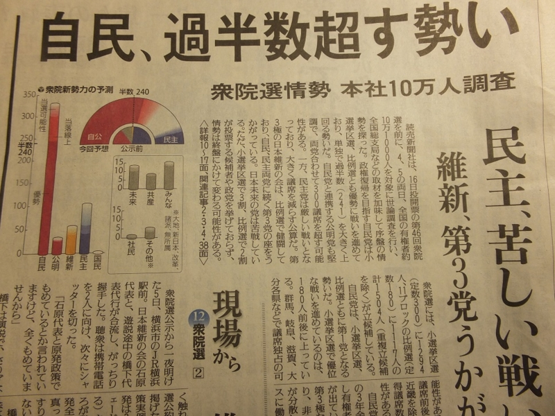

<blockquote cite="http://www.soumu.go.jp/senkyo/senkyo_s/news/touhyou/kijitsumae/kijitsumae01.html">

選挙は、選挙期日（投票日）に投票所において投票することを原則としていますが（これを投票日当日投票所投票主義といいます。）、期日前投票制度は、選挙期日前であっても、選挙期日と同じく投票を行うことができる（つまり、投票用紙を直接投票箱に入れることができる）仕組みです。

<cite><a href="http://www.soumu.go.jp/senkyo/senkyo_s/news/touhyou/kijitsumae/kijitsumae01.html">&#x7DCF;&#x52D9;&#x7701;&#xFF5C;&#x671F;&#x65E5;&#x524D;&#x6295;&#x7968;&#x5236;&#x5EA6;&#x306E;&#x6982;&#x8981;&#x30FB;&#x30E1;&#x30EA;&#x30C3;&#x30C8;</a></cite>
</blockquote>

“投票日当日主義”には何のメリットもない。

たとえば、これ。世の中には天邪鬼だの判官贔屓だのが多い<a href="#f-2b4e2d57" name="fn-2b4e2d57" title="自分もそのうちの一人だと言える">*1</a>から、こういう報道ひとつで“空気”が変わり得る<a href="#f-772f08c0" name="fn-772f08c0" title="もしかしたら、それを狙ってやっているのかもしれない">*2</a>。けれど、投票というのは本来、自分の考えを表明するためのもので、それ以外の目的で行使すべきではない<a href="#f-c7e8a4a1" name="fn-c7e8a4a1" title="たとえば、弔い選挙。亡くなった議員を惜しんで後継者に投票する">*3</a>。周りの雰囲気に流されて投票すれば、本来の支持に乖離して、特定の党へ過大な権力を与えてしまう。美人投票とバブル経済のメカニズムにちょっと似ているので、“バブル政治”現象と呼んでいいかもしれない。

それでなくとも、デマゴーグの暗躍がすさまじい。投票日が近づくにつれてますます酷くなる。自民党が基本的人権を否定して徴兵制と戦争を画策してるだの、民主党が選挙カーで迷惑なことをしているだの<a href="#f-72ad0186" name="fn-72ad0186" title="本当かもしれないが、実際に見てもいないのにリツイートするべきものではないだろう">*4</a>。インターネットでの選挙運動を解禁する動きもあるけれど、自分が Twitter などを見ている限りでは、それはそれはヒドい。理念としては賛同が、実践すると破たんすると思う。

ともあれ。

そういうものに流されないための最良の方法は、<b>さっさと投票を済ませてしまうことだ。</b>期日前投票、マジおすすめ。

<h3>P.S.</h3>

どこに投票したかって？　秘密！　ただ、自民党でも民主党でもないことは付記しておく。

自分が今望むことは、まず地方分権化かな。国と地方の役割分断を明確化しないと、責任があいまいになって、どちらも遠くない将来に財政破たんするだろう。そのほかの希望については、<a href="https://blog.daruyanagi.jp/entry/2011/12/07/223515">&#x3042;&#x306A;&#x305F;&#x306E;&#x671B;&#x3080;&#x653F;&#x7B56;&#x3092;3&#x3064;&#x3060;&#x3051;&#x6319;&#x3052;&#x3066;&#x304F;&#x3060;&#x3055;&#x3044; - &#x3060;&#x308B;&#x308D;&#x3050;</a> および <a href="https://blog.daruyanagi.jp/entry/2012/09/19/073208">&#x30E6;&#x30FC;&#x30C8;&#x30D4;&#x30A2;&#x7684;&#x300C;&#x57CB;&#x8535;&#x91D1;&#x300D;&#x6398;&#x308A;&#x5F53;&#x3066;&#x653F;&#x7B56; - &#x3060;&#x308B;&#x308D;&#x3050;</a> にまとめてある。

<a href="#fn-2b4e2d57" name="f-2b4e2d57" class="footnote-number">*1</a>:自分もそのうちの一人だと言える

<a href="#fn-772f08c0" name="f-772f08c0" class="footnote-number">*2</a>:もしかしたら、それを狙ってやっているのかもしれない

<a href="#fn-c7e8a4a1" name="f-c7e8a4a1" class="footnote-number">*3</a>:たとえば、弔い選挙。亡くなった議員を惜しんで後継者に投票する

<a href="#fn-72ad0186" name="f-72ad0186" class="footnote-number">*4</a>:本当かもしれないが、実際に見てもいないのにリツイートするべきものではないだろう

