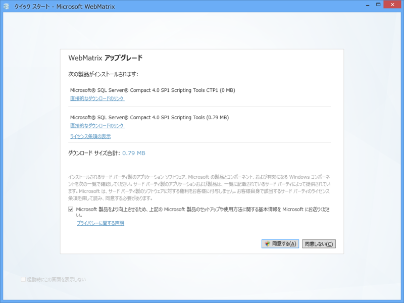
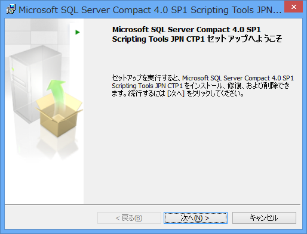
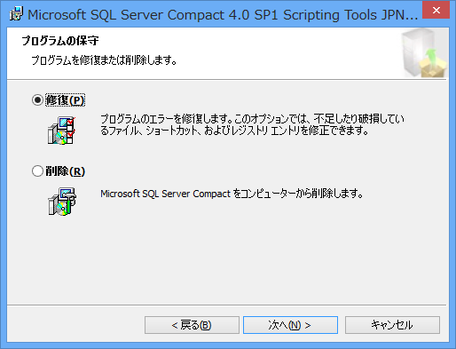

なんか「WebMatrix 2」の起動時に毎回「Microsoft SQL Server Compact 4.0 SP1 Scripting Tools（CTP1）」のアップデート通知が出る現象に出くわした。

コンポーネント自体はインストールされているみたいなので、おそらく「Web Platform Installer 4.0」側の問題かな。利用に支障がなければこのまま放置しようと思う。

