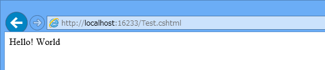
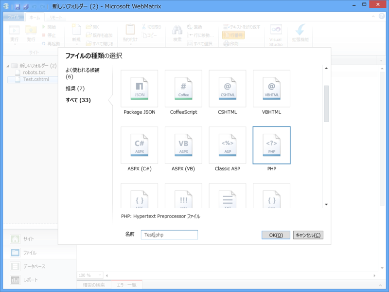
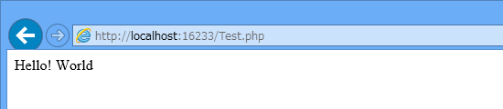
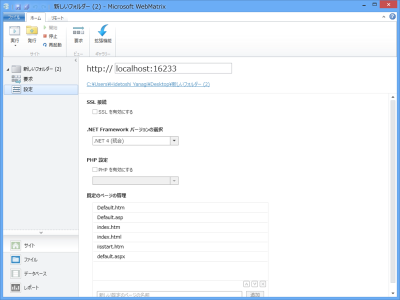
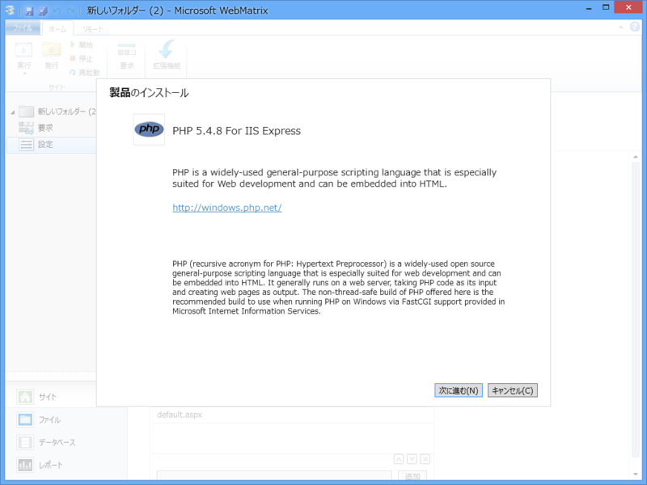
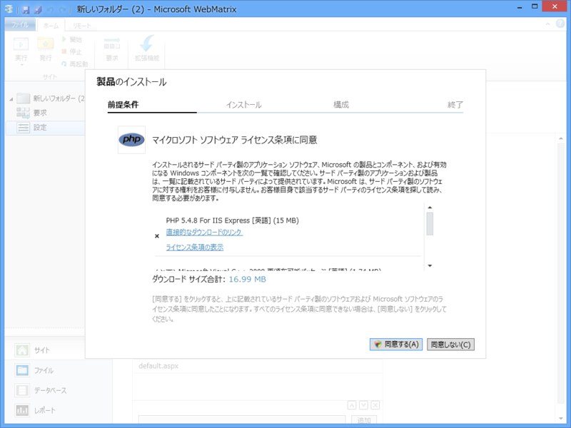
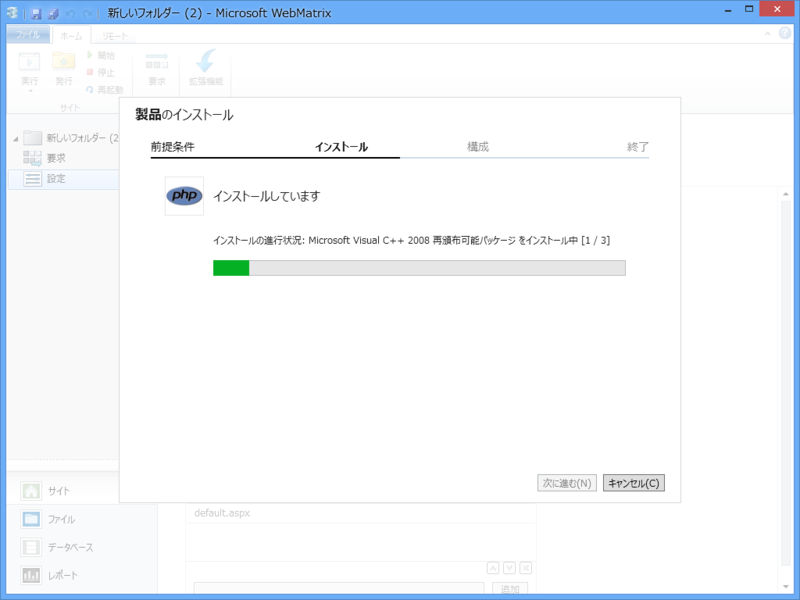
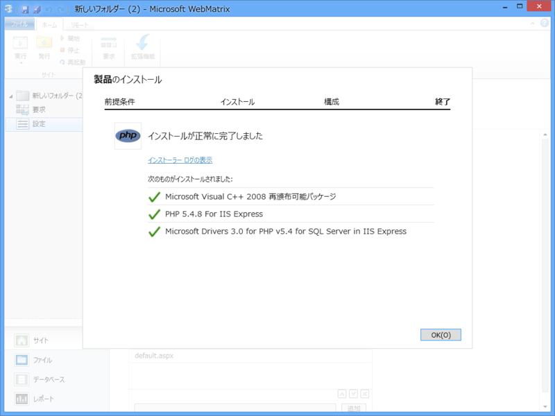

前回（<a href="https://blog.daruyanagi.jp/entry/2012/12/07/125835">WebMatrix 2&#xFF1A;&#x30D5;&#x30A9;&#x30EB;&#x30C0;&#x30FC;&#x304B;&#x3089; Web &#x30B5;&#x30A4;&#x30C8;&#x3092;&#x4F5C;&#x3063;&#x3066;&#x307F;&#x308B; - &#x3060;&#x308B;&#x308D;&#x3050;</a>）は、空のフォルダーから Web サイトを作って HTML ファイルを配置し、それをローカル Web サーバー（IIS Express 7.5）でホストするところまで進めた。でも、静的な HTML だけではちょっとつまらないかな。

「WebMatrix 2」では、サーバーサイドで動的に HTML を生成することもできる<a href="#f-5619c126" name="fn-5619c126" title="クライアントサイドの場合は、JavaScript でやるよね！">*1</a>。“動的”というのは、要求に応じて異なる内容を出力できるということ。これができると、いろいろなメリットがある。

<ul>
<li>データベースと連携できる</li>
<li>ほかの Web サイトの情報を取り込んだり、Web サービスの API が利用できる<a href="#f-dbae782a" name="fn-dbae782a" title="いわゆるマッシュアップ">*2</a></li>
<li>Web サイト共通の部分（パラメーターやデザイン）が一元管理できる</li>
<li>状況に応じて出力がカスタマイズできる（例: モバイル向けWebデザイン）</li>
</ul>
世の中にはさまざまなサーバ・サイドプログラミング環境があるけれど、「WebMatrix 2」ではそのなかでも“<b>ASP.NET</b>”と“<b>PHP</b>”をサポートしている<a href="#f-af9dfc05" name="fn-af9dfc05" title="node.js も利用できるのだけど、ちょっと理由があって今回は省いている">*3</a>。空のフォルダーから作成した Web サイト でも簡単に利用できる。

<h3>ASP.NET（C#）<a href="#f-b6e12467" name="fn-b6e12467" title="Visual Basic も利用できる">*4</a></h3>

拡張子は“.cshtml”（Visual Basic の場合は *.vbhtml）。“<b>Razor</b>”と呼ばれるシンプルな構文で記述できる。

<pre class="code lang-cs" data-lang="cs" data-unlink>@{
var s = &quot;Hello! World&quot;; // 追加
}

&lt;!DOCTYPE html&gt;

&lt;html lang=&quot;en&quot;&gt;
&lt;head&gt;
&lt;meta charset=&quot;utf-8&quot; /&gt;
&lt;title&gt;&lt;/title&gt;
&lt;/head&gt;
&lt;body&gt;
@s &lt;!-- 追加 --&gt;
&lt;/body&gt;
&lt;/html&gt;
</pre>

拡張子を省略してもアクセスできる。

<h3>PHP: Hypertext Preprocessor</h3>

拡張子は“.php”。おそらくもっともポピュラーなサーバーサイドプログラミング言語。

<pre class="code lang-php" data-lang="php" data-unlink>&lt;?php
$s = &quot;Hello! World&quot;; // 追加
?&gt;

&lt;!DOCTYPE html&gt;
&lt;html lang=&quot;en&quot;&gt;
&lt;head&gt;
        &lt;meta charset=&quot;utf-8&quot; /&gt;
        &lt;title&gt;&lt;/title&gt;
    &lt;/head&gt;
&lt;body&gt;
&lt;?php echo($s); ?&gt; &lt;!-- 追加 --&gt;
&lt;/body&gt;
&lt;/html&gt;
</pre>
 

<h4>PHP を利用するには</h4>

「WebMatrix 2」で PHP を利用するには追加のコンポーネントが必要。

まず、［サイト］タブの［設定］画面を開き、“PHP を有効にする”をチェック。

すると、「PHP 5.4.8 for IIS Express」がインストールされる。

セットアップはほとんど自動で行われる。

<h3>どちらを利用すべきか？</h3>

<b>なんなら混ぜて利用することもできる</b>ので、別にどっちでもよいのだけれど、これから Windows プラットフォームでサーバーサイドプログラミングを始めるならば、ASP.NET の方をお勧めしたい。後発であるがゆえのさまざまなメリットがある。

<ul>
<li>構文がシンプル</li>
<li>言語レベルでのセキュリティ設計で一日の長がある</li>
<li>C# が利用できる。この知識は Web プログラミング以外にも活用できる</li>
</ul>
PHP の方が優れている面も、もちろんある。

<ul>
<li>Windows / IIS 以外の環境でも動作する</li>
<li>動作実績が豊富でサンプルも多く、学習が容易</li>
<li>Razor より少しだけ速いらしい</li>
</ul>

<a href="#fn-5619c126" name="f-5619c126" class="footnote-number">*1</a>:クライアントサイドの場合は、JavaScript でやるよね！

<a href="#fn-dbae782a" name="f-dbae782a" class="footnote-number">*2</a>:いわゆるマッシュアップ

<a href="#fn-af9dfc05" name="f-af9dfc05" class="footnote-number">*3</a>:node.js も利用できるのだけど、ちょっと理由があって今回は省いている

<a href="#fn-b6e12467" name="f-b6e12467" class="footnote-number">*4</a>:Visual Basic も利用できる

