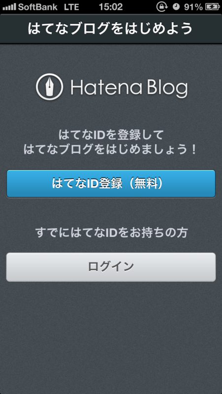
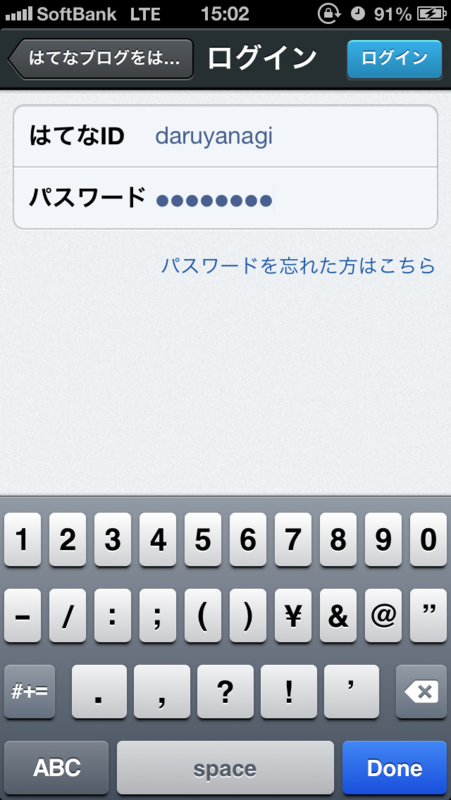
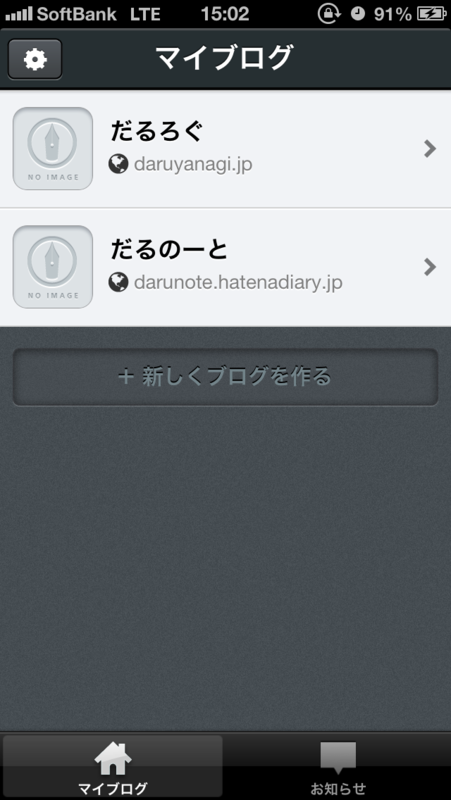
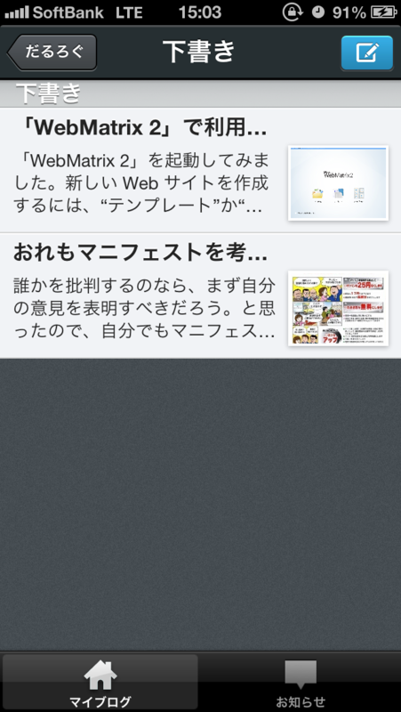
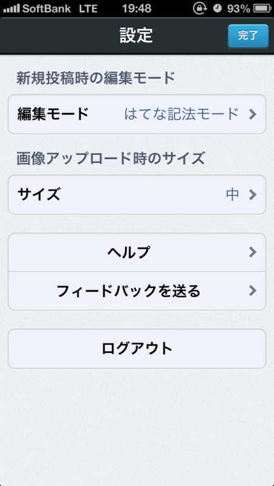
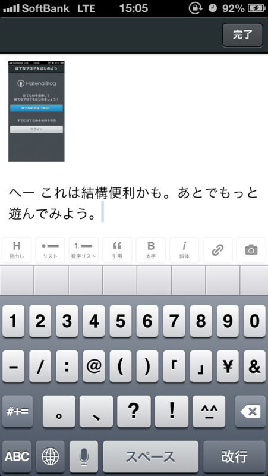
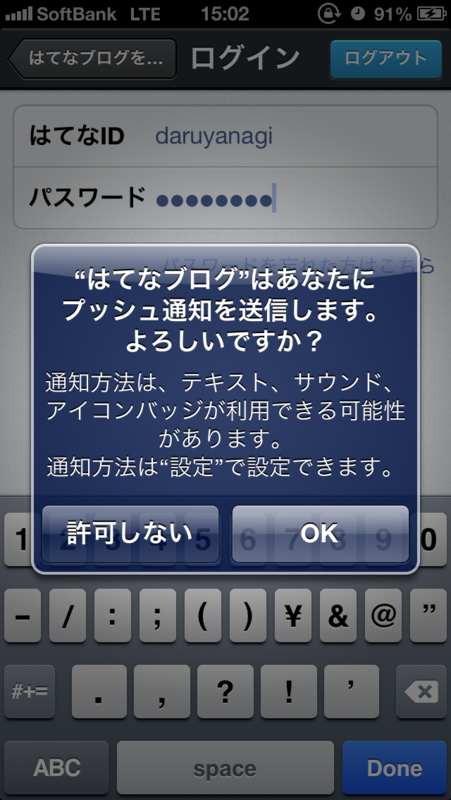
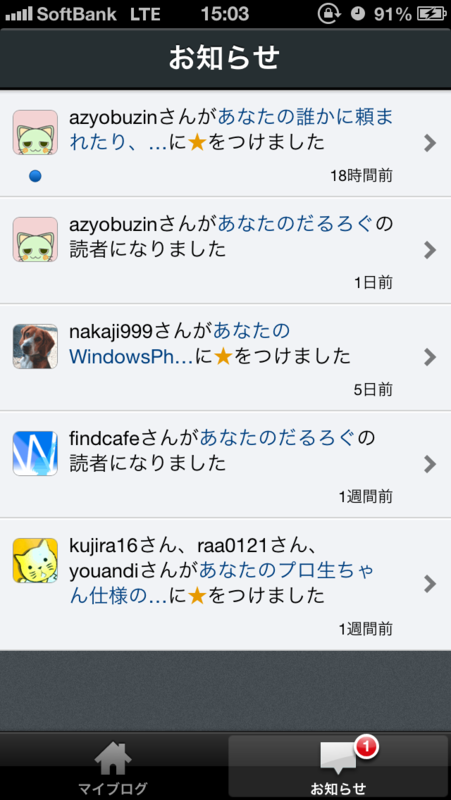

<a href="http://staff.hatenablog.com/entry/iphone-app-campaign">&#x30A2;&#x30D7;&#x30EA;&#x3092;&#x30C0;&#x30A6;&#x30F3;&#x30ED;&#x30FC;&#x30C9;&#x3057;&#x3066;iPod touch&#x3092;&#x3082;&#x3089;&#x304A;&#x3046;&#xFF01; iPhone&#x30A2;&#x30D7;&#x30EA;&#x300C;&#x306F;&#x3066;&#x306A;&#x30D6;&#x30ED;&#x30B0;&#x300D;&#x3092;&#x30EA;&#x30EA;&#x30FC;&#x30B9;&#x3057;&#x307E;&#x3057;&#x305F; - &#x306F;&#x3066;&#x306A;&#x30D6;&#x30ED;&#x30B0;&#x958B;&#x767A;&#x30D6;&#x30ED;&#x30B0;</a> らしいので早速少し試してみた。

<h3>とりあえずログイン</h3>

　　　

とりあえずログインは全く問題がなかった。ブログを新設したり、下書きの編集なんかもできるみたい。

<h3>設定</h3>

初期状態では“見たまま編集モード”だけど、これだと書式のコントロールや画像のサイズ指定が難しいと思ったので、“はてな記法モード”へ変更しておいた。

<h3>編集</h3>

これは“見たまま編集モード”のスクリーンショットだけど、結構使いやすそう。“はてな記法モード”でも編集補助のボタンはちゃんと効いた。

デスクトップほどの編集効率は望めないものの、かなり使えそう。

<h3>その他の機能</h3>

　

初回起動時にプッシュ通知の許可を求めるダイアログが出たのだけど、お知らせのプッシュ通知でもしてくれるのかな？<a href="#f1" name="fn1" title="違うかもしれない">*1</a>　だったら個人的にはうれしいなぁ。

とにかく、これでブログを書く頻度がさらにあがりそう。できたらタブレット対応版（iPad か Nexus 7）もほしいかも。Google マップと連携した位置情報の埋め込み、ほかのアプリとの連携<a href="#f2" name="fn2" title="ブラウザーで記事の引用→ブログに、など">*2</a>なんかもサポートしていただけるとありがたし。サブブログを公開メモ用に使おう。

あと、「iPod touch 欲しい！ <a href="http://blog.hatena.ne.jp/hatenablog/">id:hatenablog</a>」

<h3>追記</h3>

SNS 連携機能がないのね。ちょっと残念。

<a href="#fn1" name="f1" class="footnote-number">*1</a>:違うかもしれない

<a href="#fn2" name="f2" class="footnote-number">*2</a>:ブラウザーで記事の引用→ブログに、など

