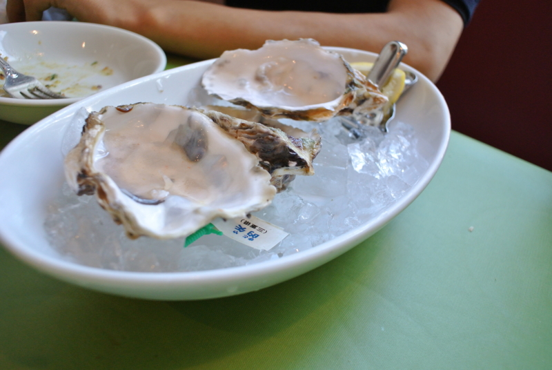
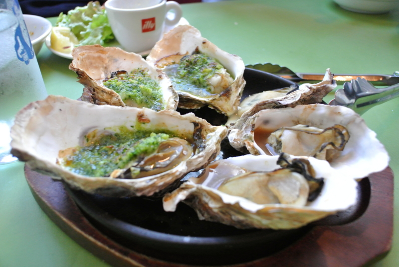
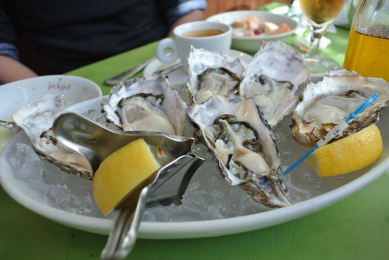
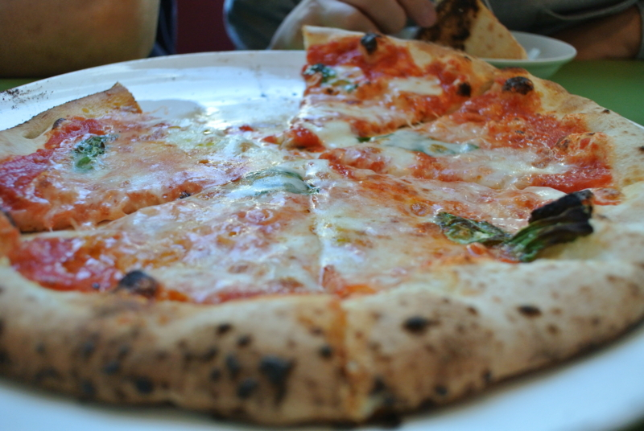

日曜日のお昼、友人とプチ忘年会をした。ノロウイルスの大流行も何のその、牡蠣ざんまいだ━━━━━━(ﾟ∀ﾟ)━━━━━━!!!!

（最初の一皿は、食べるのに夢中で写真を撮り忘れました）

ビールも白ワインもあけて、昼間っからやりたい放題。ちょっとはしゃぎ過ぎてうるさい客だったかもしれない。ごめんなさい。

なかでも結構気に入ったのがこのマルガリータ。ちゃんとした窯があるっぽくて、なかなか美味しかった。これにもちゃんと牡蠣がのっているんですよ。

今年はもう会うことないかな。直接は言いそびれたのだけど、よいお年を！

<iframe width="425" height="350" frameborder="0" scrolling="no" marginheight="0" marginwidth="0" src="https://maps.google.co.jp/maps?q=%E3%82%AA%E3%82%A4%E3%82%B9%E3%82%BF%E3%83%BC%E3%83%90%E3%83%BC+%E3%82%B8%E3%83%A3%E3%83%83%E3%82%AF%E3%83%9D%E3%83%83%E3%83%88++%E5%93%81%E5%B7%9D&amp;ie=UTF8&amp;hq=%E3%82%AA%E3%82%A4%E3%82%B9%E3%82%BF%E3%83%BC%E3%83%90%E3%83%BC+%E3%82%B8%E3%83%A3%E3%83%83%E3%82%AF%E3%83%9D%E3%83%83%E3%83%88++%E5%93%81%E5%B7%9D&amp;hnear=&amp;radius=15000&amp;t=m&amp;brcurrent=3,0x60188a501ccde98b:0x5c87a8e4d7919fd3,0&amp;cid=6629547223667193576&amp;ll=35.638813,139.743519&amp;spn=0.024414,0.036478&amp;z=14&amp;iwloc=A&amp;output=embed"></iframe> <small><a href="https://maps.google.co.jp/maps?q=%E3%82%AA%E3%82%A4%E3%82%B9%E3%82%BF%E3%83%BC%E3%83%90%E3%83%BC+%E3%82%B8%E3%83%A3%E3%83%83%E3%82%AF%E3%83%9D%E3%83%83%E3%83%88++%E5%93%81%E5%B7%9D&amp;ie=UTF8&amp;hq=%E3%82%AA%E3%82%A4%E3%82%B9%E3%82%BF%E3%83%BC%E3%83%90%E3%83%BC+%E3%82%B8%E3%83%A3%E3%83%83%E3%82%AF%E3%83%9D%E3%83%83%E3%83%88++%E5%93%81%E5%B7%9D&amp;hnear=&amp;radius=15000&amp;t=m&amp;brcurrent=3,0x60188a501ccde98b:0x5c87a8e4d7919fd3,0&amp;cid=6629547223667193576&amp;ll=35.638813,139.743519&amp;spn=0.024414,0.036478&amp;z=14&amp;iwloc=A&amp;source=embed" style="color:#0000FF;text-align:left">大きな地図で見る</a></small>

マイクロソフトの隣の下だった……プライベートできたのは初めてだ。

