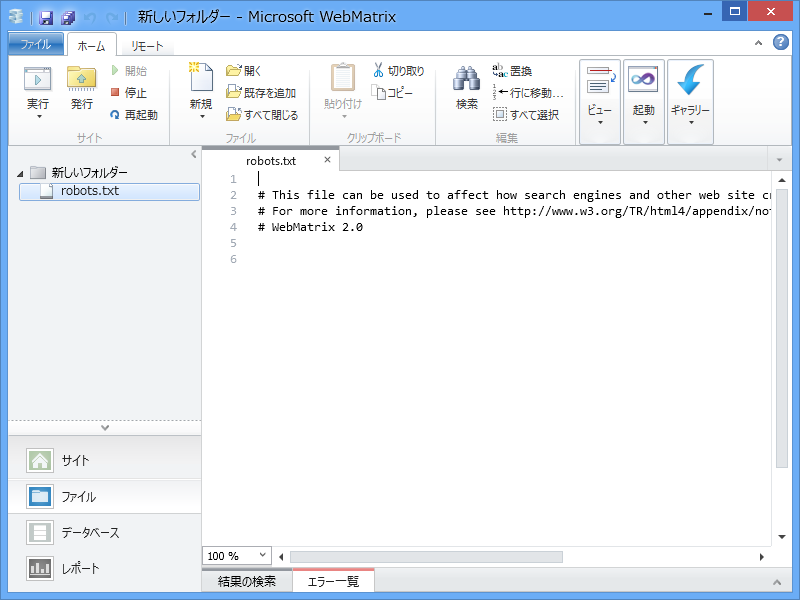
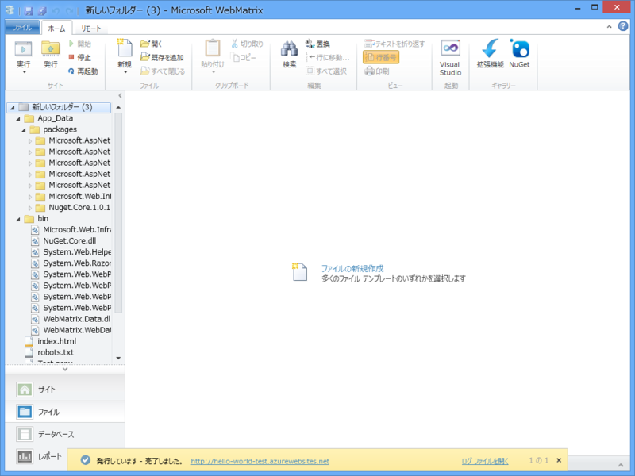
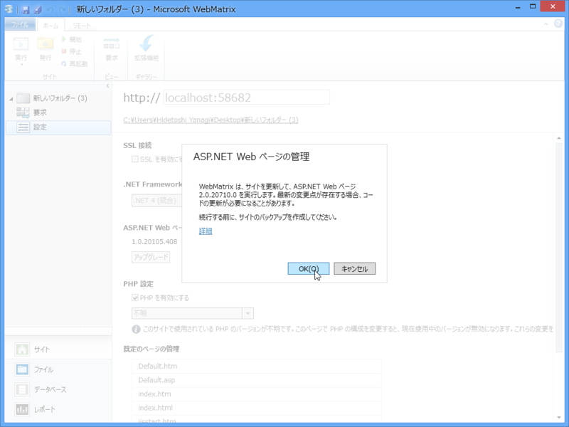
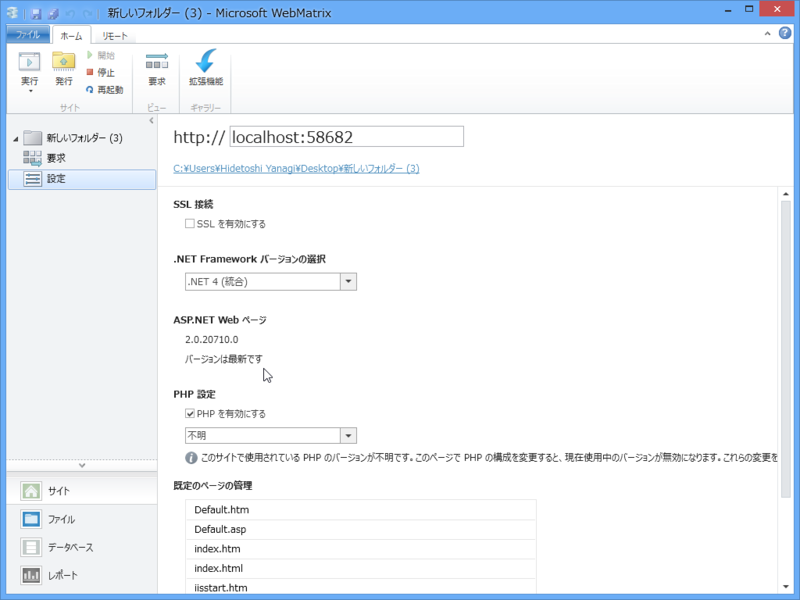

前々回（<a href="https://blog.daruyanagi.jp/entry/2012/12/07/125835">WebMatrix 2&#xFF1A;&#x30D5;&#x30A9;&#x30EB;&#x30C0;&#x30FC;&#x304B;&#x3089; Web &#x30B5;&#x30A4;&#x30C8;&#x3092;&#x4F5C;&#x3063;&#x3066;&#x307F;&#x308B; - &#x3060;&#x308B;&#x308D;&#x3050;</a>）は、空のフォルダーから Web サイトを作って HTML ファイルを配置し、それをローカル Web サーバー（IIS Express 7.5）でホストするところまで進めましたが、<i>ぶっちゃけこの方法はあまりお勧めしません。</i>ちゃんと初期画面の［テンプレート］ボタンを利用して新しいサイトを作るようにしましょう。

なぜかというと、通常の作業フローとはちょっと外れているため、いくつか困ったことが発生するからです。

 

<h4>1. NuGet が使えない</h4>

リボン右端の［ギャラリー］ボタンを押しても、［拡張機能］ボタンしか出てきません。

つまり、NuGet ギャラリーが利用できません。

<h4>2. 実環境で動かすにはコンポーネントが足りません</h4>

［テンプレート］ボタンからサイトを作成すると、 App_Data フォルダや bin フォルダに ASP.NET の実行に必要な DLL が追加されます。しかし、空のフォルダーから Web サイトを作るとこれらが追加されないため、たとえば FTP でファイルをサーバーへ丸コピしても動作しません。

ローカルでは「WebMatrix 2」が気を利かせてくれるのでちゃんと動くのですけど。

<h3>解決策</h3>

というわけで、あまりお勧めできないのですけど……いろいろ試していてひとつ気が付きました。

一度 Windows Azure Web サイトへサイトを発行してしまうと、その過程でコンポーネントの追加が行われるようですね。NuGet ギャラリーも利用できるようになります<a href="#f-c2c022f9" name="fn-c2c022f9" title="ExpressWeb の場合はどうなるのか、などは検証していません。多分動くんじゃないかな">*1</a>。

スクリーンショットの右上と左に注目してください。[NuGet]ボタンが利用できるのと、App_Data フォルダや bin フォルダに ASP.NET の実行に必要な DLL が追加されているのが分かります。

ただし、“ASP.NET Web ページ”（ここでは Razor 記法＋その他コンポーネント群のことだと思ってくれていいと思います。）のバージョンは 1.0 です。

“ASP.NET Web ページ”の最新版は 2.0 なのでアップデートをお勧めします。1.0 と 2.0 の違いは……まぁ、また今度。

……どうでもいい Tips でしたね！

Windows Azure Web サイトは、基本的な機能であればタダで利用できます<a href="#f-50298c3d" name="fn-50298c3d" title="ただし、本人確認のためにクレジットカードが必要。まぁ、大学生なら生協かどこかでカード作ってもらえばいいんじゃないかな">*2</a>。次回はその登録・利用フローでも説明しようかと思います<a href="#f-2edda042" name="fn-2edda042" title="というより、スクリーンショットととってあるので、死蔵するよりは公開しておきたいｗ">*3</a>。

<a href="#fn-c2c022f9" name="f-c2c022f9" class="footnote-number">*1</a>:ExpressWeb の場合はどうなるのか、などは検証していません。多分動くんじゃないかな

<a href="#fn-50298c3d" name="f-50298c3d" class="footnote-number">*2</a>:ただし、本人確認のためにクレジットカードが必要。まぁ、大学生なら生協かどこかでカード作ってもらえばいいんじゃないかな

<a href="#fn-2edda042" name="f-2edda042" class="footnote-number">*3</a>:というより、スクリーンショットととってあるので、死蔵するよりは公開しておきたいｗ

