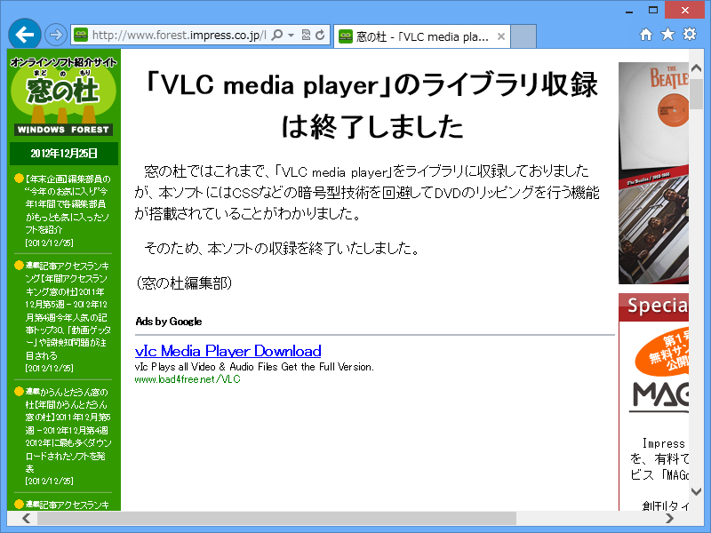
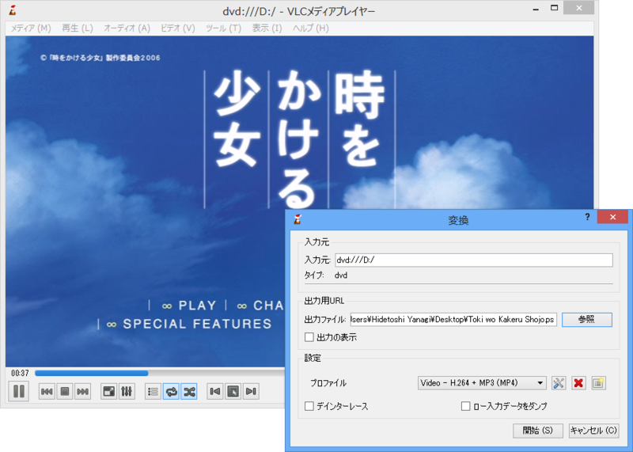

まぁ、（葬式）仏教徒なんでクリスマスなんかどうでもいいんですけど、ちょっとクリスマスネタを。

定番メディアプレイヤー「VLC media player」（<a href="http://www.videolan.org/vlc/">VideoLAN - Official page for VLC media player, the Open Source video framework!</a>）は、クリスマスになるとタスクトレイアイコンがクリスマス仕様になるんだよ！

……どうでもよかったか。

まぁ、もう日本では配布しちゃダメですしね（<a href="http://internet.watch.impress.co.jp/docs/news/20121001_561966.html">&#x4ECA;&#x65E5;&#x304B;&#x3089;DVD&#x30EA;&#x30C3;&#x30D4;&#x30F3;&#x30B0;&#x7981;&#x6B62;&#x3001;&#x9055;&#x6CD5;DL&#x306B;&#x5211;&#x7F70;&#x3082;&#x301C;&#x6539;&#x6B63;&#x8457;&#x4F5C;&#x6A29;&#x6CD5;&#x304C;&#x4E00;&#x90E8;&#x65BD;&#x884C; -INTERNET Watch</a>）。

<a href="http://www.forest.impress.co.jp/lib/pic/video/mediaplay/vlcmplayer.html">&#x7A93;&#x306E;&#x675C; - &#x300C;VLC media player&#x300D;&#x306E;&#x30E9;&#x30A4;&#x30D6;&#x30E9;&#x30EA;&#x53CE;&#x9332;&#x306F;&#x7D42;&#x4E86;&#x3057;&#x307E;&#x3057;&#x305F;</a>

まぁ、確かにあるんだけど、別にメインの機能じゃないんだけどな。

著作権保護も大事だけど、あんまりギスギスするのもどうなのかなって思う今日この頃。

たとえば、うちはデジタル TV がないので基本観ないのだけど、そうなるとない生活が当たり前になって観なくても何も感じなくなる。漫画や小説も映画も、そんなもんじゃないかな。ああいうのは手頃かつ身近にあるから楽しんでるのであって、なかったらなかったで別になにも困らないんだよ。

だからコピーし放題でいい、と主張したいわけじゃない。ただ言いたいのは、無駄にハードルを上げるとみんな離れていきますよ、戻ってきませんよ、ということ。楽しんでもらわなければそもそも金にならないけれど、変なふうに楽しまれても商売あがったり。手綱はちゃんと締めるべきだけど、ちゃんと買おうとしている人にまで不快な思いをさせたら本末転倒じゃないかな。わしは本屋や映画館へたまにいくけど、そのたんびに万引きを警告するポスターや映画泥棒の CM をみせられるのは、正直不快。行く気なくす。

まぁ、難しいけれど、ここんところなんとかうまく距離感をとってほしいと思う。

