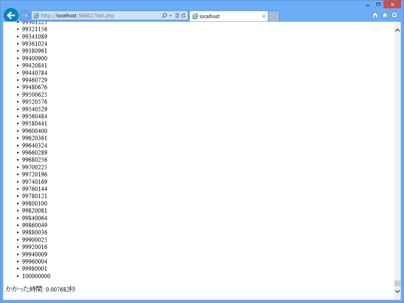
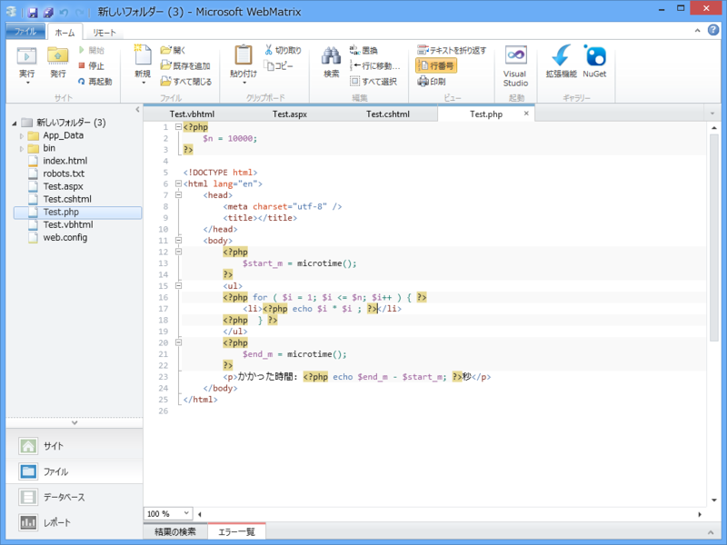
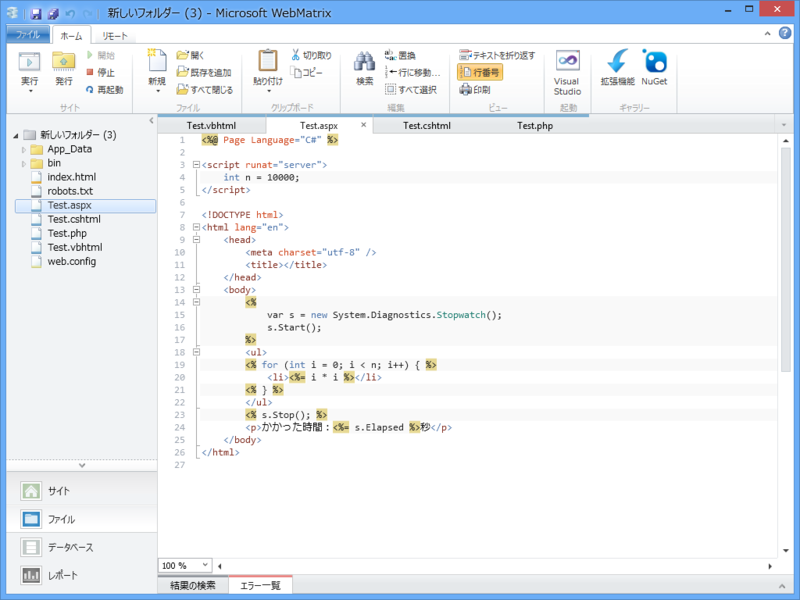
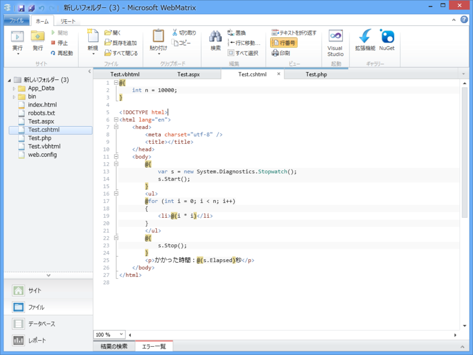
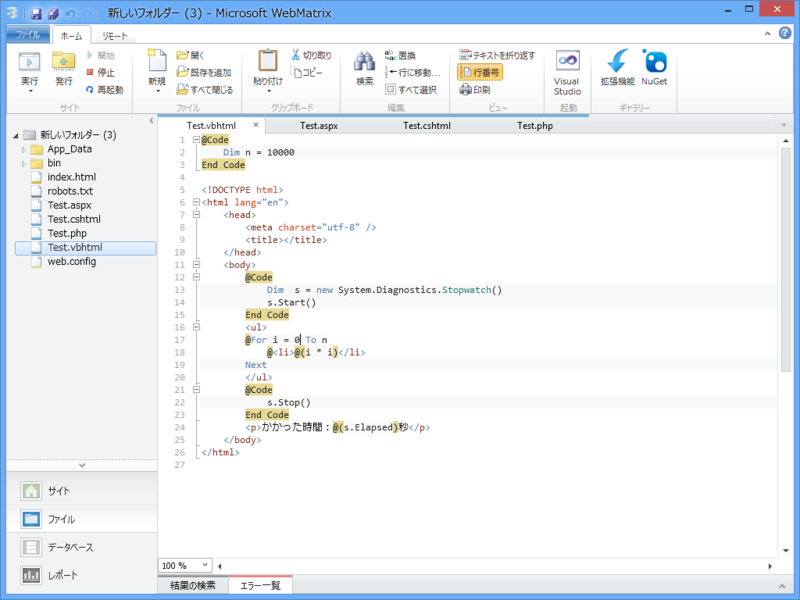

<a href="https://blog.daruyanagi.jp/entry/2012/12/11/085125">WebMatrix 2&#xFF1A;ASP.NET &#x3068; PHP - &#x3060;&#x308B;&#x308D;&#x3050;</a> あたりを書いた時に Twitter で「WebMatrix 2（というより、Razor 記法）は Visual Basic に対応していないのか？」という疑問を見かけたのですが、ちゃんと対応しています。

たとえば前回の例の場合、こんなふうに書きます。

<pre class="code lang-vb" data-lang="vb" data-unlink>@Code
Dim s = &quot;Hello! World&quot; ' 追加
End Code

&lt;!DOCTYPE html&gt;

&lt;html lang=&quot;en&quot;&gt;
&lt;head&gt;
&lt;meta charset=&quot;utf-8&quot; /&gt;
&lt;title&gt;&lt;/title&gt;
&lt;/head&gt;
&lt;body&gt;
@s &lt;!-- 追加 --&gt;
&lt;/body&gt;
&lt;/html&gt;
</pre>
C# の @{ … } が @Code … End Code に置き換わったぐらいかな。For 文の書き方なんかも VB 風に書けます。詳しいことは <a href="http://www.atmarkit.co.jp/fdotnet/rapidmaster/rapidmaster_04/rapidmaster_04.html">VB Razor&#x69CB;&#x6587; &#x57FA;&#x790E;&#x6587;&#x6CD5; &#x7DCF;&#x307E;&#x3068;&#x3081; - &#xFF20;IT</a> でも参照してください。個人的にはこれから始める人が VB で Razor を書く意味はあまりないのではないかなと思います。XML の処理などは簡単なんだそうですけど。

あと、前回は言わなかったけれど <% … %> という ASP.NET の古い記法（ASPX、C# または Visual Basic）を利用することもできます。 

まぁ、それはともかく。

こんなにいっぱいあるんだったら、どれが一番いいのかって気になりますよね。前にも言った通り、ぶっちゃけ好きなものを選べばいいと思うんですけど（Razor/C# を推しますけどね）、今回は簡単なプログラム（0から10,000までの2乗をリスト表記）で速さを計測してみました。

<h3>PHP</h3>

PHP はあんまり知らないのでこれでいいのか多少不安ですけど。

<ul>
<li>0.007682秒</li>
<li>0.004367秒</li>
<li>0.003787秒</li>
<li>0.003856秒</li>
<li>0.003891秒</li>
</ul>
最初だけ時間を食いましたが、こんな感じ。

以下、初回計測時にはサーバーを一度再起動させています。PHP の結果を見ると、初回起動時はちょっと時間がかかるのかなと感じたので。念のためもう一度計測したら、サーバー再起動後で 0.0035609999999999秒 でした。0.007秒というのは、異常値として処理しちゃってもいいレベルかな。

<h3>•ASP.NET (ASPX/C#)</h3>

 

<ul>
<li>0.0029692秒</li>
<li>0.0025189秒</li>
<li>0.0024252秒</li>
<li>0.0024489秒</li>
<li>0.0024761秒</li>
</ul>
安定して速かったです。ただ、これで書こうかという気は起こらないのですけど。

<h3>•ASP.NET (Razor/C#)</h3>

 

<ul>
<li>0.0028398秒</li>
<li>0.0024506秒</li>
<li>0.0024667秒</li>
<li>0.0025609秒</li>
<li>0.0026207秒</li>
</ul>
ASPX よりはわずかながら遅いような（ほとんど誤差レベルですが）。PHP よりは速かった。

<h3>•ASP.NET (Razor/Visual Basic)</h3>

 

<ul>
<li>0.0046345秒</li>
<li>0.0039607秒</li>
<li>0.0036215秒</li>
<li>0.0036577秒</li>
<li>0.0038143秒</li>
</ul>
ついでに Razor だけ VB でも試してみました。PHP よりはマシという感じの速さですね。

まぁ、簡単すぎてあんまり参考にならないレベルですけどちょっと興味がわいたので試してみました。著しく不公平なところがあれば、ぜひ教えてください。正直あんまり自信ない。

